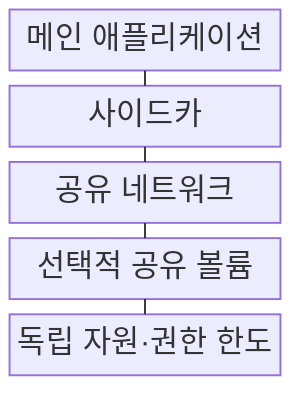
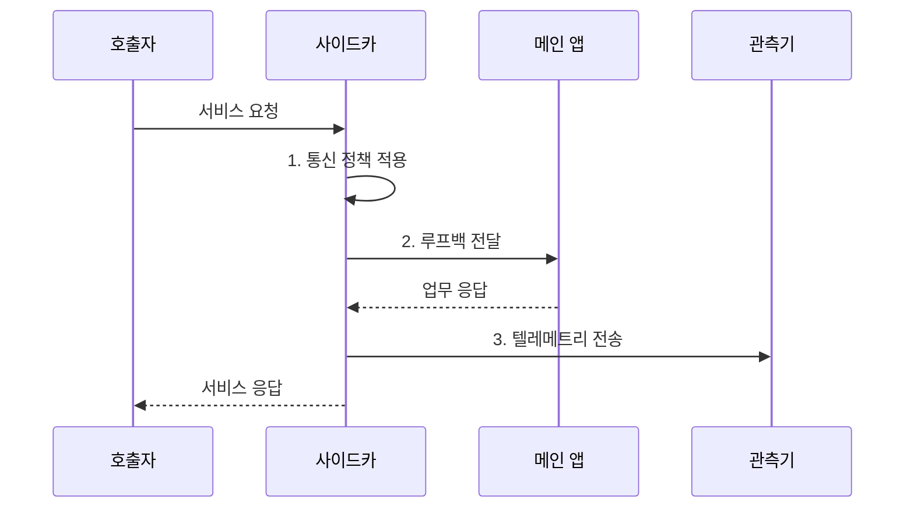

---
sidebar:
  order: 218
  label: "218. 사이드카 패턴 (Sidecar Pattern)"
  badge:
    text: "기출 · 70%"
    variant: note
title: "사이드카 패턴 (Sidecar Pattern)"
date: "2026-07-31T01:24:00+09:00"
tags: ["notes-software"]
weight: 218
extra:
  question_no: "218"
  source_status: "기출"
  source_history: "138회"
  priority: 70
  priority_note: "보조 컨테이너 책임 분리가 최근 출제됨"
---

## 미리 알고가기

- **사이드카 패턴(Sidecar Pattern)**: 메인 앱과 보조 프로세스를 같은 배포 단위에 배치해 공통 기능을 분리하는 아키텍처 패턴
- **횡단 관심사(Cross-Cutting Concern)**: 로깅·보안·통신처럼 여러 서비스에 공통 적용되는 부가 기능
- **파드(Pod)**: 쿠버네티스(Kubernetes)가 스토리지·네트워크와 생명주기를 공유하도록 묶는 배포 단위이다.
- **서비스 메쉬 프록시(Service Mesh Proxy)**: 앱 외부의 사이드카에서 트래픽 제어·보안·관측을 대행하는 프록시
- **초기화 컨테이너(Init Container)**: 메인 실행 전 준비 작업을 수행한다.
- **장애 도메인(Failure Domain)**: 장애의 영향 범위를 결정하는 배포 경계이다.
- **앰배서더 패턴(Ambassador Pattern)**: 외부 시스템 연결 정책을 대행한다.
- **루프백·소켓**: 루프백은 같은 호스트의 내부 주소이고 소켓은 프로세스 통신 끝점이다.
- **사이드카 주입**: 배포 시 보조 컨테이너 정의를 파드에 자동으로 추가하는 기능이다.
- **프로브**: 컨테이너의 생존·준비·기동 상태를 확인하는 쿠버네티스 검사이다.
- **자원 경합**: 메인 앱과 사이드카가 중앙 처리 장치(Central Processing Unit, CPU)·메모리를 서로 차지해 성능이 낮아지는 현상이다.
- **우회 경로(Bypass Path)**: 사이드카 장애 시 메인 앱이 허용된 범위에서 직접 통신하도록 전환하는 대체 경로
- **텔레메트리(Telemetry)**: 요청 지연·오류·추적 정보를 외부 관측기로 전송한 운영 데이터

## Ⅰ. 개요

- 정의/개념: 메인 앱과 **보조 프로세스**를 함께 배치하는 아키텍처 패턴
- 배경/필요성: 서비스별 횡단 기능 내장으로 **코드 중복·버전 결합** 발생

### 쉽게 이해하기 (학습용)
- 오토바이 옆 보조 좌석처럼 앱 옆 프로세스가 통신·로그를 맡아 앱 코드를 바꾸지 않고 공통 기능을 제공한다

## Ⅱ. 특징

- 메인 앱과 **네트워크·스토리지 공유**
- 횡단 기능의 **별도 프로세스 격리**
- 메인·보조 프로세스의 **생명주기 결합**

### 쉽게 이해하기 (학습용)
- 앱과 같은 파드에서 네트워크를 공유하되 별도 프로세스로 실행돼 공통 기능만 독립 교체할 수 있다

## Ⅲ. 구조 및 구성요소

| 구성요소 | 책임 |
|:---|:---|
| 메인 애플리케이션 | 핵심 **업무 기능 실행** |
| 사이드카 | 프록시·로그·**공통 기능 분리** |
| 공유 네트워크 | 루프백·소켓 **통신 경로** |
| 선택적 공유 볼륨 | 로그·설정 **파일 공유** |
| 독립 자원·권한 한도 | CPU·메모리·**최소 권한 제한** |

### 쉽게 이해하기 (학습용)
- 한 파드의 메인 앱과 사이드카가 내부 통로와 선택적 파일함을 공유하고 각자 자원·권한 한도를 갖는다

## Ⅳ. 흐름도

**동작 원리**

1. **통신 정책 적용**: 인증·재시도·라우팅 규칙 판정
2. **루프백 전달**: 공유 네트워크로 메인 앱 호출
3. **텔레메트리 전송**: 요청 지연·오류·추적 정보 기록

### 쉽게 이해하기 (학습용)
- 요청이 옆 프록시를 거쳐 앱으로 들어가고 응답 지연·오류가 관측기로 복사되는 경로다

## Ⅴ. 종류 및 비교

| 횡단 기능 배치 | 사이드카 | 임베디드 라이브러리 | 공유 서비스 |
|:---|:---|:---|:---|
| 적용 기준 | 앱별 **공통 기능 격리** | 낮은 지연·**단순 기능** | 다수 앱의 **중앙 공유** |
| 핵심 특징 | 파드 안에서 **별도 실행** | 앱 프로세스에 **직접 포함** | 원격 **공통 서비스** 제공 |
| 한계 | 인스턴스별 **자원 증가** | 코드 결합·**개별 배포** | 네트워크 지연·**중앙 장애** |

> 요약: 기능 격리와 인스턴스별 자원 비용으로 배치 방식 선택

### 쉽게 이해하기 (학습용)
- 앱마다 격리하면 사이드카, 호출 지연이 민감하면 라이브러리, 중앙 공유가 필요하면 원격 서비스를 고른다

## Ⅵ. 실무 고려사항 및 대책

| 고려사항 | 대책 | 효과 |
|:---|:---|:---|
| 사이드카의 **자원 오버헤드** | 요청량·노드별 **용량 산정** | 밀도 저하 **방지** |
| 메인 앱과 **수명주기 불일치** | 시작·종료·**준비 상태 연결** | 요청 손실 **방지** |
| 인스턴스별 **정책 차이** | 중앙 정책·**버전 동기화** | 통제 일관성 **확보** |
| 공유 노드의 **동시 장애** | 장애 격리·**우회 경로 설계** | 서비스 영향 **축소** |

### 쉽게 이해하기 (학습용)
- 메인 앱보다 프록시가 늦게 준비되면 요청이 사라지므로 두 컨테이너의 준비·종료 신호를 연결한다

## Ⅶ. 결론

- 공통 기능 격리가 자원 비용보다 크면 **사이드카**, 저지연은 **라이브러리** 선택

### 쉽게 이해하기 (학습용)
- 앱마다 붙는 보조 프로세스의 격리 이익이 파드별 CPU·메모리 비용보다 큰지 보고 적용한다
