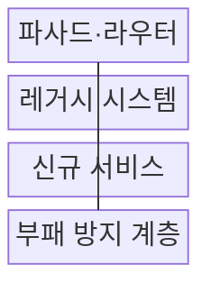
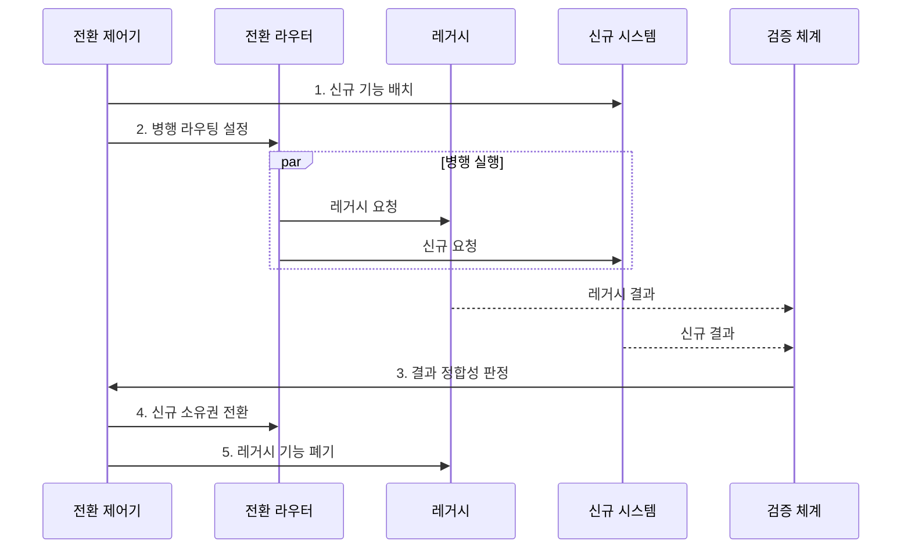

---
sidebar:
  order: 219
  label: "219. 스트랭글러 패턴 (Strangler Fig Pattern)"
  badge:
    text: "기출 · 50%"
    variant: note
title: "스트랭글러 패턴 (Strangler Fig Pattern)"
date: "2026-07-31T10:54:07+09:00"
tags: ["notes-software"]
weight: 219
extra:
  question_no: "219"
  source_status: "기출"
  source_history: "123회"
  priority: 50
  priority_note: "점진 교체와 양방향 호환이 기존 출제됨"
---

## 미리 알고가기

- **스트랭글러 피그 패턴(Strangler Fig Pattern)**: 레거시 기능을 업무 단위로 신규 시스템에 이전하고 검증된 기존 기능을 폐기하는 전환 패턴
- **파사드(Facade)**: 단일 진입점에서 요청을 신규·레거시 시스템으로 라우팅한다.
- **도메인 쉼(Domain Seam)**: 독립 이전 가능한 업무 경계 단위이다.
- **부패 방지 계층 ACL(에이씨엘, Anti-Corruption Layer)**: 영어 세 낱말의 첫 글자를 쓴 표기로 레거시 데이터 모델이 신규 모델에 번지는 것을 차단한다.
- **병행 실행(Parallel Run)**: 신·구 시스템이 같은 작업을 실행해 결과를 비교하는 방식이다.
- **변경 데이터 캡처 CDC(씨디씨, Change Data Capture)**: 영어 세 낱말의 첫 글자를 쓴 표기로 변경 로그를 읽어 다른 저장소에 반영한다.
- **데이터 소유권**: 어느 시스템이 특정 데이터의 정본을 생성·수정하는지 정한 책임이다.
- **프록시·라우팅**: 프록시는 요청을 중계하고 라우팅은 목적지 경로를 선택한다.
- **롤백·리팩터링**: 롤백은 이전 경로로 복귀하고 리팩터링은 기능 유지 상태로 내부 구조를 개선한다.
- **단일 기록원(Single Source of Truth)**: 특정 데이터의 생성·수정을 한 시스템만 담당하도록 정한 정본
- **카나리 전환(Canary Cutover)**: 일부 요청만 신규 경로로 보내 결과와 장애를 확인한 뒤 범위를 확대하는 전환 방식

> **키워드:** 스트랭글러 패턴 (Strangler Fig Pattern)

## Ⅰ. 개요

- 정의/개념: 업무 경계별 **레거시 시스템의 점진 대체**
- 배경/필요성: 일괄 재작성은 전환 결함·중단 영향이 **전체 시스템으로 확산**

### 쉽게 이해하기 (학습용)
- 낡은 건물의 방을 하나씩 새 건물로 옮기듯 업무 경계별로 교체해 전체 중단 위험을 줄인다

## Ⅱ. 특징

- 파사드의 **신·구 트래픽 분기**
- 도메인 경계별 **기능·데이터 소유권 이관**
- 병행 실행의 **결과 정합성 검증**
- **ACL**로 레거시 모델의 신규 모델 전파 차단

### 쉽게 이해하기 (학습용)
- 파사드가 신·구 경로를 나눠 보내므로 결과가 다르면 해당 업무만 레거시 경로로 되돌릴 수 있다

## Ⅲ. 구조 및 구성요소

| 구성요소 | 책임 |
|:---|:---|
| 파사드·라우터 | 업무별 **신구 요청 분기** |
| 레거시 시스템 | 미전환 업무·**데이터 정본** |
| 신규 서비스 | 전환 업무·**데이터 소유권** |
| 부패 방지 계층 | 신구 모델 **변환·격리** |

### 쉽게 이해하기 (학습용)
- 파사드가 전환 여부에 따라 신·구 시스템을 가리키고 부패 방지 계층이 두 데이터 모델을 분리한다

## Ⅳ. 흐름도

**동작 원리**

1. **신규 기능 배치**: 독립 도메인과 부패 방지 계층 구현
2. **병행 라우팅 설정**: 같은 요청을 신·구 경로로 전달
3. **결과 정합성 판정**: 업무 결과·부작용 차이 비교
4. **신규 소유권 전환**: 검증된 경계의 호출·데이터 책임 이관
5. **레거시 기능 폐기**: 잔여 의존성 확인 후 기존 경로 제거

### 쉽게 이해하기 (학습용)
- 같은 주문을 신·구 시스템에 보내 결과가 맞는지 확인한 업무부터 라우터를 신규 경로로 바꾼다

## Ⅴ. 종류 및 비교

| 레거시 개선 방식 | 점진 전환 | 일괄 재작성 | 내부 개선 |
|:---|:---|:---|:---|
| 적용 기준 | 연속 운영·**부분 경계 확보** | 소규모·**짧은 전환** 가능 | 기능 유지·**구조 개선** |
| 핵심 특징 | 업무 단위로 **신·구 교체** | 전체 시스템 **일괄 교체** | 기존 코드의 **내부 구조 개선** |
| 한계 | 이중 비용·**데이터 동기화** | 전환 실패·**대규모 결함** | **레거시 제약** 잔존 |

> 요약: 연속 운영은 **점진 전환**, 짧은 전환은 **일괄 재작성** 선택

### 쉽게 이해하기 (학습용)
- 서비스 중단을 피해야 하면 점진 전환, 전체 교체가 짧으면 재작성, 외부 동작을 유지하면 내부 개선을 고른다

## Ⅵ. 실무 고려사항 및 대책

| 고려사항 | 대책 | 효과 |
|:---|:---|:---|
| 신구 시스템의 **이중 쓰기** | 단일 기록원 지정·**CDC 동기화** | 자료 불일치 **방지** |
| 숨은 **레거시 의존성** | 호출·자료 흐름 **관측** | 이전 범위 **정확성** |
| 장기 공존의 **복잡성 증가** | 기능별 종료일·**폐기 기준** | 전환 지연 **억제** |
| 라우팅 변경의 **복귀 실패** | 카나리·**레거시 경로 복귀 시험** | 단계 전환 **복구성** |

### 쉽게 이해하기 (학습용)
- 주문 조회는 오류 시 레거시 경로로 되돌림

## Ⅶ. 결론

- 독립 업무 경계부터 **병행 검증** 후 **소유권 이관**·레거시 폐기

### 쉽게 이해하기 (학습용)
- 함께 바뀌지 않는 작은 업무부터 신·구 결과를 맞춘 뒤 라우팅과 데이터 소유권을 넘긴다
