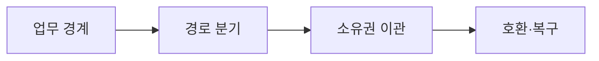

---
sidebar:
  order: 219
  label: "219. 스트랭글러 패턴 (Strangler Fig Pattern)"
  badge:
    text: "기출 · 50%"
    variant: note
title: "스트랭글러 패턴 (Strangler Fig Pattern)"
date: "2026-07-25T00:30:00+09:00"
tags: ["notes-software"]
weight: 219
extra:
  question_no: "219"
  source_status: "기출"
  source_history: "123회"
  priority: 50
  priority_note: "점진 교체와 양방향 호환이 기존 출제됨"
---

## 미리 알고가기

- **스트랭글러(Strangler)**: 레거시 기능을 업무 단위로 신규 시스템에 이전·폐기하는 패턴임
- **파사드(Facade)**: 단일 진입점에서 요청을 신규·레거시 시스템으로 라우팅함
- **도메인 쉼(Domain Seam)**: 독립 이전 가능한 업무 경계 단위임
- **부패 방지 계층 ACL(에이씨엘, Anti-Corruption Layer)**: 영어 세 낱말의 첫 글자를 쓴 표기로 레거시 데이터 모델이 신규 모델에 번지는 것을 차단함
- **병행 실행(Parallel Run)**: 신·구 시스템이 같은 작업을 실행해 결과를 비교하는 방식임
- **CDC(Change Data Capture)**: 데이터베이스 변경 로그를 읽어 다른 저장소에 반영하는 방식임
- **데이터 소유권**: 어느 시스템이 특정 데이터의 정본을 생성·수정하는지 정한 책임임
- **프록시·라우팅**: 프록시는 요청을 중계하고 라우팅은 목적지 경로를 선택함
- **롤백·리팩토링**: 롤백은 이전 경로로 복귀하고 리팩토링은 기능 유지 상태로 내부 구조를 개선함

## Ⅰ. 개요

- **정의/개념**: 레거시 시스템의 점진적 대체임
- **배경/필요성**: 일괄 전환 실패 위험으로 점진 교체 필요

### 쉽게 이해하기 (학습용)
- 부분 이전으로 중단 없이 전환함

## Ⅱ. 특징

- 파사드로 트래픽 경로를 분기한다.
- 독립 업무 영역 단위로 기능을 분리한다.
- 병행 실행으로 결과 정합성을 검증한다.
- 의존성을 제거한 뒤 레거시 자원을 폐기한다.

### 쉽게 이해하기 (학습용)
- 결함 시 이전 경로로 즉시 복원함

## Ⅲ. 아키텍처 및 구성요소

| 설계 요소 | 설명 |
|:---|:---|
| 업무 경계 | 독립성과 의존 관계로 영역을 나눔 |
| 경로 분기 | 파사드가 신·구 시스템으로 요청을 보냄 |
| 소유권 이관 | 단방향 복제 후 정본 책임을 옮김 |
| 호환·복구 | ACL과 이전 경로 복귀를 준비함 |

> 요약: 파사드와 부패 방지 계층으로 정적 경계를 구성함

### 쉽게 이해하기 (학습용)
- 파사드 레이어를 통해 신구 시스템의 역할을 정적으로 분리함

## Ⅳ. 원리 및 절차 흐름도

| 절차 | 설명 |
|:---|:---|
| **분석** | 연관도 및 리스크 진단함 |
| **선정** | 독립 도메인 단위 지정함 |
| **구현** | 부패 방지 계층 및 로직 구현함 |
| **전환** | 병행 비교 후 소유권 이관함 |
| **폐기** | 의존성 제거 후 자원 삭제함 |

> 요약: 신구 시스템 병행 검증 후 안전하게 자원을 폐기함

### 쉽게 이해하기 (학습용)
- 검증된 단위부터 순차적으로 전환하고 레거시를 닫음

## Ⅴ. 종류 및 비교

| 비교축 | 점진 전환 | 일괄 재작성 | 내부 개선 |
|:---|:---|:---|:---|
| 핵심 특징 | 업무 단위로 신·구를 교체함 | 전체 시스템을 한 번에 바꿈 | 기존 코드 내부를 개선함 |
| 적용 기준 | 연속 운영·부분 경계 확보 | 소규모·짧은 전환 가능 | 기능 유지·구조 개선 |
| 주요 위험 | 이중 비용·데이터 동기화 | 전환 실패·대규모 결함 | 레거시 제약 잔존 |

> 요약: 위험도에 따라 전환 방식 산정함

### 쉽게 이해하기 (학습용)
- 전면 개편의 전환 위험을 점진적 교체로 완화함

## Ⅵ. 실무 사례

1. 주문 조회는 파사드로 신규 경로를 늘림
2. 고객 데이터는 정본 소유권을 단계 이관함

### 쉽게 이해하기 (학습용)
- 주문 조회는 오류 시 레거시 경로로 되돌림
- 고객 데이터는 한 시스템만 쓰도록 소유권을 옮김

## Ⅶ. 결론

- 병행 결과가 같고 복귀 가능할 때만 경로를 전환함

### 쉽게 이해하기 (학습용)
- 작은 기능부터 검증해 실패 범위를 그 기능에 가둠
