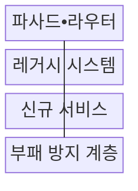
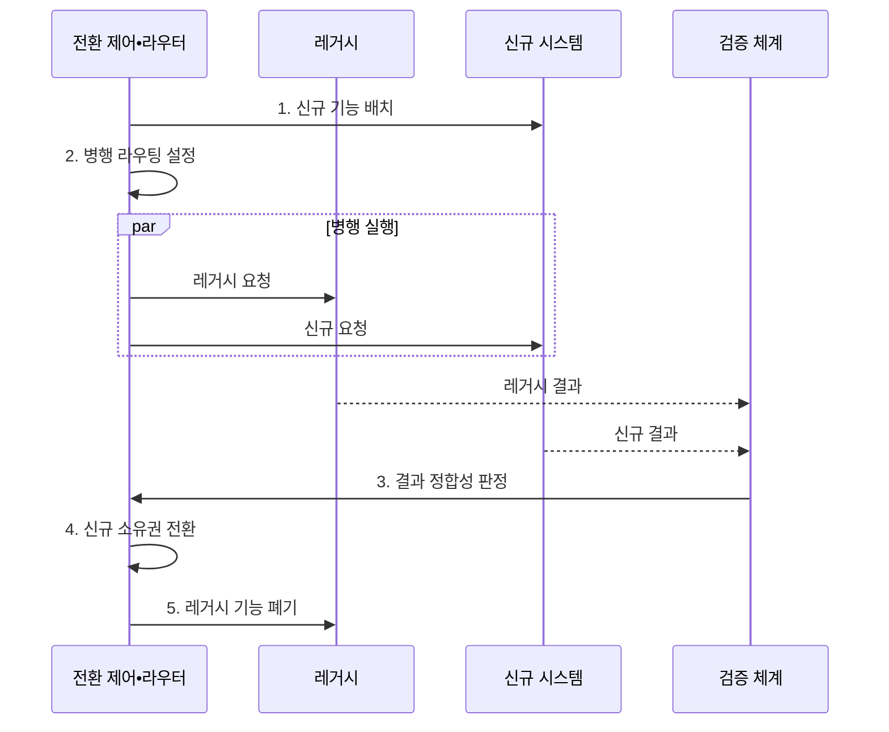

---
sidebar:
  order: 219
  label: "219. 스트랭글러 패턴 (Strangler Fig Pattern)"
  badge:
    text: "기출 • 50%"
    variant: note
title: "스트랭글러 패턴 (Strangler Fig Pattern)"
date: "2026-08-04T14:59:00+09:00"
tags: ["notes-software"]
weight: 219
extra:
  question_no: "219"
  source_status: "기출"
  source_history: "123회"
  priority: 50
  priority_note: "점진 교체와 양방향 호환이 기존 출제됨"
---

## Ⅰ. 개요

핵심 용어

- **레거시 시스템의 점진 대체**: 스트랭글러 패턴은 독립 업무 경계별로 신규 기능을 배치하고 검증된 레거시 시스템을 점진 대체한다.
- **스트랭글러 피그 패턴(Strangler Fig Pattern)**: 요청 경로를 업무 경계별 신규 서비스로 점진 전환하고 해당 레거시 기능을 단계적으로 제거하는 현대화 패턴이다.

- 정의/개념: **교살자 무화과 패턴** 은 요청 경로를 업무 경계별 새 서비스로 점진 전환하면서 해당 레거시 기능을 단계적으로 축소•제거하는 현대화 패턴
- 배경/필요성: 일괄 재작성은 전환 결함•중단 영향이 **전체 시스템으로 확산**

#### 한줄 요약
- 낡은 건물의 방을 하나씩 새 건물로 옮기듯 업무 경계별로 교체해 전체 중단 위험을 줄인다

## Ⅱ. 특징

핵심 용어

- **기능•데이터 소유권 이관**: 점진 전환은 파사드의 트래픽 분기와 병행 검증 뒤 기능 호출과 데이터 정본의 소유권을 신규 시스템에 이관한다.
- **파사드(Facade)**: 호출자 앞에서 신•구 시스템의 차이를 감추고 업무별 요청 경로를 분기하는 단일 접점이다.
- **부패 방지 계층(Anti-Corruption Layer, ACL)**: 레거시 모델을 신규 도메인 모델로 변환해 낡은 개념의 전파를 차단하는 계층이다.

- 파사드의 **신•구 트래픽 분기**
- 도메인 경계별 **기능•데이터 소유권 이관**
- 병행 실행의 **결과 정합성 검증**
- **ACL** 로 레거시 모델의 신규 모델 전파 차단

#### 한줄 요약
- 파사드가 신•구 경로를 나눠 보내므로 결과가 다르면 해당 업무만 레거시 경로로 되돌릴 수 있다

## Ⅲ. 구조 및 구성요소

핵심 용어

- **ACL 역할**: 레거시 모델을 신규 모델로 변환해 낡은 개념 전파 차단
- **데이터 정본(System of Record)**: 특정 업무 데이터의 생성•수정 권한과 최종 진실을 소유하는 시스템이다.
- **신규 서비스(New Service)**: 전환된 업무 기능과 데이터 소유권을 담당하는 독립 배포 단위이다.

| 구성요소 | 책임 |
|:---|:---|
| 파사드•라우터 | 업무별 **신구 요청 분기** |
| 레거시 시스템 | 미전환 업무•**데이터 정본** |
| 신규 서비스 | 전환 업무•**데이터 소유권** |
| 부패 방지 계층 | 신구 모델 **변환•격리** |

#### 한줄 요약
- 파사드가 전환 여부에 따라 신•구 시스템을 가리키고 부패 방지 계층이 두 데이터 모델을 분리한다

## Ⅳ. 흐름도

핵심 용어

- **4. 신규 소유권 전환**: 신•구 결과 정합성이 확인된 업무 경계의 호출 경로와 데이터 생성•수정 책임을 신규 시스템으로 넘긴다.
- **1. 신규 기능 배치**: 독립 업무 경계와 부패 방지 계층을 신규 시스템에 구현하는 단계이다.
- **2. 병행 라우팅 설정**: 같은 요청을 신•구 경로에 전달해 결과를 비교하도록 구성하는 단계이다.
- **3. 결과 정합성 판정**: 업무 결과와 외부 부작용의 차이를 허용 기준에 대조하는 단계이다.
- **5. 레거시 기능 폐기**: 잔여 호출•데이터 의존성이 없음을 확인하고 기존 경로를 제거하는 단계이다.

**동작 원리**

1. **신규 기능 배치**: 독립 도메인과 부패 방지 계층 구현
2. **병행 라우팅 설정**: 같은 요청을 신•구 경로로 전달
3. **결과 정합성 판정**: 업무 결과•부작용 차이 비교
4. **신규 소유권 전환**: 검증된 경계의 호출•데이터 책임 이관
5. **레거시 기능 폐기**: 잔여 의존성 확인 후 기존 경로 제거

#### 한줄 요약
- 같은 주문을 신•구 시스템에 보내 결과가 맞는지 확인한 업무부터 라우터를 신규 경로로 바꾼다

## Ⅴ. 종류 및 비교

핵심 용어

- **점진 전환**: 점진 전환은 서비스를 계속 운영하면서 업무 단위로 신•구 시스템을 교체하고 각 단계의 복귀를 가능하게 한다.
- **일괄 재작성(Big-Bang Rewrite)**: 신규 시스템을 전체 구현한 뒤 한 번에 기존 시스템을 대체하는 방식이다.
- **내부 개선(Internal Refactoring)**: 외부 기능과 배포 경계를 유지한 채 기존 코드의 내부 구조만 개선하는 방식이다.

| 레거시 개선 방식 | 점진 전환 | 일괄 재작성 | 내부 개선 |
|:---|:---|:---|:---|
| 적용 기준 | 연속 운영•**부분 경계 확보** | 소규모•**짧은 전환** 가능 | 기능 유지•**구조 개선** |
| 핵심 특징 | 업무 단위로 **신•구 교체** | 전체 시스템 **일괄 교체** | 기존 코드의 **내부 구조 개선** |
| 한계 | 이중 비용•**데이터 동기화** | 전환 실패•**대규모 결함** | **레거시 제약** 잔존 |

> 요약: 연속 운영은 **점진 전환**, 짧은 전환은 **일괄 재작성** 선택

#### 한줄 요약
- 서비스 중단을 피해야 하면 점진 전환, 전체 교체가 짧으면 재작성, 외부 동작을 유지하면 내부 개선을 고른다

## Ⅵ. 실무 고려사항 및 대책

핵심 용어

- **이중 쓰기**: 이중 쓰기는 신•구 시스템이 같은 데이터를 동시에 수정해 어느 쪽이 정본인지 불명확하고 값이 어긋나는 문제다.
- **변경 데이터 캡처(Change Data Capture, CDC)**: 데이터베이스의 변경 로그를 읽어 다른 저장소에 변경 내용을 전달하는 동기화 방식이다.
- **카나리 전환(Canary Cutover)**: 소수 사용자나 트래픽부터 신규 경로로 보내 결과를 확인한 뒤 범위를 확대하는 방식이다.

| 문제 | 대책 | 효과 |
|:---|:---|:---|
| 신구 시스템의 **이중 쓰기** | 단일 기록원 지정•**CDC 동기화** | 자료 불일치 **방지** |
| 숨은 **레거시 의존성** | 호출•자료 흐름 **관측** | 이전 범위 **정확성** |
| 장기 공존의 **복잡성 증가** | 기능별 종료일•**폐기 기준** | 전환 지연 **억제** |
| 라우팅 변경의 **복귀 실패** | 카나리•**레거시 경로 복귀 시험** | 단계 전환 **복구성** |

#### 한줄 요약
- 주문 조회는 오류 시 레거시 경로로 되돌림

## Ⅶ. 결론

핵심 용어

- **소유권 이관**: 독립 업무 경계부터 병행 검증한 뒤 호출과 데이터 소유권 이관을 완료하고 잔여 의존성이 없는 레거시 기능을 폐기한다.
- **완료 기준(Exit Criteria)**: 호출•데이터 소유권 이전과 잔여 의존성 제거를 확인해 레거시 폐기를 허용하는 조건이다.

- 독립 업무 경계부터 **병행 검증** 후 **소유권 이관**•레거시 폐기

#### 한줄 요약
- 함께 바뀌지 않는 작은 업무부터 신•구 결과를 맞춘 뒤 라우팅과 데이터 소유권을 넘긴다
