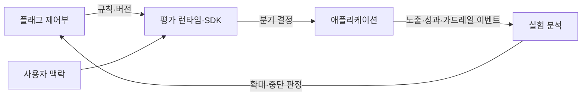

---
sidebar:
  order: 220
  label: "220. 피처 토글·실험 플랫폼 (Feature Toggle Experimentation)"
  badge:
    text: "기출 · 70%"
    variant: note
title: "피처 토글·실험 플랫폼 (Feature Toggle Experimentation)"
date: "2026-07-27T23:59:59+09:00"
tags: ["notes-software"]
weight: 220
extra:
  question_no: "220"
  source_status: "기출"
  source_history: "138회"
  priority: 70
  priority_note: "기능 노출 분리와 즉시 복구가 최근 출제됨"
---

## 미리 알고가기

- **피처 토글 FT(에프티, Feature Toggle)**: 영어 두 낱말의 첫 글자를 쓴 표기로 배포와 기능 노출을 분리해 실행 경로를 선택함
- **릴리즈 토글(Release Toggle)**: 미완성 기능을 점진적으로 사용자에게 노출함
- **실험 토글(Experiment Toggle)**: 무작위 사용자군 대상 변종 효과 측정함
- **운영 토글(Operational Toggle)**: 장애 시 기능을 즉시 비활성화하는 스위치임
- **노출 로그(Exposure Log)**: 사용자가 노출된 변종 이력을 기록함
- **가드레일 지표(Guardrail Metric)**: 서비스 악화를 방지하는 예방 지표임
- **대조군·변종군**: 대조군은 기존 기능, 변종군은 새 기능에 노출된 비교 집단임
- **무작위 해시 할당**: 사용자 식별자를 일정 비율의 집단에 재현 가능하게 배정하는 방식임
- **평가 런타임**: 요청 시 플래그 규칙을 계산해 실행할 기능 경로를 반환하는 구성요소임
- **컨트롤 플레인**: 플래그·대상·비율·만료일을 등록하고 배포하는 관리 계층임
- **통계적 유의성**: 관측한 차이가 우연일 가능성이 정한 기준보다 낮은지 나타내는 판단임
- **토글 부채**: 만료된 분기 코드가 남아 복잡도와 시험 조합을 늘리는 기술 부채임

## Ⅰ. 개요

- 정의/개념: 배포와 **기능 노출 시점·대상 분리**
- **배경/필요성**: 배포와 노출 결합의 **복구·실험 한계** 해소

### 쉽게 이해하기 (학습용)
- 배포 롤백 없이 플래그 제어로 빠른 복구를 수행함

## Ⅱ. 특징

- 배포와 **기능 활성화 시점 분리**
- 무작위 해시의 **대조군·변종군 배정**
- 노출 로그의 **기능 효과 검증**

### 쉽게 이해하기 (학습용)
- 사용자 노출 정보를 수집하여 데이터로 검증함

## Ⅲ. 아키텍처 및 구성요소

| 설계 요소 | 설명 |
|:---|:---|
| 플래그 제어부 | 플래그 소유자·규칙·버전·만료일을 관리함 |
| 사용자 맥락 | 사용자·단말·지역 속성으로 실험군을 일관되게 결정함 |
| 평가 런타임·SDK | 규칙을 계산해 애플리케이션의 기능 분기를 결정함 |
| 애플리케이션 | 분기 결과에 따라 기존·후보 기능을 실행하고 노출 이벤트를 기록함 |
| 실험 분석 | 성과와 가드레일 악화를 분석해 확대·중단 여부를 판정함 |

> 요약: 제어부의 규칙을 런타임이 평가하고 노출·성과 이벤트를 분석해 확대 여부를 결정함

### 쉽게 이해하기 (학습용)
- 플래그 제어부와 평가 런타임을 정적으로 배치함

## Ⅳ. 원리 및 절차 흐름도

| 절차 | 설명 |
|:---|:---|
| **정의** | 평가 지표 및 모수 설정함 |
| **구성** | 소유 부서 및 룰 조건 설정함 |
| **노출** | 사용자 분배 및 로그 수집함 |
| **판정** | 에러율 및 유의성 분석함 |
| **정리** | 잔여 코드 및 플래그 정리함 |

> 요약: 가드레일 판정 후 점진 확대하고 미사용 플래그를 정리함

### 쉽게 이해하기 (학습용)
- 가설 검증 후 잔여 스크립트를 깔끔히 정돈함

## Ⅴ. 종류 및 비교

| 피처 토글 유형 | 릴리즈 토글 | 실험 토글 | 운영 토글 |
|:---|:---|:---|:---|
| 적용 기준 | 배포 후 점진 노출 | 가설·지표 비교 필요 | 긴급 기능 차단 필요 |
| 핵심 특징 | 기능 단계적 개방 | 집단별 효과 측정 | 장애 기능 즉시 차단 |
| 한계 | 제거 지연·분기 누적 | 표본 편향·오노출 | 상시 의존·복구 누락 |

> 요약: 목적별 수명과 제거 지침 정의함

### 쉽게 이해하기 (학습용)
- 토글 목적에 맞춰 수명과 제어 방식을 격리함

## Ⅵ. 실무 사례

1. 결제 오류율 상승 시 **운영 토글 차단**

### 쉽게 이해하기 (학습용)
- 결제 오류가 임계를 넘으면 배포 없이 기능을 끔

## Ⅶ. 결론

- 배포와 실험 노출을 분리해 변경 위험을 통제하기 위해 **대상 코호트·성과 지표·안전 가드레일·토글 수명**을 검토하고, 기준을 충족한 실험만 확대한 뒤 토글을 제거한다

### 쉽게 이해하기 (학습용)
- 켜고 끄는 데서 끝내지 말고 결과 판정 뒤 코드를 정리함
