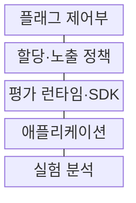
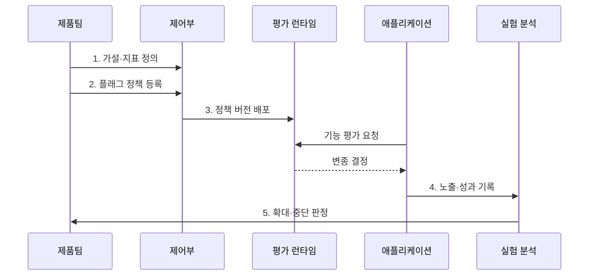

---
sidebar:
  order: 220
  label: "220. 피처 토글·실험 플랫폼 (Feature Toggle Experimentation)"
  badge:
    text: "기출 · 70%"
    variant: note
title: "피처 토글·실험 플랫폼 (Feature Toggle Experimentation)"
date: "2026-08-02T12:00:00+09:00"
tags: ["notes-software"]
weight: 220
extra:
  question_no: "220"
  source_status: "기출"
  source_history: "138회"
  priority: 70
  priority_note: "기능 노출 분리와 즉시 복구가 최근 출제됨"
---

## Ⅰ. 개요

핵심 용어

- **기능 노출 시점·대상**: 피처 토글은 코드 배포와 기능 노출 시점·대상을 분리해 요청별 실행 경로를 제어한다.

- 정의/개념: 배포와 **기능 노출 시점·대상**을 분리하는 릴리즈 제어 기법
- 배경/필요성: 배포·노출 결합으로 **부분 실험·즉시 차단 불가**

### 쉽게 이해하기 (학습용)
- 새 코드는 미리 배포해 두고 스위치로 일부 사용자에게만 열어 이상 시 배포 롤백 없이 즉시 닫는다

## Ⅱ. 특징

핵심 용어

- **대조군·변종군 배정**: 안정 키와 무작위 해시를 사용해 같은 사용자를 실험 기간 동안 일관된 대조군·변종군에 배정한다.

- 배포와 **기능 활성화 시점 분리**
- 무작위 해시의 **대조군·변종군 배정**
- 노출 로그의 **기능 효과 검증**

### 쉽게 이해하기 (학습용)
- 같은 사용자에게 같은 변종을 보여 주고 실제 노출 기록과 성과를 연결해야 기능 차이만 비교할 수 있다

## Ⅲ. 구조 및 구성요소

핵심 용어

- **평가 런타임·SDK**: 평가 런타임·SDK는 요청 시 플래그 정책을 계산해 애플리케이션이 실행할 기능 경로를 반환한다.

| 구성요소 | 책임 |
|:---|:---|
| 플래그 제어부 | 소유자·규칙·**버전·만료 관리** |
| 할당·노출 정책 | 속성·안정 키 기반 **실험군 일관 배정** |
| 평가 런타임·SDK | 규칙 계산·**기능 분기** |
| 애플리케이션 | 기존·후보 **실행·노출 기록** |
| 실험 분석 | 성과·가드레일 **확대·중단 판정** |

### 쉽게 이해하기 (학습용)
- 제어부가 토글 규칙을 배포하면 런타임이 사용자 집단을 정하고 앱과 분석기가 노출·성과를 연결한다

## Ⅳ. 흐름도

핵심 용어

- **5. 확대·중단 판정**: 사전에 정한 효과·가드레일 지표와 관측 기간, 통계적 유의성을 기준으로 기능 노출을 확대하거나 중단한다.

**동작 원리**

1. **가설·지표 정의**: 기대 효과와 가드레일 지표 설정
2. **플래그 정책 등록**: 소유자·대상·비율·만료일 지정
3. **정책 버전 배포**: 평가 런타임에 불변 규칙 전달
4. **노출·성과 기록**: 사용자 배정과 업무 결과 결속
5. **확대·중단 판정**: 효과·오류율·**통계적 유의성**으로 노출 결정

### 쉽게 이해하기 (학습용)
- 일부 사용자에게 새 기능을 보여 준 기록과 성과를 묶어 확대·중단을 정하고 끝난 스위치 코드를 제거한다

## Ⅴ. 종류 및 비교

핵심 용어

- **실험 토글**: 실험 토글은 무작위 사용자군에 서로 다른 변종을 노출하고 노출 로그와 업무 성과를 연결해 효과를 비교한다.

| 피처 토글 유형 | 릴리즈 토글 | 실험 토글 | 운영 토글 |
|:---|:---|:---|:---|
| 적용 기준 | 배포 후 **점진 노출** | **가설·지표 비교** 필요 | 긴급 **기능 차단** 필요 |
| 핵심 특징 | 기능의 **단계적 개방** | 집단별 **효과 측정** | 장애 기능 **즉시 차단** |
| 한계 | 제거 지연·**분기 누적** | 표본 편향·**오노출** | 상시 의존·**복구 누락** |

> 요약: 노출 목적별 **토글 유형**, 종료 시 **분기 제거 조건** 지정

### 쉽게 이해하기 (학습용)
- 점진 공개는 릴리즈, 효과 비교는 실험, 긴급 차단은 운영 토글로 나누고 종료 뒤 분기를 지운다

## Ⅵ. 실무 고려사항 및 대책

핵심 용어

- **토글 잔존**: 토글 잔존은 실험이나 출시가 끝난 분기 코드가 제거되지 않아 조건 복잡도와 시험 조합을 계속 늘리는 문제다.

| 문제 | 대책 | 효과 |
|:---|:---|:---|
| 사용 종료 뒤 **토글 잔존** | 소유자·만료일·**자동 정리** | 조건 복잡성 **감소** |
| 사용자별 **할당 불일치** | 안정 키·**일관 해시 적용** | 실험 오염 **방지** |
| 반복 확인의 **유의성 왜곡** | 사전 지표·기간·**중단 규칙** | 통계 신뢰성 **확보** |
| 실험 자료의 **동의 누락** | 최소 수집·**목적 동의 적용** | 프라이버시 **보호** |

### 쉽게 이해하기 (학습용)
- 결제 오류가 임계를 넘으면 배포 없이 기능을 끔

## Ⅶ. 결론

핵심 용어

- **운영 토글**: 점진 노출과 효과 비교에는 릴리즈·실험 토글을 사용하고 장애 기능을 즉시 차단할 때는 운영 토글을 사용한다.

- 점진 노출·효과 비교는 **릴리즈·실험 토글**, 장애 차단은 **운영 토글**

### 쉽게 이해하기 (학습용)
- 토글 목적과 만료일을 먼저 정하고 노출 결과를 판정한 뒤 남은 분기 코드를 제거한다
