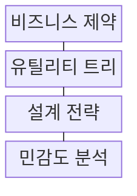
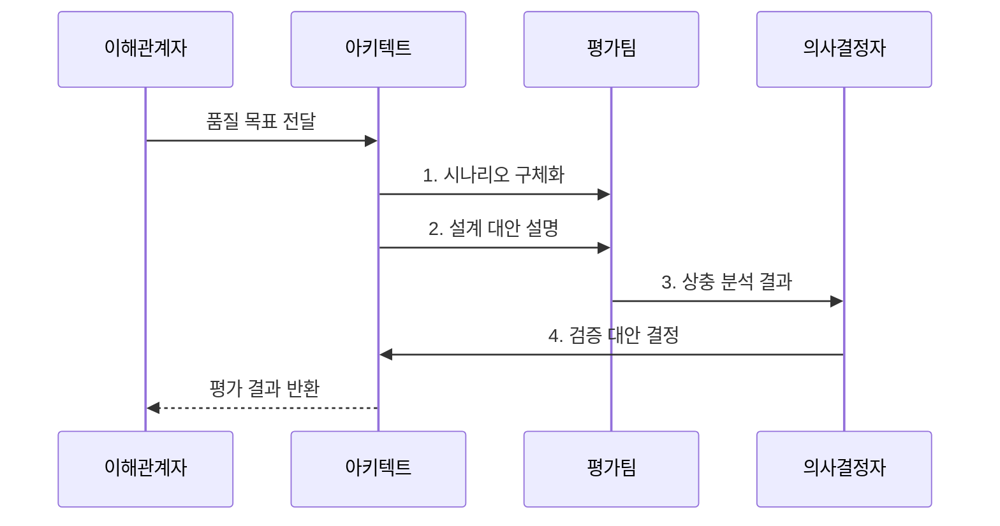

---
sidebar:
  order: 221
  label: "221. 소프트웨어 아키텍처 품질 속성 트레이드오프 (Architecture Quality Tradeoff)"
  badge:
    text: "기출 · 70%"
    variant: note
title: "소프트웨어 아키텍처 품질 속성 트레이드오프 (Architecture Quality Tradeoff)"
date: "2026-08-02T12:00:00+09:00"
tags: ["notes-software"]
weight: 221
extra:
  question_no: "221"
  source_status: "기출"
  source_history: "120회"
  priority: 70
  priority_note: "품질 속성 간 비용·효과 판단이 반복 활용됨"
---

## Ⅰ. 개요

핵심 용어

- **비기능 요구사항(NFR)**: 비기능 요구사항은 성능·가용성·보안 같은 품질 목표와 제약을 측정 가능한 기준으로 정의한다.

- 정의/개념: **비기능 요구사항(NFR)**의 품질 간 영향을 평가하는 설계 의사결정 기법
- 배경/필요성: 단일 품질 최적화는 **다른 품질 저하** 유발

### 쉽게 이해하기 (학습용)
- 설계 목표치 합격 구간을 사전에 조율함

## Ⅱ. 특징

핵심 용어

- **유틸리티 트리**: 유틸리티 트리는 품질 목표를 시나리오로 세분화하고 중요도와 난이도로 우선순위를 정한다.

- **시나리오화**: 요구 조건을 측정 가능한 응답으로 변환
- **우선순위화**: 유틸리티 트리로 품질 요구 정렬
- **상충 분석**: 택틱의 민감점·부작용 비교
- **ATAM**: 시나리오별 위험·민감점·상충점 평가

### 쉽게 이해하기 (학습용)
- 추상적 품질 지표를 측정 가능 사양으로 작성함

## Ⅲ. 구조 및 구성요소

핵심 용어

- **민감도 분석**: 민감도 분석은 설계 파라미터 변화가 품질 속성과 상충 관계에 미치는 영향을 측정한다.

| 구성요소 | 책임 |
|:---|:---|
| 비즈니스 제약 | 목표·예산·**규제·일정 합의** |
| 유틸리티 트리 | 품질 시나리오 **우선순위** |
| 설계 전략 | 품질 목표의 **택틱·패턴** |
| 민감도 분석 | 품질 영향·**상충 관계 측정** |

### 쉽게 이해하기 (학습용)
- 정량화된 가치 평가 테이블을 작성해 선택함

## Ⅳ. 흐름도

핵심 용어

- **3. 상충 분석 결과**: 평가팀은 대안별 효익, 민감점, 다른 품질의 부작용을 비교한 상충 분석 결과를 전달한다.

**동작 원리**

1. **시나리오 구체화**: 자극·환경·응답 수치화
2. **설계 대안 설명**: 택틱·전제·가설 공개
3. **상충 분석 결과**: 효익·민감점·부작용 비교
4. **검증 대안 결정**: 시험 결과·수용 위험 기록

### 쉽게 이해하기 (학습용)
- 상황별 부작용 한계를 계측하여 대안을 비교함

## Ⅴ. 종류 및 비교

핵심 용어

- **가용성 택틱**: 가용성 택틱은 복제와 장애 전환으로 중단을 줄이지만 비용과 상태 동기화 복잡도를 높일 수 있다.

| 품질 속성 택틱 | **성능 택틱** | **가용성 택틱** | **보안 택틱** |
|:---|:---|:---|:---|
| 적용 기준 | 응답 시간·처리량 우선 | 연속 운영·복구 우선 | 기밀성·무결성 우선 |
| 핵심 특징 | 비동기·캐시로 지연 감소 | 복제·전환으로 중단 감소 | 암호화·권한으로 접근 제한 |
| 한계 | 일관성·복잡도 악화 | 비용·동기화 증가 | 지연·사용성 저하 |

> 요약: **품질 측정값·비용**을 함께 비교해 택틱 선택

### 쉽게 이해하기 (학습용)
- 단일 요인 개선에 따른 다른 품질 악화를 체크함

## Ⅵ. 실무 고려사항 및 대책

핵심 용어

- **국소 최적화**: 국소 최적화는 한 구성요소의 품질만 개선해 전체 경로의 다른 필수 품질을 악화시키는 문제다.

| 문제 | 대책 | 효과 |
|:---|:---|:---|
| 모호한 **품질 시나리오** | 자극·환경·응답 **수치화** | 대안 비교 **가능성** |
| 이해관계자의 **가중치 충돌** | 사업 목표·**우선순위 합의** | 판단 기준 **투명성** |
| 한 구성의 **국소 최적화** | 전체 경로·**부작용 분석** | 품질 전이 **통제** |
| 근거 없는 **아키텍처 결정** | ADR·측정·**재검토 조건 기록** | 결정 추적성 **확보** |
| 품질 저하의 **발견 지연** | 텔레메트리 기반 **피트니스 함수** | 품질 제약 **상시 검증** |

### 쉽게 이해하기 (학습용)
- 캐시로 빨라져도 중복 결제가 늘면 채택하지 않음

## Ⅶ. 결론

핵심 용어

- **택틱 적용**: 필수 품질 한계를 위반하는 대안은 폐기하고 모든 한계를 충족하는 대안에 검증된 택틱을 적용한다.

- 필수 품질 한계 위반 대안은 **폐기**, 충족 대안은 **택틱 적용**

### 쉽게 이해하기 (학습용)
- 한 품질 개선이 다른 필수 한도를 깨면 설계를 바꿈
