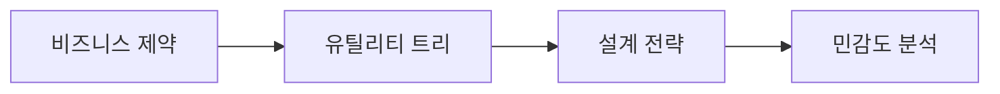

---
sidebar:
  order: 221
  label: "221. 소프트웨어 아키텍처 품질 속성 트레이드오프 (Architecture Quality Tradeoff)"
  badge:
    text: "기출 · 70%"
    variant: note
title: "소프트웨어 아키텍처 품질 속성 트레이드오프 (Architecture Quality Tradeoff)"
date: "2026-07-27T23:59:59+09:00"
tags: ["notes-software"]
weight: 221
extra:
  question_no: "221"
  source_status: "기출"
  source_history: "120회"
  priority: 70
  priority_note: "품질 속성 간 비용·효과 판단이 반복 활용됨"
---

## 미리 알고가기

- **품질 속성 QA(큐에이, Quality Attribute)**: 영어 두 낱말의 첫 글자를 쓴 표기로 시스템이 얼마나 잘 동작하는지를 수치화한 비기능 특성임
- **비기능 요구사항 NFR(엔에프알, Non-Functional Requirements)**: 영어 핵심어의 첫 글자를 쓴 표기로 시스템 품질과 제약을 명시적 척도로 정의함
- **품질 속성 시나리오(Quality Attribute Scenario)**: 품질 요구를 자극과 응답 측정값으로 구체화함
- **아키텍처 택틱(Architectural Tactic)**: 품질 목표를 달성하도록 설계 결정을 제어하는 기법임
- **민감점(Sensitivity Point)**: 설계 파라미터 변화가 특정 품질 속성에 큰 영향을 주는 지점임
- **트레이드오프 지점(Tradeoff Point)**: 하나의 설계 결정이 다수 품질 속성에 상충을 유발하는 지점임
- **아키텍처 트레이드오프 분석 방법 ATAM(에이탬, Architecture Tradeoff Analysis Method)**: 영어 네 낱말의 첫 글자를 쓴 표기로 시나리오별 위험·민감점·상충점을 평가함
- **유틸리티 트리**: 품질 목표를 시나리오로 세분화하고 중요도·난이도로 우선순위를 정한 트리임
- **피트니스 함수**: 아키텍처가 정한 품질 제약을 계속 만족하는지 자동 측정하는 검사임
- **텔레메트리**: 실행 중 지연·오류·자원 사용량을 자동 수집한 관측 데이터임
- **수용 위험**: 비용·일정 때문에 제거하지 않고 책임자 합의로 받아들이는 잔여 위험임

## Ⅰ. 개요

- 정의/개념: 품질 속성의 **상충 분석과 설계 대안 선택**
- **배경/필요성**: 단일 품질 최적화의 **타 품질 저하 한계** 해소

### 쉽게 이해하기 (학습용)
- 설계 목표치 합격 구간을 사전에 조율함

## Ⅱ. 특징

- 요구 조건의 **측정 가능 품질 시나리오화**
- 유틸리티 트리의 **품질 요구 우선순위화**
- 택틱의 **민감점·상충점 분석**

### 쉽게 이해하기 (학습용)
- 추상적 품질 지표를 측정 가능 사양으로 작성함

## Ⅲ. 아키텍처 및 구성요소

| 설계 요소 | 설명 |
|:---|:---|
| 비즈니스 제약 | 목표·예산·규제·일정을 합의함 |
| 유틸리티 트리 | 품질 시나리오의 우선순위를 정함 |
| 설계 전략 | 목표를 달성할 택틱과 패턴을 설계함 |
| 민감도 분석 | 설계 변화가 품질에 주는 영향을 측정함 |

> 요약: 사업 방향을 계측 시나리오로 정의해 결정함

### 쉽게 이해하기 (학습용)
- 정량화된 가치 평가 테이블을 작성해 선택함

## Ⅳ. 원리 및 절차 흐름도

| 절차 | 설명 |
|:---|:---|
| **목표수집** | 도메인 범위와 규제 제약 정의함 |
| **시나리오** | 측정 가능한 평가 지표 수치화함 |
| **접근설명** | 적용 기술과 전제 가설 공개함 |
| **상충분석** | 설계 대안과 유틸리티 민감점 대조함 |
| **검증결정** | 모형 테스트 후 수용 위험 명시함 |

> 요약: 설계 민감 요소를 분석해 결과에 반영함

### 쉽게 이해하기 (학습용)
- 상황별 부작용 한계를 계측하여 대안을 비교함

## Ⅴ. 종류 및 비교

| 품질 속성 택틱 | 성능 택틱 | 가용성 택틱 | 보안 택틱 |
|:---|:---|:---|:---|
| 적용 기준 | 응답 시간·처리량 우선 | 연속 운영·복구 우선 | 기밀성·무결성 우선 |
| 핵심 특징 | 비동기·캐시로 지연 감소 | 복제·전환으로 중단 감소 | 암호화·권한으로 접근 제한 |
| 한계 | 일관성·복잡도 악화 | 비용·동기화 증가 | 지연·사용성 저하 |

> 요약: 품질 메트릭과 비용을 종합적으로 판단함

### 쉽게 이해하기 (학습용)
- 단일 요인 개선에 따른 다른 품질 악화를 체크함

## Ⅵ. 실무 사례

1. 결제 API의 **지연·이중 결제 위험 평가**

### 쉽게 이해하기 (학습용)
- 캐시로 빨라져도 중복 결제가 늘면 채택하지 않음

## Ⅶ. 결론

- **품질 시나리오·수용 위험**이 합의된 대안 채택

### 쉽게 이해하기 (학습용)
- 한 품질 개선이 다른 필수 한도를 깨면 설계를 바꿈
