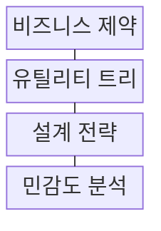
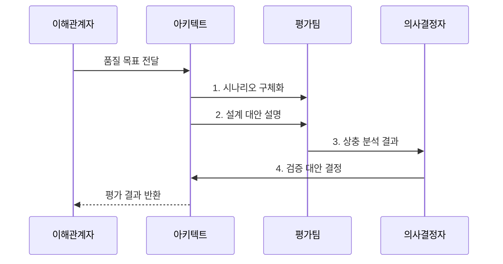

---
sidebar:
  order: 221
  label: "221. 소프트웨어 아키텍처 품질 속성 트레이드오프 (Architecture Quality Tradeoff)"
  badge:
    text: "기출 · 70%"
    variant: note
title: "소프트웨어 아키텍처 품질 속성 트레이드오프 (Architecture Quality Tradeoff)"
date: "2026-07-30T16:24:00+09:00"
tags: ["notes-software"]
weight: 221
extra:
  question_no: "221"
  source_status: "기출"
  source_history: "120회"
  priority: 70
  priority_note: "품질 속성 간 비용·효과 판단이 반복 활용됨"
---

## 미리 알고가기

- **품질 속성 QA(큐에이, Quality Attribute)**: 영어 두 낱말의 첫 글자를 쓴 표기로 시스템이 얼마나 잘 동작하는지를 수치화한 비기능 특성이다.
- **비기능 요구사항 NFR(엔에프알, Non-Functional Requirements)**: 영어 핵심어의 첫 글자를 쓴 표기로 시스템 품질과 제약을 명시적 척도로 정의한다.
- **품질 속성 시나리오(Quality Attribute Scenario)**: 품질 요구를 자극과 응답 측정값으로 구체화한다.
- **아키텍처 택틱(Architectural Tactic)**: 품질 목표를 달성하도록 설계 결정을 제어하는 기법이다.
- **민감점(Sensitivity Point)**: 설계 파라미터 변화가 특정 품질 속성에 큰 영향을 주는 지점이다.
- **트레이드오프 지점(Tradeoff Point)**: 하나의 설계 결정이 다수 품질 속성에 상충을 유발하는 지점이다.
- **아키텍처 트레이드오프 분석 방법 ATAM(에이탬, Architecture Tradeoff Analysis Method)**: 영어 네 낱말의 첫 글자를 쓴 표기로 시나리오별 위험·민감점·상충점을 평가한다.
- **유틸리티 트리**: 품질 목표를 시나리오로 세분화하고 중요도·난이도로 우선순위를 정한 트리이다.
- **피트니스 함수**: 아키텍처가 정한 품질 제약을 계속 만족하는지 자동 측정하는 검사이다.
- **텔레메트리**: 실행 중 지연·오류·자원 사용량을 자동 수집한 관측 데이터이다.
- **수용 위험**: 비용·일정 때문에 제거하지 않고 책임자 합의로 받아들이는 잔여 위험이다.
- **아키텍처 결정 기록(Architecture Decision Record, ADR)**: 설계 대안·결정·근거·재검토 조건을 남기는 문서
- **캐시(Cache)**: 자주 쓰는 데이터를 가까운 저장소에 두어 응답 지연을 줄이는 기법
- **복제(Replication)**: 데이터나 서비스를 여러 사본으로 유지해 장애 대응력을 높이는 기법
- **암호화(Encryption)**: 데이터를 허가된 주체만 해석하도록 변환하는 보안 기법
- **성능·가용성·보안**: 응답 효율·연속 운영·정보 보호를 나타내는 대표 품질 속성
- **일관성(Consistency)**: 여러 사본이나 연산이 정한 규칙과 동일한 상태를 보장하는 속성

## Ⅰ. 개요

- 정의/개념: 품질 속성 간 영향을 평가하는 **설계 의사결정 기법**
- 배경/필요성: 단일 품질 최적화는 **다른 품질 저하** 유발

### 쉽게 이해하기 (학습용)
- 설계 목표치 합격 구간을 사전에 조율함

## Ⅱ. 특징

- **시나리오화**: 요구 조건을 측정 가능한 응답으로 변환
- **우선순위화**: 유틸리티 트리로 품질 요구 정렬
- **상충 분석**: 택틱의 민감점·부작용 비교

### 쉽게 이해하기 (학습용)
- 추상적 품질 지표를 측정 가능 사양으로 작성함

## Ⅲ. 구조 및 구성요소

| 구성요소 | 책임 |
|:---|:---|
| 비즈니스 제약 | 목표·예산·**규제·일정 합의** |
| 유틸리티 트리 | 품질 시나리오 **우선순위** |
| 설계 전략 | 품질 목표의 **택틱·패턴** |
| 민감도 분석 | 품질 영향·**상충 관계 측정** |

### 쉽게 이해하기 (학습용)
- 정량화된 가치 평가 테이블을 작성해 선택함

## Ⅳ. 흐름도

**동작 원리**

1. **시나리오 구체화**: 자극·환경·응답 수치화
2. **설계 대안 설명**: 택틱·전제·가설 공개
3. **상충 분석 결과**: 효익·민감점·부작용 비교
4. **검증 대안 결정**: 시험 결과·수용 위험 기록

### 쉽게 이해하기 (학습용)
- 상황별 부작용 한계를 계측하여 대안을 비교함

## Ⅴ. 종류 및 비교

| 품질 속성 택틱 | **성능 택틱** | **가용성 택틱** | **보안 택틱** |
|:---|:---|:---|:---|
| 적용 기준 | 응답 시간·처리량 우선 | 연속 운영·복구 우선 | 기밀성·무결성 우선 |
| 핵심 특징 | 비동기·캐시로 지연 감소 | 복제·전환으로 중단 감소 | 암호화·권한으로 접근 제한 |
| 한계 | 일관성·복잡도 악화 | 비용·동기화 증가 | 지연·사용성 저하 |

> 요약: **품질 측정값·비용**을 함께 비교해 택틱 선택

### 쉽게 이해하기 (학습용)
- 단일 요인 개선에 따른 다른 품질 악화를 체크함

## Ⅵ. 실무 고려사항 및 대책

| 고려사항 | 대책 | 효과 |
|:---|:---|:---|
| 모호한 **품질 시나리오** | 자극·환경·응답 **수치화** | 대안 비교 **가능성** |
| 이해관계자의 **가중치 충돌** | 사업 목표·**우선순위 합의** | 판단 기준 **투명성** |
| 한 구성의 **국소 최적화** | 전체 경로·**부작용 분석** | 품질 전이 **통제** |
| 근거 없는 **아키텍처 결정** | ADR·측정·**재검토 조건 기록** | 결정 추적성 **확보** |

### 쉽게 이해하기 (학습용)
- 캐시로 빨라져도 중복 결제가 늘면 채택하지 않음

## Ⅶ. 결론

- 필수 품질 한계 위반 대안은 **폐기**, 충족 대안은 **택틱 적용**

### 쉽게 이해하기 (학습용)
- 한 품질 개선이 다른 필수 한도를 깨면 설계를 바꿈
