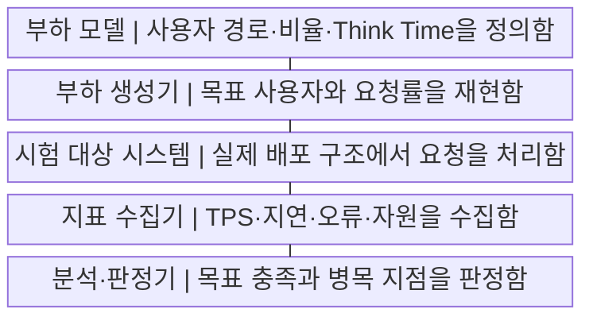
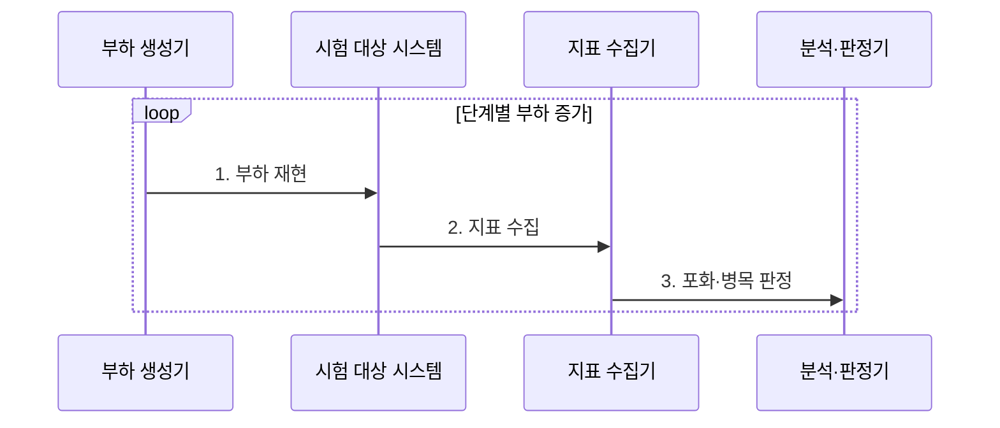

---
sidebar:
  order: 222
  label: "222. 성능 테스트 지표: TPS·응답시간·동시 사용자 (Performance Test Metrics)"
  badge:
    text: "기출 · 70%"
    variant: note
title: "성능 테스트 지표: TPS·응답시간·동시 사용자 (Performance Test Metrics)"
date: "2026-07-29T19:51:00+09:00"
tags: ["notes-software"]
weight: 222
extra:
  question_no: "222"
  source_status: "기출"
  source_history: "131회"
  priority: 70
  priority_note: "처리량·지연·동시사용자 관계가 기존 출제됨"
---

## 미리 알고가기

- **초당 트랜잭션 수 TPS(티피에스, Transactions Per Second)**: 영어 세 낱말의 첫 글자를 쓴 표기로 시스템이 1초 동안 완료한 업무 트랜잭션 수를 나타내며 처리 용량을 측정한다.
- **응답 시간**: 요청을 보낸 시점부터 전체 응답을 받을 때까지 걸린 시간이다.
- **동시 사용자**: 같은 측정 구간에 시스템과 세션·요청을 주고받는 사용자 수이다.
- **분위수**: 응답 시간 표본 중 일정 비율이 해당 값 이하인 위치 지표이다.
- **p95(피 나인티파이브, 95th Percentile)**: percentile의 첫 글자 p와 95를 붙여 전체 응답의 95%가 해당 시간 이하로 완료됐음을 나타내며 느린 사용자 지연을 판단한다.
- **사고 시간(Think Time)**: 사용자가 응답을 본 뒤 다음 요청을 보내기까지 기다리는 시간으로 실제 사용자 부하 간격을 재현한다.
- **오류율·포화도**: 오류율은 실패 비율이고 포화도는 자원 용량이 사용된 정도이다.
- **부하·스트레스·내구 시험**: 목표 부하, 한계 초과, 장시간 부하를 각각 검증하는 시험이다.
- **병목**: 전체 처리량 증가를 제한하는 가장 먼저 포화된 자원이나 구간이다.
- **서비스 수준 목표(Service Level Objective, SLO)**: 지연·오류율처럼 서비스가 지켜야 할 측정 목표로 성능 시험의 통과 기준을 정한다.
- **실사용자 모니터링(Real User Monitoring, RUM)**: 실제 사용자의 브라우저·기기에서 지연과 오류를 수집해 시험 결과와 비교하는 관측 방식이다.

## Ⅰ. 개요

- 정의/개념: **처리량·응답시간·동시성**으로 성능 수치화
- 배경/필요성: 단일 평균값으로 **꼬리 지연·병목 오판**

### 쉽게 이해하기 (학습용)
- 처리량과 지연을 함께 봐야 실제 수용량을 앎

## Ⅱ. 특징

- **TPS·응답 분위수**를 함께 측정
- **Think Time**으로 실제 요청 간격 재현
- 부하별 **오류율·자원 포화도** 확인

### 쉽게 이해하기 (학습용)
- TPS가 늘 때 지연·오류가 급증하는 지점을 찾음

## Ⅲ. 구조 및 구성요소

| 구성요소 | 책임 |
|:---|:---|
| 부하 모델 | 사용자 경로·**Think Time 정의** |
| 부하 생성기 | 목표 사용자·**요청률 재현** |
| 시험 대상 시스템 | 실제 배포 구조·**요청 처리** |
| 지표 수집기 | TPS·지연·**오류·자원 수집** |
| 분석·판정기 | 목표 충족·**병목 지점 판정** |

### 쉽게 이해하기 (학습용)
- 실제 사용자 흐름으로 부하를 만들고 병목을 찾음

## Ⅳ. 흐름도

**동작 원리**

1. **부하 재현**: 사용자 경로·Think Time 기반 부하
2. **지표 수집**: TPS·응답·오류·자원 기록
3. **포화·병목 판정**: 목표 위반·포화 구간 연결

### 쉽게 이해하기 (학습용)
- 임계점 진입 시 오류 발생 여부 검증

## Ⅴ. 종류 및 비교

| 성능 시험 지표 | TPS | 응답 시간 | 동시 사용자 |
|:---|:---|:---|:---|
| 적용 기준 | 처리 용량·**확장 효과 평가** | 체감 성능·**SLO 평가** | 수용 사용자·**세션 평가** |
| 핵심 특징 | 단위 시간 **완료 거래량** | 요청의 **대기시간 분포** | 같은 시점의 **활동 사용자 수** |
| 한계 | 실패 포함·**업무 혼합 왜곡** | 평균의 **꼬리 지연 은폐** | 접속자·**활동자 혼동** |

> 요약: 다차원 관측 뷰로 사각지대 제거

### 쉽게 이해하기 (학습용)
- RUM·가상 스크립트 복합 평가 수행

## Ⅵ. 실무 고려사항 및 대책

| 고려사항 | 대책 | 효과 |
|:---|:---|:---|
| 운영과 다른 **부하 모델** | 업무량·Think Time **재현** | 시험 대표성 **향상** |
| 평균의 **꼬리 지연 은폐** | p95·p99·**오류율 병행** | 사용자 지연 **가시성** |
| 부하 도구의 **병목 발생** | 분산 생성기·**도구 지표 확인** | 측정 왜곡 **방지** |
| 캐시 상태의 **결과 편향** | Cold·Warm **조건 분리** | 성능 비교 **재현성** |

### 쉽게 이해하기 (학습용)
- 결제는 평균이 빨라도 느린 5%가 기준을 넘으면 실패함

## Ⅶ. 결론

- **운영 부하 대표성·꼬리 지연·포화 지점**으로 용량 결정

### 쉽게 이해하기 (학습용)
- 처리량만 높고 응답이 느리거나 실패하면 통과가 아님
