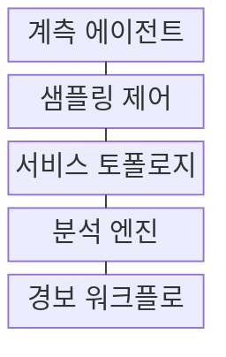
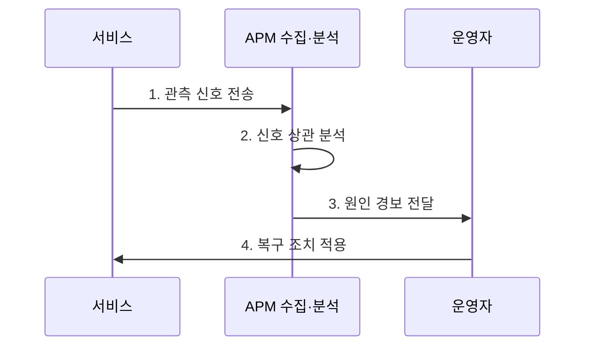

---
sidebar:
  order: 223
  label: "223. APM 애플리케이션 성능 관리 (Application Performance Management)"
  badge:
    text: "기출 · 70%"
    variant: note
title: "APM 애플리케이션 성능 관리 (Application Performance Management)"
date: "2026-07-31T10:50:28+09:00"
tags: ["notes-software"]
weight: 223
extra:
  question_no: "223"
  source_status: "기출"
  source_history: "137회"
  priority: 70
  priority_note: "응용 지연과 자원 병목 연계가 최근 출제됨"
---

## 미리 알고가기

- **APM(Application Performance Management)**: ‘에이피엠’으로 읽고 영문 머리글자를 딴 약어이며, 사용자 경험부터 코드·인프라까지 성능 원인을 관리한다.
- **RUM(Real User Monitoring)**: ‘럼’으로 읽고 영문 머리글자를 딴 약어이며, 실제 사용자 브라우저·앱의 지연과 오류를 측정한다.
- **신세틱 모니터링(Synthetic Monitoring)**: 가상 스크립트를 정기 가동하여 서비스 가용성을 측정한다.
- **분산 추적(Distributed Tracing)**: 분산 요청을 Trace ID로 연결하여 서비스 간 지연 경로를 추적한다.
- **RED(Rate, Errors, Duration)**: ‘레드’로 읽고 세 지표의 영문 머리글자를 딴 약어이며, 요청률·오류·처리시간으로 서비스 성능을 관찰한다.
- **카디널리티(Cardinality)**: 메트릭 라벨 값의 고유 조합 수로 데이터 저장과 질의 비용을 결정한다.
- **계측 에이전트·소프트웨어 개발 키트(Software Development Kit, SDK)**: 에이전트는 실행 정보를 수집하고 SDK는 코드에서 계측 기능을 호출하게 한다.
- **샘플링**: 전체 요청 중 일부만 수집해 분석 대표성과 수집 비용을 조절하는 방식이다.
- **서비스 토폴로지**: 서비스와 데이터베이스의 호출·의존 관계를 연결한 구조이다.
- **서비스 수준 목표(Service Level Objective, SLO)·오류 예산**: SLO는 신뢰성 목표이고 오류 예산은 그 목표가 허용한 실패량이다.
- **Runbook·Pager**: Runbook은 대응 절차이고 Pager는 당직자에게 경보를 전달하는 도구이다.
- **추적 식별자(Trace Identifier, Trace ID)·스팬(Span)**: Trace ID는 한 요청을 묶고 Span은 요청 안의 개별 작업 구간을 나타내어 분산 지연 경로를 연결한다.
- **메트릭·로그·트레이스**: 수치 지표·사건 기록·요청 경로를 나타내는 관측 신호
- **꼬리 우선 샘플링(Tail-based Sampling)**: 처리 결과를 확인한 뒤 느리거나 실패한 요청을 우선 보존하는 방식
- **마스킹(Masking)**: 관측 자료의 민감값을 가리거나 대체하는 보호 기법
- **계측 오버헤드(Instrumentation Overhead)**: 관측 자료 수집이 서비스에 추가하는 자원·지연 비용

> **키워드:** APM 애플리케이션 성능 관리 (Application Performance Management)

## Ⅰ. 개요

- 정의/개념: 사용자 요청부터 코드까지 추적하는 **APM 성능 관리 체계**
- 배경/필요성: 분산 호출로 **지연 구간·장애 원인 식별 곤란**

### 쉽게 이해하기 (학습용)
- 연동 모듈 간 분산 추적 식별자로 병목을 계측함

## Ⅱ. 특징

- **복합 관측**: RUM·합성 감시로 실제·예방 관측 결합
- **경로 추적**: Trace ID·Span으로 서비스별 지연 연결
- **상관 분석**: 메트릭·로그·트레이스 증거 결합
- **RED 지표**: 요청률·오류·처리시간으로 서비스 상태 관측

### 쉽게 이해하기 (학습용)
- 코드 실행 행적 분석으로 지연 원인을 추적함

## Ⅲ. 구조 및 구성요소

| 구성요소 | 책임 |
|:---|:---|
| 계측 에이전트·SDK | 요청·코드·**자원 정보 수집** |
| 샘플링 제어 | 수집 비율·**오버헤드 통제** |
| 서비스 토폴로지 | 호출 관계·**의존성 연결** |
| 분석 엔진 | 정상 범위·**이상 원인 분석** |
| 경보 워크플로 | Pager·**Runbook 연결** |

### 쉽게 이해하기 (학습용)
- 식별자 정보 동조화로 분산 요소를 쉽게 추적함

## Ⅳ. 흐름도

**동작 원리**

1. **관측 신호 전송**: 거래·메트릭·로그·Trace ID 수집
2. **신호 상관 분석**: 호출 경로·자원 지표 연결
3. **원인 경보 전달**: SLO 위반·Runbook 연결
4. **복구 조치 적용**: 지연·오류·처리량 회복 확인

### 쉽게 이해하기 (학습용)
- 측정 값 개선 상태를 모니터링하여 효익을 증명함

## Ⅴ. 종류 및 비교

| APM 관측 방식 | **RUM** | **Synthetic** | **Tracing** |
|:---|:---|:---|:---|
| 적용 기준 | 단말·지역별 **체감 분석** | 사전 가용성·**경로 감시** | 서비스별 **병목 원인 분석** |
| 핵심 특징 | 실제 사용자 **경험 측정** | 가상 요청 **정기 실행** | 분산 호출 **경로 연결** |
| 한계 | 표본 편향·**개인정보 노출** | 실제 행동과 **시나리오 차이** | 샘플 누락·**수집 비용** |

> 요약: **메트릭·로그·트레이스** 결합으로 성능 사각지대 제거

### 쉽게 이해하기 (학습용)
- 다중 채널에서 들어오는 증거를 조합하여 판단함

## Ⅵ. 실무 고려사항 및 대책

| 고려사항 | 대책 | 효과 |
|:---|:---|:---|
| 표본 추출의 **느린 요청 누락** | Tail·오류 **우선 Sampling** | 장애 원인 **가시성** |
| Agent의 **측정 오버헤드** | 비율 조정·**자체 지표 감시** | 서비스 영향 **통제** |
| 추적 자료의 **개인정보 노출** | 마스킹·보존·**접근 통제** | 관측 자료 **보호** |
| 지표별 **경보 분절** | Trace·로그·**변경 사건 상관** | 원인 분석 **단축** |
| 높은 **라벨 카디널리티** | 라벨 차원·**보존 기간 제한** | 저장·질의 비용 **통제** |

### 쉽게 이해하기 (학습용)
- 결제 요청의 Span별 시간으로 병목 서비스를 찾음

## Ⅶ. 결론

- 체감 분석은 **RUM**, 예방 감시는 **Synthetic**, 원인 추적은 **Tracing** 선택

### 쉽게 이해하기 (학습용)
- 느리다는 경보에서 끝내지 말고 느린 코드까지 찾음
