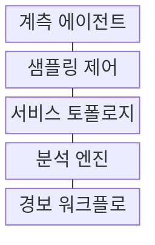
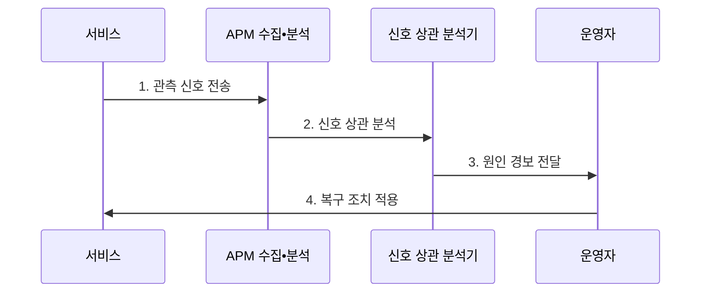

---
sidebar:
  order: 223
  label: "223. APM 애플리케이션 성능 관리 (Application Performance Management)"
  badge:
    text: "기출 • 70%"
    variant: note
title: "APM 애플리케이션 성능 관리 (Application Performance Management)"
date: "2026-08-04T14:45:37+09:00"
tags: ["notes-software"]
weight: 223
extra:
  question_no: "223"
  source_status: "기출"
  source_history: "137회"
  priority: 70
  priority_note: "응용 지연과 자원 병목 연계가 최근 출제됨"
---

## Ⅰ. 개요

핵심 용어

- **애플리케이션 성능 관리(Application Performance Management, APM)**: 실제 사용자 요청부터 서비스 호출•코드•데이터베이스•인프라 지표를 연결해 성능과 장애 원인을 지속 관찰•진단하는 관리 체계이다.
- **분산 추적(Distributed Tracing)**: 하나의 요청이 여러 서비스를 거치는 호출 경로와 작업 시간을 연결해 기록하는 관측 방식이다.

- 정의/개념: 사용자 요청부터 분산 서비스•코드•인프라까지 추적해 지연과 장애 원인을 진단하는 **APM 성능 관리 체계**
- 배경/필요성: 분산 호출로 **지연 구간•장애 원인 식별 곤란**

#### 한줄 요약
- 연동 모듈 간 분산 추적 식별자로 병목을 계측함

## Ⅱ. 특징

핵심 용어

- **추적 식별자(Trace Identifier, Trace ID)**: 한 분산 요청에서 생성된 모든 작업 구간을 같은 경로로 묶는 식별자이다.
- **작업 구간(Span)**: 분산 요청 안의 개별 서비스 호출이나 코드 작업의 시작•종료와 상태를 기록한 단위이다.
- **요청률•오류•처리시간(Rate, Errors, Duration, RED)**: 서비스 요청량•실패량•지연을 함께 관측하는 핵심 지표 묶음이다.

- **복합 관측**: RUM•합성 감시로 실제•예방 관측 결합
- **경로 추적**: Trace ID•Span으로 서비스별 지연 연결
- **상관 분석**: 메트릭•로그•트레이스 증거 결합
- **RED 지표**: 요청률•오류•처리시간으로 서비스 상태 관측

#### 한줄 요약
- 코드 실행 행적 분석으로 지연 원인을 추적함

## Ⅲ. 구조 및 구성요소

핵심 용어

- **서비스 토폴로지**: 서비스 토폴로지는 애플리케이션과 데이터베이스의 호출•의존 관계를 연결해 장애 전파 경로를 보여 준다.
- **소프트웨어 개발 키트(Software Development Kit, SDK)**: 애플리케이션에 관측 신호 수집 기능을 연결하는 라이브러리와 도구 모음이다.
- **샘플링(Sampling)**: 관측 비용을 통제하도록 전체 요청 중 일부만 선택해 상세 신호를 수집하는 방식이다.
- **런북(Runbook)**: 경보 원인의 진단•완화•복구 절차를 정리한 운영 문서이다.

| 구성요소 | 책임 |
|:---|:---|
| 계측 에이전트•SDK | 요청•코드•**자원 정보 수집** |
| 샘플링 제어 | 수집 비율•**오버헤드 통제** |
| 서비스 토폴로지 | 호출 관계•**의존성 연결** |
| 분석 엔진 | 정상 범위•**이상 원인 분석** |
| 경보 워크플로 | Pager•**Runbook 연결** |

#### 한줄 요약
- 식별자 정보 동조화로 분산 요소를 쉽게 추적함

## Ⅳ. 흐름도

핵심 용어

- **2. 신호 상관 분석**: APM 분석기는 메트릭•로그•트레이스를 호출 경로와 자원 지표에 연결해 지연 원인을 좁힌다.
- **1. 관측 신호 전송**: 거래•메트릭•로그•트레이스를 공통 식별자와 함께 수집하는 단계이다.
- **3. 원인 경보 전달**: 서비스 수준 목표 위반과 의심 구간 및 런북을 운영자에게 알리는 단계이다.
- **4. 복구 조치 적용**: 조치 뒤 지연•오류•처리량이 정상 범위로 회복됐는지 확인하는 단계이다.
- **서비스 수준 목표(Service Level Objective, SLO)**: 사용자 관점의 지연•가용성 등이 달성해야 할 측정 기준이다.

**동작 원리**

1. **관측 신호 전송**: 거래•메트릭•로그•Trace ID 수집
2. **신호 상관 분석**: 호출 경로•자원 지표 연결
3. **원인 경보 전달**: SLO 위반•Runbook 연결
4. **복구 조치 적용**: 지연•오류•처리량 회복 확인

#### 한줄 요약
- 측정 값 개선 상태를 모니터링하여 효익을 증명함

## Ⅴ. 종류 및 비교

핵심 용어

- **분산 추적 역할**: Trace ID•Span으로 서비스별 병목 원인 분석
- **실사용자 모니터링(Real User Monitoring, RUM)**: 실제 사용자 단말에서 지역•기기별 체감 성능과 오류를 수집하는 방식이다.
- **합성 모니터링(Synthetic Monitoring)**: 가상 요청을 정기 실행해 주요 경로의 가용성과 지연을 사전 감시하는 방식이다.

| APM 관측 방식 | **RUM** | **Synthetic** | **Tracing** |
|:---|:---|:---|:---|
| 적용 기준 | 단말•지역별 **체감 분석** | 사전 가용성•**경로 감시** | 서비스별 **병목 원인 분석** |
| 핵심 특징 | 실제 사용자 **경험 측정** | 가상 요청 **정기 실행** | 분산 호출 **경로 연결** |
| 한계 | 표본 편향•**개인정보 노출** | 실제 행동과 **시나리오 차이** | 샘플 누락•**수집 비용** |

> 요약: **메트릭•로그•트레이스** 결합으로 성능 사각지대 제거

#### 한줄 요약
- 다중 채널에서 들어오는 증거를 조합하여 판단함

## Ⅵ. 실무 고려사항 및 대책

핵심 용어

- **측정 오버헤드**: 측정 오버헤드는 계측 에이전트와 신호 수집이 서비스에 추가하는 CPU•메모리•응답 지연 비용이다.
- **중앙 처리장치(Central Processing Unit, CPU)**: 범용 연산과 프로그램 제어를 수행하는 프로세서이다.
- **꼬리 기반 샘플링(Tail-Based Sampling)**: 요청 완료 뒤 오류나 느린 지연을 확인해 보존할 추적을 선택하는 방식이다.
- **라벨 카디널리티(Label Cardinality)**: 지표 라벨 조합에서 생성되는 서로 다른 시계열 값의 개수이다.

| 문제 | 대책 | 효과 |
|:---|:---|:---|
| 표본 추출의 **느린 요청 누락** | Tail•오류 **우선 Sampling** | 장애 원인 **가시성** |
| Agent의 **측정 오버헤드** | 비율 조정•**자체 지표 감시** | 서비스 영향 **통제** |
| 추적 자료의 **개인정보 노출** | 마스킹•보존•**접근 통제** | 관측 자료 **보호** |
| 지표별 **경보 분절** | Trace•로그•**변경 사건 상관** | 원인 분석 **단축** |
| 높은 **라벨 카디널리티** | 라벨 차원•**보존 기간 제한** | 저장•질의 비용 **통제** |

#### 한줄 요약
- 결제 요청의 Span별 시간으로 병목 서비스를 찾음

## Ⅶ. 결론

핵심 용어

- **합성 감시 적용**: 주요 경로의 가용성•지연을 가상 요청으로 사전 감시
- **관측 방식 선택**: 실제 체감은 RUM, 사전 경로 감시는 합성 모니터링, 서비스별 원인 추적은 분산 추적을 사용하는 원칙이다.

- 체감 분석은 **RUM**, 예방 감시는 **Synthetic**, 원인 추적은 **Tracing** 선택

#### 한줄 요약
- 느리다는 경보에서 끝내지 말고 느린 코드까지 찾음
