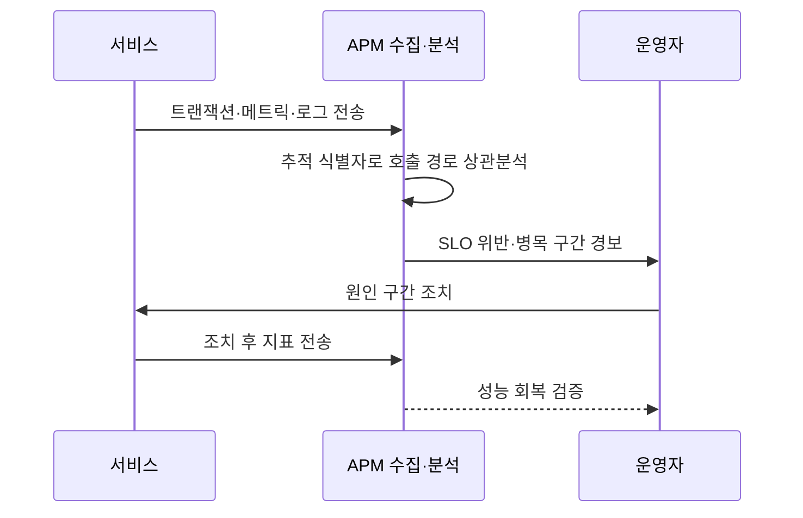

---
sidebar:
  order: 223
  label: "223. APM 애플리케이션 성능 관리 (Application Performance Management)"
  badge:
    text: "기출 · 70%"
    variant: note
title: "APM 애플리케이션 성능 관리 (Application Performance Management)"
date: "2026-07-27T23:59:59+09:00"
tags: ["notes-software"]
weight: 223
extra:
  question_no: "223"
  source_status: "기출"
  source_history: "137회"
  priority: 70
  priority_note: "응용 지연과 자원 병목 연계가 최근 출제됨"
---

## 미리 알고가기

- **APM(Application Performance Management)**: ‘에이피엠’으로 읽고 영문 머리글자를 딴 약어이며, 사용자 경험부터 코드·인프라까지 성능 원인을 관리함
- **RUM(Real User Monitoring)**: ‘럼’으로 읽고 영문 머리글자를 딴 약어이며, 실제 사용자 브라우저·앱의 지연과 오류를 측정함
- **신세틱 모니터링(Synthetic Monitoring)**: 가상 스크립트를 정기 가동하여 서비스 가용성을 측정함
- **분산 추적(Distributed Tracing)**: 분산 요청을 Trace ID로 연결하여 서비스 간 지연 경로를 추적함
- **RED(Rate, Errors, Duration)**: ‘레드’로 읽고 세 지표의 영문 머리글자를 딴 약어이며, 요청률·오류·처리시간으로 서비스 성능을 관찰함
- **카디널리티(Cardinality)**: 메트릭 라벨 값의 고유 조합 수로 데이터 저장과 질의 비용을 결정함
- **계측 에이전트·소프트웨어 개발 키트(Software Development Kit, SDK)**: 에이전트는 실행 정보를 수집하고 SDK는 코드에서 계측 기능을 호출하게 함
- **샘플링**: 전체 요청 중 일부만 수집해 분석 대표성과 수집 비용을 조절하는 방식임
- **서비스 토폴로지**: 서비스와 데이터베이스의 호출·의존 관계를 연결한 구조임
- **서비스 수준 목표(Service Level Objective, SLO)·오류 예산**: SLO는 신뢰성 목표이고 오류 예산은 그 목표가 허용한 실패량임
- **Runbook·Pager**: Runbook은 대응 절차이고 Pager는 당직자에게 경보를 전달하는 도구임
- **익명화·덤프**: 익명화는 개인 식별값을 제거하고 덤프는 장애 시점의 실행 상태 기록임
- **추적 식별자(Trace Identifier, Trace ID)·스팬(Span)**: Trace ID는 한 요청을 묶고 Span은 요청 안의 개별 작업 구간을 나타내어 분산 지연 경로를 연결함
- **쿼리 튜닝**: 데이터베이스 질의와 인덱스를 개선해 실행 시간과 자원 사용을 줄이는 작업임

## Ⅰ. 개요

- 정의/개념: 사용자 요청부터 코드까지 **성능 원인을 추적·관리**
- 기존 한계: 분산 호출로 **지연 구간·장애 원인 식별 곤란**

### 쉽게 이해하기 (학습용)
- 연동 모듈 간 분산 추적 식별자로 병목을 계측함

## Ⅱ. 특징

- **RUM·합성 감시**로 실제·예방 관측 결합
- **분산 추적**으로 서비스별 지연 구간 연결
- 메트릭·로그·트레이스의 **상관 분석**

### 쉽게 이해하기 (학습용)
- 코드 실행 행적 분석으로 지연 원인을 추적함

## Ⅲ. 아키텍처 및 구성요소

| 설계 요소 | 설명 |
|:---|:---|
| 계측 에이전트 | SDK로 요청·코드·자원 정보를 수집함 |
| 샘플링 제어 | 수집 비율과 오버헤드를 통제함 |
| 서비스 토폴로지 | 호출 관계와 의존성을 연결함 |
| 분석 엔진 | 정상 범위와 이상 원인을 분석함 |
| 경보 워크플로 | 경보를 담당자와 Runbook에 연결함 |

> 요약: 수집 정보와 원인 요소를 단일 맵으로 구성함

### 쉽게 이해하기 (학습용)
- 식별자 정보 동조화로 분산 요소를 쉽게 추적함

## Ⅳ. 원리 및 절차 흐름도

| 절차 | 설명 |
|:---|:---|
| **수집·계측** | 트랜잭션·메트릭·로그를 공통 추적 식별자와 함께 수집 |
| **상관분석** | 호출 경로와 자원 지표를 시간축으로 연결해 병목 구간 식별 |
| **원인 경보** | SLO 위반과 원인 후보를 담당자·Runbook에 연결 |
| **조치 검증** | 원인 구간 조치 전후의 지연·오류·처리량 회복을 확인 |

> 요약: 장애 지표 수집부터 보완 검증까지 한 루프임

### 쉽게 이해하기 (학습용)
- 측정 값 개선 상태를 모니터링하여 효익을 증명함

## Ⅴ. 종류 및 비교

| APM 관측 방식 | RUM | Synthetic | Tracing |
|:---|:---|:---|:---|
| 적용 기준 | 단말·지역별 **체감 분석** | 사전 가용성·**경로 감시** | 서비스별 **병목 원인 분석** |
| 핵심 특징 | 실제 사용자 **경험 측정** | 가상 요청 **정기 실행** | 분산 호출 **경로 연결** |
| 한계 | 표본 편향·**개인정보 노출** | 실제 행동과 **시나리오 차이** | 샘플 누락·**수집 비용** |

> 요약: 다차원 관측 뷰로 애플리케이션 성능 사각지대를 제거함

### 쉽게 이해하기 (학습용)
- 다중 채널에서 들어오는 증거를 조합하여 판단함

## Ⅵ. 실무 사례

1. 결제 지연은 Trace로 느린 호출 구간을 찾음

### 쉽게 이해하기 (학습용)
- 결제 요청의 Span별 시간으로 병목 서비스를 찾음

## Ⅶ. 결론

- 애플리케이션 성능 저하의 사용자 영향과 코드 원인을 신속히 연결하기 위해 **실사용 지표·트랜잭션 추적·의존 호출·오류·자원 지표**를 검토하고, 원인까지 설명하는 APM 경보를 운영한다

### 쉽게 이해하기 (학습용)
- 느리다는 경보에서 끝내지 말고 느린 코드까지 찾음
