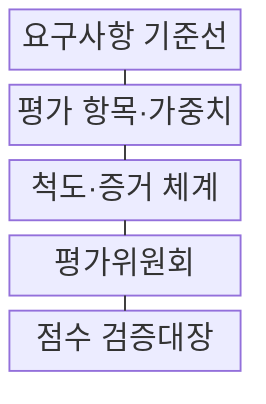
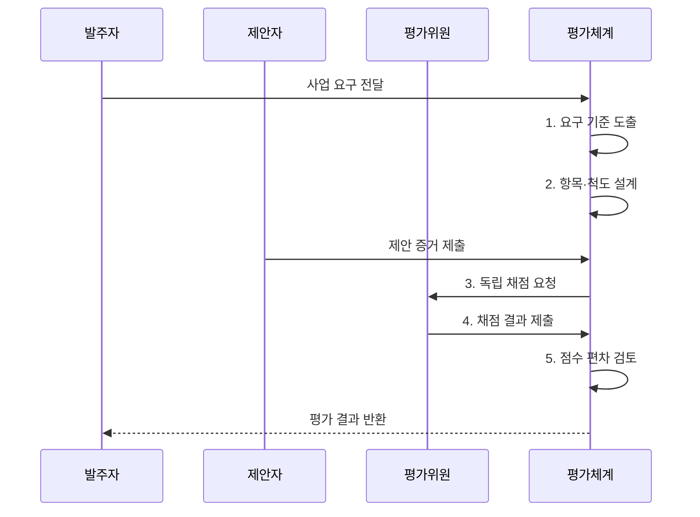

---
sidebar:
  order: 224
  label: "224. 소프트웨어 기술성 평가 (SW Technology Evaluation)"
  badge:
    text: "기출 · 50%"
    variant: note
title: "소프트웨어 기술성 평가 (SW Technology Evaluation)"
date: "2026-08-02T23:34:00+09:00"
tags: ["notes-software"]
weight: 224
extra:
  question_no: "224"
  source_status: "기출"
  source_history: "132회, 137회"
  priority: 50
  priority_note: "제안 기술·품질·수행력 평가가 반복 출제됨"
---

## Ⅰ. 개요

핵심 용어

- **소프트웨어 기술성 평가(Software Technology Evaluation)**: 제안 기술·품질·사업 관리·수행 역량을 공통 항목과 척도로 채점해 요구에 적합한 사업자를 선정하는 평가 절차이다.

- 정의/개념: 제안 기술·품질·사업 관리·수행 역량을 공통 기준으로 채점하는 **소프트웨어 사업자 선정 절차**
- 배경/필요성: 가격 중심 선정으로 **기술 적합성·수행력 검증 부족**

### 쉽게 이해하기 (학습용)

- 가장 싼 제안이 아니라 요구 기능을 만들고 운영할 능력이 있는 제안인지 같은 기준과 증거로 비교한다.

## Ⅱ. 특징

핵심 용어

- **사전 척도**: 사전 척도는 충족 수준별 점수와 인정할 증거를 미리 정해 평가자의 판단 일관성을 높인다.

- **복합 평가**: 정량 증거와 정성 판단을 함께 반영
- **가중치 평가**: 사업 우선순위를 항목별로 점수화
- **사전 척도**: 수준별 근거를 정해 판단 일관성 확보

### 쉽게 이해하기 (학습용)

- 숫자로 확인할 내용과 전문가가 판단할 내용을 나누고 점수 기준을 미리 구체화해야 평가자마다 다른 해석을 줄일 수 있다.

## Ⅲ. 구조 및 구성요소

핵심 용어

- **점수 검증대장**: 점수 검증대장은 위원별 점수, 판단 사유, 편차와 조정 이력을 보존해 평가 결과를 추적하게 한다.

| 구성요소 | 책임 |
|:---|:---|
| 요구사항 기준선 | 사업 목표·범위·**필수 조건 확정** |
| 평가 항목·가중치 | 판단 단위와 중요도별 **배점 정의** |
| 척도·증거 체계 | 수준별 점수와 **인정 자료 명시** |
| 평가위원회 | 이해충돌을 배제한 **독립 채점** |
| 점수 검증대장 | 점수·사유·편차와 **조정 이력 기록** |

### 쉽게 이해하기 (학습용)

- 사업 요구를 배점과 증거 기준으로 바꾼 뒤 독립된 평가위원이 채점하고 점수 차이와 사유를 기록한다.

## Ⅳ. 흐름도

핵심 용어

- **5. 점수 편차 검토**: 평가체계는 위원별 채점 결과의 계산 오류와 과도한 편차를 확인하되 근거 없는 점수 변경을 막는다.

**동작 원리**

1. **요구 기준 도출**: 목표·범위에서 평가 대상을 추출
2. **항목·척도 설계**: 가중치·수준·증거 요건을 명시
3. **독립 채점 요청**: 제안서·실적·시험 자료 배포
4. **채점 결과 제출**: 위원별 점수와 판단 사유 기록
5. **점수 편차 검토**: 계산 오류·과도한 편차를 확인

### 쉽게 이해하기 (학습용)

- 무엇을 어떤 증거로 몇 점 줄지 먼저 정하고 각 평가위원이 따로 채점한 뒤 오류와 큰 차이를 확인해 결과를 확정한다.

## Ⅴ. 종류 및 비교

핵심 용어

- **기술성 평가**: 기술성 평가는 제안자의 기술 방안과 사업 수행 역량을 종합 채점해 실제 수행 가능성을 판단한다.

| 제안 평가 방식 | **기술성 평가** | **벤치마크 테스트(BMT)** | **가격 평가** |
|:---|:---|:---|:---|
| 적용 기준 | 사업의 **수행 가능성 판단** | 제안만으로 **성능 확인 불가** | 예산 내 **가격 경쟁** |
| 핵심 특징 | 기술·수행 역량 **종합 채점** | 동일 조건의 **제품 직접 시험** | 입찰 금액의 **경제성 계산** |
| 한계 | 정성 점수의 **주관 편차** | 시험 환경·**후보별 편향** | 저가 경쟁·**품질 저하** |

> 요약: **수행성·실증성·경제성**에 맞춰 평가 방식 선택

### 쉽게 이해하기 (학습용)

- 수행 계획은 기술성 평가, 실제 제품 성능은 벤치마크 테스트, 금액의 적정성은 가격 평가로 확인한다.

## Ⅵ. 실무 고려사항 및 대책

핵심 용어

- **가중치 왜곡**: 가중치 왜곡은 사업 목표와 무관한 항목에 높은 배점을 줘 최종 선정 결과의 타당성을 떨어뜨리는 문제다.

| 문제 | 대책 | 효과 |
|:---|:---|:---|
| 공급자 중심 **PoC 편향** | 공통 자료·**동일 시나리오 적용** | 후보 비교 **공정성** |
| 평가 항목의 **가중치 왜곡** | 사업 목표·**필수 기준 사전 확정** | 선정 타당성 **향상** |
| 도입비만의 **비용 비교** | 운영·전환·**종료 TCO 포함** | 장기 비용 **현실성** |
| 개방성 없는 **기술 종속** | 표준·자료 이전·**출구 시험** | 교체 가능성 **확보** |

### 쉽게 이해하기 (학습용)

- 공공 정보시스템 사업은 인력·개발 방법·품질 계획을 같은 척도로 평가해 수행 가능한 업체를 선택한다.

## Ⅶ. 결론

핵심 용어

- **가중 점수**: 필수 기술 기준에 미달한 제안은 배제하고 기준을 충족한 후보는 사전 정의한 가중 점수로 선정한다.

- 필수 기술 기준 미달은 **배제**, 충족 후보는 **가중 점수**로 선정

### 쉽게 이해하기 (학습용)

- 평가의 공정성은 위원 수보다 사업 요구를 구체적인 점수 기준과 확인 가능한 증거로 바꾸는 데서 시작한다.
