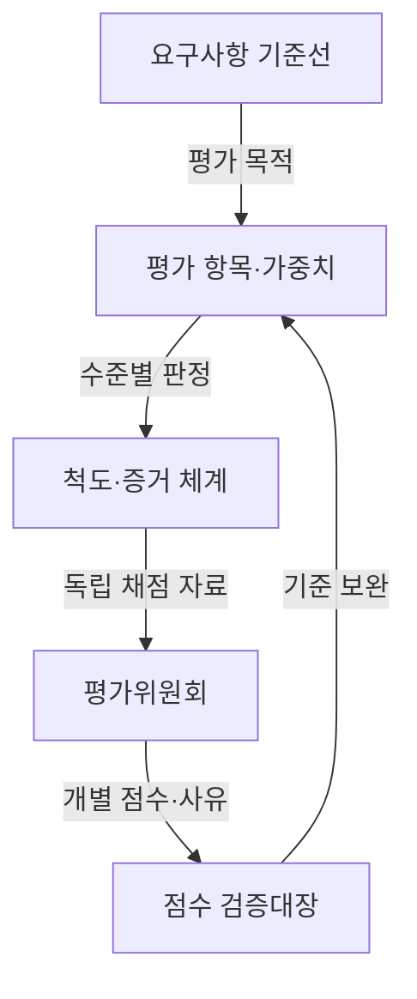
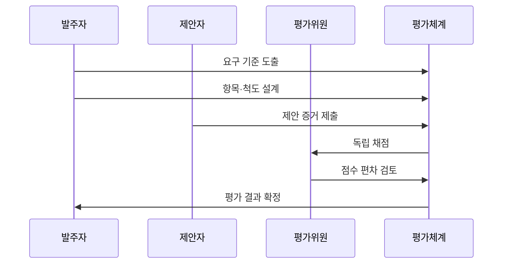

---
sidebar:
  order: 224
  label: "224. 소프트웨어 기술성 평가 (SW Technology Evaluation)"
  badge:
    text: "기출 · 50%"
    variant: note
title: "소프트웨어 기술성 평가 (SW Technology Evaluation)"
date: "2026-07-27T23:59:59+09:00"
tags: ["notes-software"]
weight: 224
extra:
  question_no: "224"
  source_status: "기출"
  source_history: "132회, 137회"
  priority: 50
  priority_note: "제안 기술·품질·수행력 평가가 반복 출제됨"
---

## 미리 알고가기

- **소프트웨어 SW(에스더블유, Software)**: 영어 Software의 앞 글자와 끝 글자를 쓴 약어로 평가 대상인 프로그램·관련 산출물을 가리킴
- **소프트웨어 기술성 평가**: 제안 기술과 수행 역량이 사업 요구를 충족하는지 공통 기준으로 채점해 적합한 제안자를 선정하는 절차다.
- **평가 항목**: 기능, 성능, 품질, 수행 역량처럼 제안서를 나누어 판단하는 기준 단위다.
- **가중치**: 사업 중요도에 따라 평가 항목이 최종 점수에 기여하는 비율이다.
- **평가 척도**: 충족 수준별 점수와 그 점수를 부여할 구체적 근거를 미리 정한 규칙이다.
- **정량 평가**: 실적 수, 처리량, 인증 여부처럼 수치나 사실로 확인되는 증거를 채점하는 방식이다.
- **정성 평가**: 해결 방안과 실현 가능성을 평가위원이 근거에 따라 판단하는 방식이다.
- **BMT(Benchmark Test)**: ‘비엠티’로 읽고 영문 머리글자를 딴 약어이며, 같은 조건에서 후보 제품을 실행해 성능·기능을 비교한다.
- **이해충돌**: 평가위원의 사적 관계나 이익이 독립적인 판단에 영향을 줄 수 있는 상태다.

## Ⅰ. 개요

- 정의/개념: 제안 기술·수행 역량을 **공통 기준으로 채점**
- 기존 한계: 가격 중심 선정으로 **기술 적합성·수행력 검증 부족**

### 쉽게 이해하기 (학습용)

- 가장 싼 제안이 아니라 요구 기능을 만들고 운영할 능력이 있는 제안인지 같은 기준과 증거로 비교한다.

## Ⅱ. 특징

- **정량 증거·정성 판단**을 함께 반영
- **항목 가중치**로 사업 우선순위 점수화
- **사전 평가 척도**로 판단 일관성 확보

### 쉽게 이해하기 (학습용)

- 숫자로 확인할 내용과 전문가가 판단할 내용을 나누고 점수 기준을 미리 구체화해야 평가자마다 다른 해석을 줄일 수 있다.

## Ⅲ. 아키텍처 및 구성요소

| 설계 요소 | 설명 |
|:---|:---|
| 요구사항 기준선 | 사업 목표·범위·필수 조건 확정 |
| 평가 항목·가중치 | 판단 단위와 중요도별 배점 정의 |
| 척도·증거 체계 | 수준별 점수와 인정 자료 명시 |
| 평가위원회 | 이해충돌을 배제하고 독립 채점 |
| 점수 검증대장 | 점수·사유·편차와 조정 이력 기록 |

> 요약: 요구를 척도화하고 독립 점수를 검증

### 쉽게 이해하기 (학습용)

- 사업 요구를 배점과 증거 기준으로 바꾼 뒤 독립된 평가위원이 채점하고 점수 차이와 사유를 기록한다.

## Ⅳ. 원리 및 절차 흐름도

| 절차 | 설명 |
|:---|:---|
| 요구 기준 도출 | 목표·범위에서 평가 대상을 추출 |
| 항목·척도 설계 | 가중치·수준·증거 요건을 명시 |
| 제안 증거 제출 | 제안서·실적·시험 자료를 접수 |
| 독립 채점 | 위원별 점수와 판단 사유 기록 |
| 점수 편차 검토 | 계산 오류·과도한 편차를 확인 |
| 평가 결과 확정 | 합산 점수로 협상 대상자를 선정 |

> 요약: 사전 척도와 독립 채점으로 결과 확정

### 쉽게 이해하기 (학습용)

- 무엇을 어떤 증거로 몇 점 줄지 먼저 정하고 각 평가위원이 따로 채점한 뒤 오류와 큰 차이를 확인해 결과를 확정한다.

## Ⅴ. 종류 및 비교

| 제안 평가 방식 | 기술성 평가 | 벤치마크 테스트 | 가격 평가 |
|:---|:---|:---|:---|
| 적용 기준 | 사업의 **수행 가능성 판단** | 제안만으로 **성능 확인 불가** | 예산 내 **가격 경쟁** |
| 핵심 특징 | 기술·수행 역량 **종합 채점** | 동일 조건의 **제품 직접 시험** | 입찰 금액의 **경제성 계산** |
| 한계 | 정성 점수의 **주관 편차** | 시험 환경·**후보별 편향** | 저가 경쟁·**품질 저하** |

> 요약: 수행성·실증성·경제성에 맞춰 평가 선택

### 쉽게 이해하기 (학습용)

- 수행 계획은 기술성 평가, 실제 제품 성능은 벤치마크 테스트, 금액의 적정성은 가격 평가로 확인한다.

## Ⅵ. 실무 사례

1. 공공 정보시스템 제안의 수행 역량 채점

### 쉽게 이해하기 (학습용)

- 공공 정보시스템 사업은 인력·개발 방법·품질 계획을 같은 척도로 평가해 수행 가능한 업체를 선택한다.

## Ⅶ. 결론

- 사업 요구를 항목·척도·증거로 변환해 채점

### 쉽게 이해하기 (학습용)

- 평가의 공정성은 위원 수보다 사업 요구를 구체적인 점수 기준과 확인 가능한 증거로 바꾸는 데서 시작한다.
