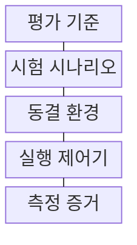
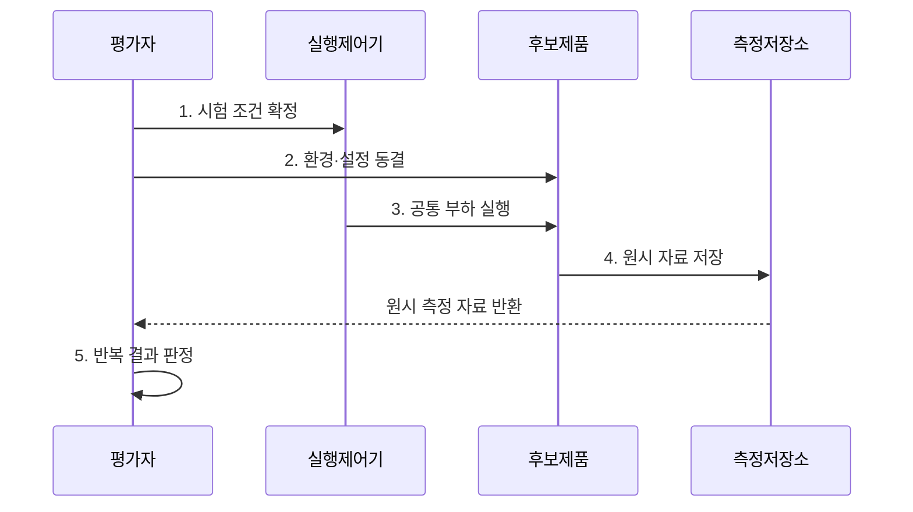

---
sidebar:
  order: 225
  label: "225. BMT 벤치마크 테스트 (Benchmark Test BMT)"
  badge:
    text: "기출 · 50%"
    variant: note
title: "BMT 벤치마크 테스트 (Benchmark Test BMT)"
date: "2026-07-31T10:51:23+09:00"
tags: ["notes-software"]
weight: 225
extra:
  question_no: "225"
  source_status: "기출"
  source_history: "123회, 129회"
  priority: 50
  priority_note: "제품 비교 시나리오와 측정 기준이 반복 출제됨"
---

## 미리 알고가기

- **벤치마크 테스트 BMT(비엠티, Benchmark Test)**: 영어 핵심어의 첫 글자를 쓴 표기로 후보 제품을 같은 조건에서 실행해 기능·성능을 수치 비교하는 시험이다.
- **개념 검증 PoC(피오씨, Proof of Concept)**: 영어 세 낱말의 첫 글자를 쓴 표기로 새로운 기술이나 설계의 실제 구현 가능성을 제한된 범위에서 확인한다.
- **시험 시나리오**: 업무 흐름, 입력 자료, 부하, 실행 시간과 판정 기준을 한 묶음으로 정의한 시험 명세다.
- **작업 부하(Workload)**: 시험 대상에 발생시키는 요청 종류, 요청량, 동시 사용자와 자료 분포의 조합이다.
- **예열(Warm-Up)**: 연결과 임시 저장 상태를 안정시켜 초기 실행 편차를 측정에서 제외하는 준비 실행이다.
- **반복성(Repeatability)**: 같은 시험자와 환경에서 반복 측정했을 때 유사한 결과를 얻는 성질이다.
- **재현성(Reproducibility)**: 시험자나 환경이 달라도 명세대로 실행하면 허용 범위 안의 결과를 얻는 성질이다.
- **원시 측정 자료**: 평균값으로 가공하기 전의 요청별 시간, 오류, 자원 사용량과 실행 기록이다.
- **동결 환경(Frozen Environment)**: 후보 외 조건이 바뀌지 않도록 장비·버전·설정을 고정한 환경
- **실행 제어기(Test Controller)**: 예열·반복 횟수·후보별 실행 순서를 통제하는 구성요소
- **분산(Variance)**: 반복 측정값이 평균에서 퍼진 정도를 나타내는 통계량
- **문서 평가(Document Evaluation)**: 제안 내용·실적·수행 계획을 제출 문서로 판단하는 방식

## Ⅰ. 개요

- 정의/개념: 동일 조건에서 후보를 실행하는 **BMT 기능·성능 비교 시험**
- 배경/필요성: 제안서만으로는 **실제 처리 능력 검증 불가**

### 쉽게 이해하기 (학습용)

- 여러 제품에 같은 장비와 같은 일을 주고 실제 속도와 오류를 재어 광고가 아닌 실행 결과로 비교한다.

## Ⅱ. 특징

- **조건 통제**: 후보 외 공통 환경·부하 고정
- **반복 측정**: 여러 실행으로 우연 편차 분리
- **대표 부하**: 운영 업무를 반영해 결과 타당성 확보

### 쉽게 이해하기 (학습용)

- 제품만 다르고 나머지 조건은 같아야 하며 실제 업무와 닮은 일을 여러 번 실행해야 믿을 수 있는 차이를 얻는다.

## Ⅲ. 구조 및 구성요소

| 구성요소 | 책임 |
|:---|:---|
| 평가 기준 | 기능·성능 지표와 **합격선 정의** |
| 시험 시나리오 | 업무 자료·부하·**실행 시간 명시** |
| 동결 환경 | 장비·버전·**조정 범위 고정** |
| 실행 제어기 | 예열·반복·**실행 순서 통제** |
| 측정 증거 | 원시 자료·설정·**이력 보존** |

### 쉽게 이해하기 (학습용)

- 같은 시험 문제와 장비를 준비하고 실행 순서까지 통제한 뒤 원래 측정 자료를 남겨 제품별 결과를 비교한다.

## Ⅳ. 흐름도

**동작 원리**

1. **시험 조건 확정**: 지표·부하·합격선 등록
2. **환경·설정 동결**: 장비·버전·조정 범위 고정
3. **공통 부하 실행**: 예열 후 동일 요청 반복
4. **원시 자료 저장**: 시간·오류·사용량 기록
5. **반복 결과 판정**: 편차 확인 후 기준별 채점

### 쉽게 이해하기 (학습용)

- 시험 규칙과 설정을 먼저 잠그고 각 제품을 예열한 뒤 같은 일을 반복시켜 원래 측정값과 편차를 비교한다.

## Ⅴ. 종류 및 비교

| 기술 평가 방식 | **벤치마크 테스트(BMT)** | **개념 검증(PoC)** | **문서 평가** |
|:---|:---|:---|:---|
| 적용 기준 | 제품 간 **수치 차이 확인** | 신기술의 **구현 여부 불확실** | 실행 시험 전 **후보 선별** |
| 핵심 특징 | 동일 조건의 **후보 성능 비교** | 제한 구현의 **실현 가능성 확인** | 제안 내용·실적의 **수행성 판단** |
| 한계 | 비대표 부하·**설정 편향** | 시범 성공의 **운영성 오판** | 과장 제안·**평가자 주관 편차** |

> 요약: **성능 비교·실현성·수행성**에 맞춰 평가 방식 선택

### 쉽게 이해하기 (학습용)

- 제품의 실제 수치는 벤치마크, 새 기술의 구현 가능성은 개념 검증, 제안자의 계획과 경험은 문서 평가로 확인한다.

## Ⅵ. 실무 고려사항 및 대책

| 고려사항 | 대책 | 효과 |
|:---|:---|:---|
| 비대표 **작업 부하** | 운영 로그로 **시나리오 구성** | 결과 대표성 **확보** |
| 후보별 **설정 편차** | 조정 허용 범위 **사전 동결** | 비교 공정성 **확보** |
| 단일 실행의 **우연 편차** | 예열 후 **반복값·분산 공개** | 결과 재현성 **향상** |
| **요약 점수**만 보존 | 원시 자료·설정·**이력 보관** | 판정 추적성 **확보** |

### 쉽게 이해하기 (학습용)

- 데이터베이스마다 같은 거래 자료와 동시 요청을 반복해 처리 시간과 오류를 비교한다.

## Ⅶ. 결론

- 운영 대표 부하의 반복 측정 결과가 **합격선을 충족한 후보**만 선정

### 쉽게 이해하기 (학습용)

- 최고 점수보다 실제 업무와 같은 부하와 후보별 동일 조건을 입증할 자료가 중요하다.
