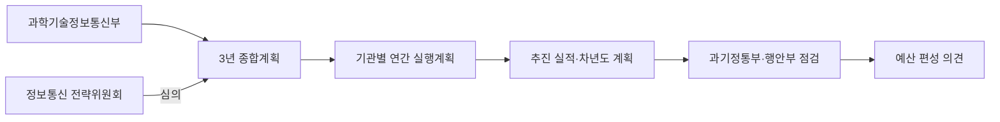
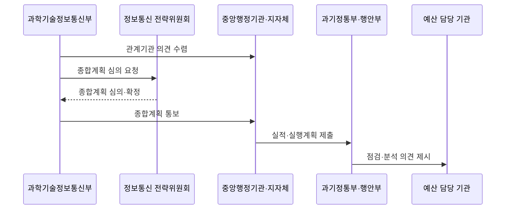

---
sidebar:
  order: 226
  label: "226. 지능정보화 기본법 (Framework Act on Intelligent Informatization)"
  badge:
    text: "기출 · 50%"
    variant: note
title: "지능정보화 기본법 (Framework Act on Intelligent Informatization)"
date: "2026-07-27T23:59:59+09:00"
tags: ["notes-software"]
weight: 226
extra:
  question_no: "226"
  source_status: "기출"
  source_history: "131회"
  priority: 50
  priority_note: "지능정보 권리·책임 기준이 기존 출제됨"
---

## 미리 알고가기

- **지능정보화**: 정보와 지능정보기술을 활용해 사회 각 분야의 활동을 효율화하고 새로운 가치를 만드는 활동이다.
- **지능정보화 기본법(Framework Act on Intelligent Informatization)**: 지능정보사회 정책의 수립·추진 체계, 지능정보화 기반과 기본 원칙을 규정하는 기본법
- **지능정보사회 종합계획**: 법 제6조에 따라 정부가 3년 단위로 수립하고 정보통신 전략위원회 심의를 거쳐 확정하는 국가 계획
- **지능정보사회 실행계획**: 법 제7조에 따라 중앙행정기관과 지방자치단체가 종합계획에 맞춰 매년 수립·시행하는 계획
- **디지털포용법**: 2026년 1월 22일부터 디지털 접근·역량, 취약계층의 이용 편의와 접근성 품질인증을 별도로 규율하는 법률
- **인공지능 발전과 신뢰 기반 조성 등에 관한 기본법(인공지능기본법)**: 2026년 7월 21일 시행된 법률로 인공지능 산업 진흥과 신뢰 기반·사업자 의무를 규율
- **무인정보단말기**: 이용자의 조작으로 서류 발급, 정보 제공, 주문·결제 등을 처리하는 기기다.
- **하위 법령**: 법률에서 위임한 세부 기준과 절차를 정하는 시행령·시행규칙·고시다.

## Ⅰ. 개요

- 정의/개념: 국가 **지능정보사회 정책·계획·기반**의 기본법
- 기존 한계: 기관별 정보화 분산은 **정책 중복·투자 연계 부족**

### 쉽게 이해하기 (학습용)

- 국가의 디지털 정책 방향을 정하고 각 기관이 매년 할 일을 연결하되 세부 의무는 관련 법률까지 함께 확인하게 하는 틀이다.

## Ⅱ. 특징

- **3년 종합계획·매년 실행계획**의 계층 연계
- **추진 실적·차년도 계획 점검**과 예산 의견 연계
- 기본법과 **전자정부·디지털포용·AI 특별 규정** 구분

### 쉽게 이해하기 (학습용)

- 큰 정책 방향은 기본법에서 찾고 서비스별 세부 책임은 시행 시점에 유효한 다른 법과 하위 기준까지 함께 확인해야 한다.

## Ⅲ. 아키텍처 및 구성요소

| 설계 요소 | 설명 |
|:---|:---|
| 과학기술정보통신부 | 관계기관 의견을 들어 **종합계획 수립** |
| 정보통신 전략위원회 | 종합계획을 **심의·확정 지원** |
| 중앙행정기관·지자체 | 매년 **실행계획 수립·시행** |
| 과기정통부·행안부 | 실적·실행계획을 **공동 점검·분석** |
| 예산 담당 기관 | 점검 의견을 **예산 편성에 참작** |

> 요약: 3년 종합계획을 연간 실행계획·점검·예산으로 연계

### 쉽게 이해하기 (학습용)

- 국가의 3년 방향을 각 기관의 연간 사업과 예산으로 이어 추진 실적을 다시 점검한다.

## Ⅳ. 원리 및 절차 흐름도

| 절차 | 설명 |
|:---|:---|
| 관계기관 의견 수렴 | 부처·지자체의 **정책·사업 의견** 수렴 |
| 종합계획 심의 요청 | 3년 계획을 **전략위원회에 상정** |
| 종합계획 심의·확정 | 국가 정책 방향·과제를 **심의** |
| 종합계획 통보 | 기관별 **연간 계획 기준** 제공 |
| 실적·실행계획 제출 | 전년도 실적·**차년도 계획** 제출 |
| 점검·분석 의견 제시 | 공동 분석 결과를 **예산에 연계** |

> 요약: 종합계획 수립 후 기관 실행계획과 실적을 점검

### 쉽게 이해하기 (학습용)

- 정부가 3년 방향을 정하면 각 기관이 매년 계획과 실적을 제출하고 점검 결과가 예산에 반영된다.

## Ⅴ. 종류 및 비교

| 지능정보 관련 법률 | 지능정보화 기본법 | 디지털포용법 | 인공지능기본법 |
|:---|:---|:---|:---|
| 적용 기준 | 국가·기관의 **정책·계획·기반** | 디지털 **접근·역량·포용** | AI **개발·제공·이용** |
| 핵심 특징 | **종합계획·실행계획** 추진 체계 | 취약계층 **이용 편의·접근성** | 산업 진흥·**신뢰 기반·사업자 의무** |
| 한계 | 실행계획·**사업 연계 미흡** | 대상·정당한 조치 **판정 누락** | 고영향 인공지능·**의무 분류 오류** |

> 요약: 정책·포용·인공지능 책임의 적용법 구분

### 쉽게 이해하기 (학습용)

- 국가 디지털 정책은 지능정보화 기본법, 취약계층 이용 편의는 디지털포용법, 인공지능 사업 책임은 인공지능기본법에서 확인한다.

## Ⅵ. 실무 사례

1. 중앙행정기관은 **지능정보화 사업을 실행계획**에 반영

### 쉽게 이해하기 (학습용)

- 공공기관은 새 지능정보화 사업의 목표와 예산을 기관의 연간 실행계획에 연결해 추진 근거와 성과를 관리한다.

## Ⅶ. 결론

- 정책·계획은 **지능정보화법**, 접근성은 **포용법**

### 쉽게 이해하기 (학습용)

- 법 이름만 보고 적용하지 말고 서비스 주체와 이용자, 시행 날짜를 확인해 실제 기능으로 옮길 현행 의무를 결정해야 한다.
