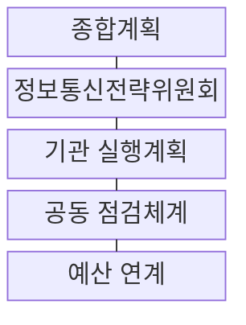
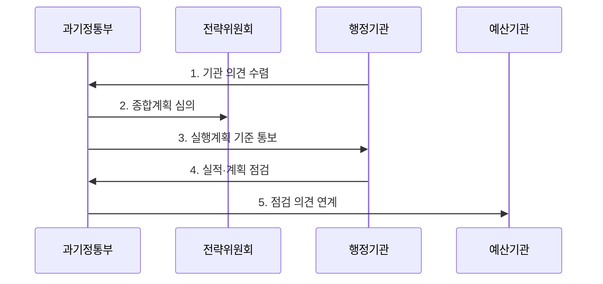

---
sidebar:
  order: 226
  label: "226. 지능정보화 기본법 (Framework Act on Intelligent Informatization)"
  badge:
    text: "기출 · 50%"
    variant: note
title: "지능정보화 기본법 (Framework Act on Intelligent Informatization)"
date: "2026-08-02T23:36:00+09:00"
tags: ["notes-software"]
weight: 226
extra:
  question_no: "226"
  source_status: "기출"
  source_history: "131회"
  priority: 50
  priority_note: "지능정보 권리·책임 기준이 기존 출제됨"
---

## Ⅰ. 개요

핵심 용어

- **지능정보화 기본법(Framework Act on Intelligent Informatization)**: 국가와 공공기관의 지능정보사회 정책·기본계획·시행계획과 공통 기반 조성을 규정하는 기본법이다.

- 정의/개념: 국가와 기관의 **지능정보사회 정책·계획·공통 기반**을 규정하는 지능정보화 기본법
- 배경/필요성: 기관별 정보화 분산은 **정책 중복·투자 연계 부족**

#### 한줄 요약

- 국가의 디지털 정책 방향을 정하고 각 기관이 매년 할 일을 연결하되 세부 의무는 관련 법률까지 함께 확인하게 하는 틀이다.

## Ⅱ. 특징

핵심 용어

- **성과 환류**: 성과 환류는 기관의 추진 실적과 차년도 계획을 점검해 다음 사업과 예산 편성에 반영하는 과정이다.

- **계획 계층**: 3년 종합계획과 매년 실행계획 연계
- **성과 환류**: 추진 실적·차년도 계획과 예산 연결
- **법률 구분**: 기본법과 디지털포용·AI 규정 분리

#### 한줄 요약

- 큰 정책 방향은 기본법에서 찾고 서비스별 세부 책임은 시행 시점에 유효한 다른 법과 하위 기준까지 함께 확인해야 한다.

## Ⅲ. 구조 및 구성요소

핵심 용어

- **기관 실행계획**: 기관 실행계획은 국가 종합계획에 맞춰 중앙행정기관과 지방자치단체가 매년 사업과 예산을 구체화한다.

| 구성요소 | 책임 |
|:---|:---|
| 종합계획 | 국가 정책 방향·**추진 과제 수립** |
| 정보통신전략위원회 | 종합계획 **심의·확정 지원** |
| 기관 실행계획 | 기관별 연간 **사업·예산 구체화** |
| 공동 점검체계 | 실적·차년도 계획 **점검·분석** |
| 예산 연계 | 점검 의견을 **예산 편성에 반영** |

#### 한줄 요약

- 국가의 3년 방향을 각 기관의 연간 사업과 예산으로 이어 추진 실적을 다시 점검한다.

## Ⅳ. 흐름도

핵심 용어

- **5. 점검 의견 연계**: 정부는 기관 실적과 차년도 계획의 분석 결과를 예산기관에 전달해 편성 의견으로 연계한다.

**동작 원리**

1. **기관 의견 수렴**: 정책·사업 의견 제출
2. **종합계획 심의**: 3년 방향·과제 상정
3. **실행계획 기준 통보**: 연간 사업·예산 기준 전달
4. **실적·계획 점검**: 실적·차년도 계획 제출
5. **점검 의견 연계**: 분석 결과·예산 의견 제공

#### 한줄 요약

- 정부가 3년 방향을 정하면 각 기관이 매년 계획과 실적을 제출하고 점검 결과가 예산에 반영된다.

## Ⅴ. 종류 및 비교

핵심 용어

- **지능정보화 기본법**: 지능정보화 기본법은 국가·기관의 정책·계획·기반을 규율하고 세부 권리·의무는 관련 특별법과 나눠 적용한다.

| 지능정보 관련 법률 | **지능정보화 기본법** | **디지털포용법** | **인공지능기본법** |
|:---|:---|:---|:---|
| 적용 기준 | 국가·기관의 **정책·계획·기반** | 디지털 **접근·역량·포용** | AI **개발·제공·이용** |
| 핵심 특징 | **종합계획·실행계획** 추진 체계 | 취약계층 **이용 편의·접근성** | 산업 진흥·**신뢰 기반·사업자 의무** |
| 한계 | 실행계획·**사업 연계 미흡** | 대상·정당한 조치 **판정 누락** | 고영향 인공지능·**의무 분류 오류** |

> 요약: **정책·포용·인공지능 책임**에 따라 적용법 구분

#### 한줄 요약

- 국가 디지털 정책은 지능정보화 기본법, 취약계층 이용 편의는 디지털포용법, 인공지능 사업 책임은 인공지능기본법에서 확인한다.

## Ⅵ. 실무 고려사항 및 대책

핵심 용어

- **성과 기준**: 기관마다 다른 성과 기준을 사용하면 사업 간 효과를 비교하거나 예산 우선순위를 정하기 어렵다.

| 문제 | 대책 | 효과 |
|:---|:---|:---|
| 상위 계획과 **기관 사업 불일치** | **종합·실행계획 연결표** 관리 | 정책 정합성 **확보** |
| 기관마다 다른 **성과 기준** | **공통 성과지표·증거** 정의 | 사업 비교 가능성 **향상** |
| 기본법만 확인한 **접근성 의무 누락** | **현행 관련 법률** 함께 점검 | 이용자 권리 **보장** |
| 개정 법령의 **시행일 미반영** | **시행일·하위 기준** 정기 확인 | 준수 오류 **예방** |

#### 한줄 요약

- 공공기관은 새 지능정보화 사업의 목표와 예산을 기관의 연간 실행계획에 연결해 추진 근거와 성과를 관리한다.

## Ⅶ. 결론

핵심 용어

- **실행계획**: 국가 방향은 종합계획, 기관별 연간 사업은 실행계획으로 연결하고 세부 의무는 현행 특별법을 적용한다.

- 국가 방향은 **종합계획**, 기관 사업은 **실행계획**, 세부 의무는 **특별법** 적용

#### 한줄 요약

- 서비스 주체와 시행 날짜를 확인해 기본법의 정책 방향을 현행 세부 의무와 연결해야 한다.
