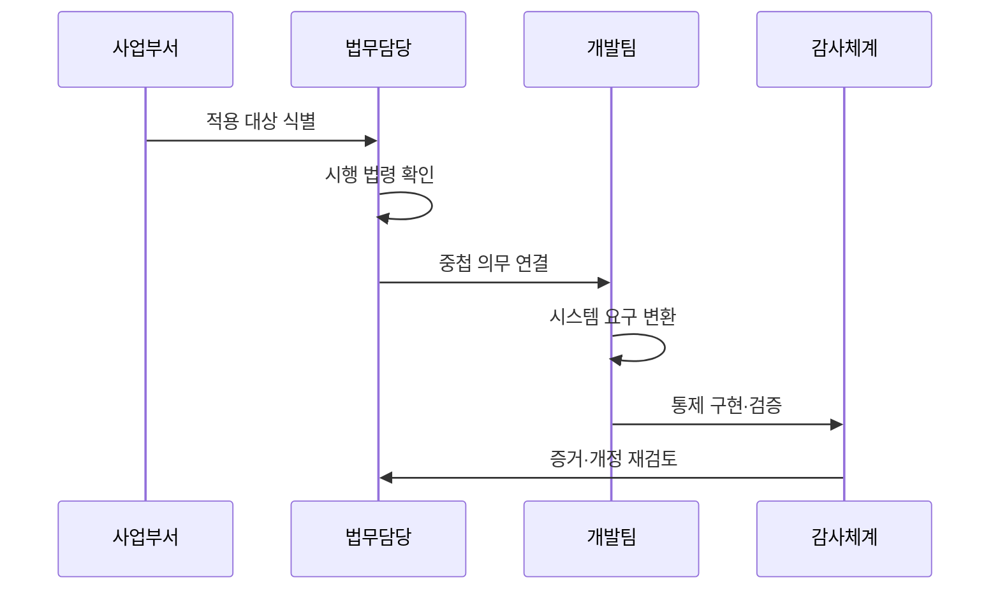

---
sidebar:
  order: 226
  label: "226. 지능정보화 기본법 적용 (Intelligent Information Act)"
  badge:
    text: "기출 · 50%"
    variant: note
title: "지능정보화 기본법 적용 (Intelligent Information Act)"
date: "2026-07-25T00:30:00+09:00"
tags: ["notes-software"]
weight: 226
extra:
  question_no: "226"
  source_status: "기출"
  source_history: "131회"
  priority: 50
  priority_note: "지능정보 권리·책임 기준이 기존 출제됨"
---

## 미리 알고가기

- **지능정보화**: 정보와 지능정보기술을 활용해 사회 각 분야의 활동을 효율화하고 새로운 가치를 만드는 활동이다.
- **지능정보화 기본법**: 지능정보화 정책의 수립·추진 체계와 기반 조성의 기본 원칙을 정하는 법률이다.
- **지능정보사회 종합계획**: 정부가 부처별 지능정보사회 정책을 조정하기 위해 3년 단위로 세우는 국가 계획이다.
- **지능정보사회 실행계획**: 중앙행정기관과 지방자치단체가 종합계획에 맞춰 매년 수립·시행하는 기관별 계획이다.
- **법률 적용성**: 서비스 주체, 기능, 이용자와 시행 시점을 법률의 적용 대상·요건에 대조한 결과다.
- **의무 대응표**: 적용 조문별 의무, 담당자, 시스템 통제와 증거를 연결해 추적하는 표다.
- **디지털포용법**: 2026년 1월 22일부터 디지털 접근·역량과 취약계층의 이용 편의를 별도로 규율하는 법률이다.
- **인공지능 발전과 신뢰 기반 조성 등에 관한 기본법(인공지능기본법)**: 인공지능 산업 육성과 신뢰 기반, 사업자 의무를 규율하는 법률이다.
- **무인정보단말기**: 이용자의 조작으로 서류 발급, 정보 제공, 주문·결제 등을 처리하는 기기다.
- **하위 법령**: 법률에서 위임한 세부 기준과 절차를 정하는 시행령·시행규칙·고시다.

## Ⅰ. 개요

- **정의/개념**: 지능정보화 정책·계획·기반의 기본 체계
- **배경/필요성**: 기관별 정책 분산으로 국가 추진 체계 필요

### 쉽게 이해하기 (학습용)

- 국가의 디지털 정책 방향을 정하고 각 기관이 매년 할 일을 연결하되 세부 의무는 관련 법률까지 함께 확인하게 하는 틀이다.

## Ⅱ. 특징

- 종합계획과 기관별 실행계획을 계층 연계한다.
- 진흥·기반·역기능 대응을 국가 정책으로 조정한다.
- 기본법이라 세부 의무는 관련 법률이 보완한다.
- 개정·이관을 놓치면 폐지된 의무를 잘적용하지 못한다.

### 쉽게 이해하기 (학습용)

- 큰 정책 방향은 기본법에서 찾고 서비스별 세부 책임은 시행 시점에 유효한 다른 법과 하위 기준까지 함께 확인해야 한다.

## Ⅲ. 아키텍처 및 구성요소

| 설계 요소 | 설명 |
|:---|:---|
| 적용 대상 목록 | 사업 주체·서비스·이용자·시점 기록 |
| 현행 법령 지도 | 기본법·관련 법·하위 기준 연결 |
| 의무 대응표 | 조문과 담당자·통제·증거를 추적 |
| 시스템 통제 | 법적 요구를 기능·절차로 구현 |
| 준수 증거 저장소 | 시험·승인·운영 이력을 보존 |

> 요약: 적용 조문을 시스템 통제와 증거로 연결

### 쉽게 이해하기 (학습용)

- 사업이 어느 법의 어떤 의무를 받는지 찾고 그 의무를 실제 기능과 담당 업무, 확인 자료까지 끊김 없이 연결한다.

## Ⅳ. 원리 및 절차 흐름도

| 절차 | 설명 |
|:---|:---|
| 적용 대상 식별 | 주체·서비스·이용자 범위를 확인 |
| 시행 법령 확인 | 기준일의 법률·하위 기준을 확정 |
| 중첩 의무 연결 | 기본법과 관련 법의 책임을 구분 |
| 시스템 요구 변환 | 조문을 기능·절차·담당자로 전환 |
| 통제 구현·검증 | 접근·기록·시험 통제를 확인 |
| 증거·개정 재검토 | 운영 증거와 법 개정을 재반영 |

> 요약: 현행 조문을 구현·증거로 바꾸고 재검토

### 쉽게 이해하기 (학습용)

- 기준일에 적용되는 법을 찾고 각 조문의 책임을 기능과 업무로 바꿔 구현한 뒤 운영 증거와 법 개정을 계속 반영한다.

## Ⅴ. 종류 및 비교

| 판단 기준 | 지능정보화 기본법 | 디지털포용법 | 인공지능기본법 |
|:---|:---|:---|:---|
| 핵심 특징 | 국가 지능정보화 정책·계획의 기본 틀 | 디지털 접근·역량·포용을 규율 | 인공지능 산업·신뢰 기반을 규율 |
| 적용 기준 | 기관의 지능정보화 계획·기반 사업 | 취약계층 이용 편의·접근성 | 인공지능 개발·제공·이용 사업 |
| 주요 위험 | 실행계획과 사업의 불일치 | 접근성·대체 수단 누락 | 사업자 의무·위험 분류 누락 |

> 요약: 정책·포용·인공지능 책임의 적용법 구분

### 쉽게 이해하기 (학습용)

- 국가 디지털 정책은 지능정보화 기본법, 취약계층 이용 편의는 디지털포용법, 인공지능 사업 책임은 인공지능기본법에서 확인한다.

## Ⅵ. 실무 사례

1. 공공 지능정보화 사업을 연간 실행계획에 연결
2. 무인정보단말기 접근성은 디지털포용법 적용

### 쉽게 이해하기 (학습용)

- 공공기관은 새 지능정보화 사업의 목표와 예산을 기관의 연간 실행계획에 연결해 추진 근거와 성과를 관리한다.
- 무인정보단말기의 음성 안내와 이용 보조는 기본법에만 기대지 않고 디지털포용법의 현행 의무를 확인해 구현한다.

## Ⅶ. 결론

- 적용 시점·대상·관련 법으로 구현 의무 확정

### 쉽게 이해하기 (학습용)

- 법 이름만 보고 적용하지 말고 서비스 주체와 이용자, 시행 날짜를 확인해 실제 기능으로 옮길 현행 의무를 결정해야 한다.
