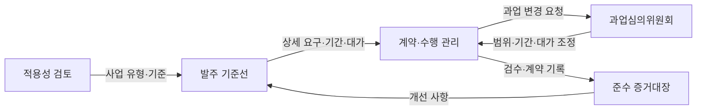
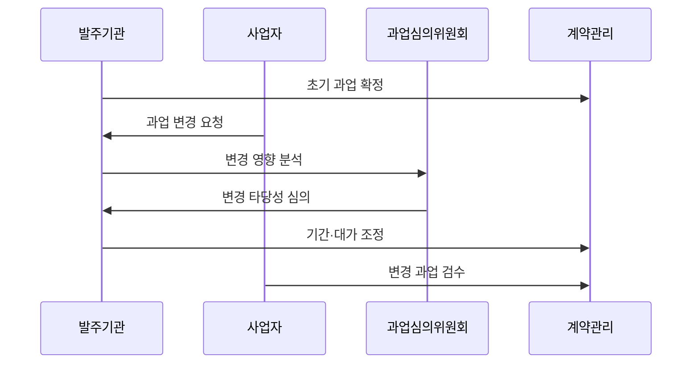

---
sidebar:
  order: 227
  label: "227. 소프트웨어 진흥법 (Software Promotion Act)"
  badge:
    text: "기출 · 50%"
    variant: note
title: "소프트웨어 진흥법 (Software Promotion Act)"
date: "2026-07-25T00:30:00+09:00"
tags: ["notes-software"]
weight: 227
extra:
  question_no: "227"
  source_status: "기출"
  source_history: "126회, 129회"
  priority: 50
  priority_note: "사업 절차·공정 계약 기준이 반복 출제됨"
---

## 미리 알고가기

- **소프트웨어 진흥법**: 소프트웨어 산업·인력·기술을 진흥하고 공공 소프트웨어사업의 공정한 계약과 수행 기준을 정하는 법률이다.
- **공공 소프트웨어사업**: 국가기관 등이 소프트웨어를 기획·구축·구매·운영하는 사업이다.
- **요구사항 상세화**: 사업자가 과업 규모를 산정할 수 있도록 기능, 성능, 품질과 검수 기준을 구체적으로 작성하는 활동이다.
- **적정 사업기간**: 사업 규모, 난이도와 품질 확보에 필요한 기간을 근거에 따라 산정해 계약에 반영한 기간이다.
- **적정 대가**: 과업의 내용과 변경된 범위에 맞춰 사업자에게 지급해야 할 합리적인 금액이다.
- **과업심의위원회**: 공공 소프트웨어사업의 과업내용 확정·변경과 그에 따른 기간·대가 조정을 심의하는 위원회다.
- **상용소프트웨어 직접구매**: 기준에 해당하는 상용 제품을 시스템 구축 계약에 묶지 않고 국가기관 등이 별도로 구매하는 제도다.
- **소프트웨어사업 영향평가**: 공공기관의 사업이 민간 시장을 침해하는지 사전에 분석하고 개선하는 제도다.
- **하위 기준**: 법률이 위임한 적용 금액, 절차와 예외를 정하는 시행령·시행규칙·고시·지침이다.

## Ⅰ. 개요

- **정의/개념**: 산업 진흥과 공공 사업의 공정성을 규율
- **배경/필요성**: 불명확 과업·무상 변경으로 계약 통제 필요

### 쉽게 이해하기 (학습용)

- 소프트웨어 산업을 키우면서 공공사업에서는 할 일과 기간, 대가를 명확히 해 발주자와 사업자가 공정하게 계약하도록 한다.

## Ⅱ. 특징

- 산업 육성과 공공 조달 규칙을 함께 규정한다.
- 기획부터 계약·변경·검수까지 전주기 적용한다.
- 과업 증가를 기간·대가 조정과 연결한다.
- 하위 기준·예외 누락 시 잘못된 발주 발생한다.

### 쉽게 이해하기 (학습용)

- 처음 계약할 때만 지키는 법이 아니라 사업을 계획하고 변경하고 끝낼 때까지 과업과 대가의 균형을 계속 확인하게 한다.

## Ⅲ. 아키텍처 및 구성요소

| 설계 요소 | 설명 |
|:---|:---|
| 적용성 검토 | 사업 유형·금액·예외 기준 확인 |
| 발주 기준선 | 요구사항·기간·대가·구매 방식 확정 |
| 계약·수행 관리 | 과업 이행과 변경 요청을 추적 |
| 과업심의위원회 | 변경 타당성과 기간·대가 조정 심의 |
| 준수 증거대장 | 산정·심의·계약·검수 자료 보존 |

> 요약: 과업 변경을 심의해 기간·대가와 동기화

### 쉽게 이해하기 (학습용)

- 발주 전에 할 일과 기간, 대가를 정하고 수행 중 일이 늘면 위원회가 검토해 계약과 검수 기준까지 함께 바꾼다.

## Ⅳ. 원리 및 절차 흐름도

| 절차 | 설명 |
|:---|:---|
| 초기 과업 확정 | 상세 요구·기간·대가를 계약 반영 |
| 과업 변경 요청 | 추가·삭제 요구와 근거를 제출 |
| 변경 영향 분석 | 범위·일정·비용·품질 영향을 산정 |
| 변경 타당성 심의 | 필요성과 조정 근거를 독립 검토 |
| 기간·대가 조정 | 승인 범위를 계약과 일정에 반영 |
| 변경 과업 검수 | 조정된 기준으로 산출물을 확인 |

> 요약: 변경 영향 심의 후 계약·검수 기준 조정

### 쉽게 이해하기 (학습용)

- 계약 뒤 일이 늘면 바로 개발시키지 않고 필요한 변화인지와 추가 기간·비용을 심의해 계약을 바꾼 뒤 검수한다.

## Ⅴ. 종류 및 비교

| 판단 기준 | 요구사항 상세화 | 과업심의 | 상용소프트웨어 직접구매 |
|:---|:---|:---|:---|
| 핵심 특징 | 발주 전 과업·검수 기준을 구체화 | 수행 중 과업 변경을 독립 심의 | 상용 제품을 구축 계약과 분리 구매 |
| 적용 기준 | 공공 사업의 과업 규모 산정 | 과업 확정·변경과 조정 필요 | 직접구매 기준에 해당하는 제품 |
| 주요 위험 | 누락 요구·규모 오산 | 무심의 변경·대가 미조정 | 예외 오판·통합 책임 공백 |

> 요약: 발주 상세화·변경 심의·분리 구매를 구분

### 쉽게 이해하기 (학습용)

- 처음 할 일을 명확히 하는 제도, 중간 변경을 심의하는 제도, 완제품을 따로 사는 제도는 적용 시점과 목적이 다르다.

## Ⅵ. 실무 사례

1. 민원 기능 추가를 과업심의 후 계약 반영
2. 상용 보안 제품을 구축 계약과 별도 구매

### 쉽게 이해하기 (학습용)

- 공공 민원시스템에 새 기능이 추가되면 위원회가 범위와 기간·대가를 심의한 뒤 승인된 내용만 계약에 반영한다.
- 기준에 해당하는 상용 보안 제품은 개발업체에 일괄 맡기지 않고 발주기관이 별도 구매해 부당한 계약을 줄인다.

## Ⅶ. 결론

- 과업 범위 변화에 기간·대가·검수 동기화

### 쉽게 이해하기 (학습용)

- 공정한 소프트웨어사업은 요구사항을 먼저 상세히 쓰고 변경된 일만큼 기간과 대가, 검수 기준을 함께 조정하는 데서 시작한다.
