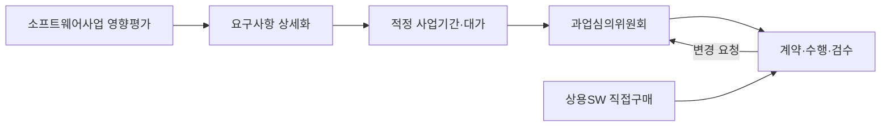
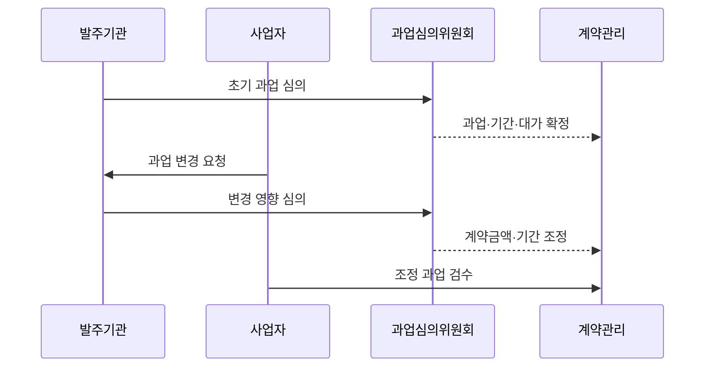

---
sidebar:
  order: 227
  label: "227. 소프트웨어 진흥법 (Software Promotion Act)"
  badge:
    text: "기출 · 50%"
    variant: note
title: "소프트웨어 진흥법 (Software Promotion Act)"
date: "2026-07-27T23:59:59+09:00"
tags: ["notes-software"]
weight: 227
extra:
  question_no: "227"
  source_status: "기출"
  source_history: "126회, 129회"
  priority: 50
  priority_note: "사업 절차·공정 계약 기준이 반복 출제됨"
---

## 미리 알고가기

- **소프트웨어(Software, SW)**: ‘에스더블유’로 읽고 영문 첫 글자를 딴 약어이며, 법이 진흥하고 공공사업 계약 기준을 적용하는 프로그램·관련 자료
- **소프트웨어 진흥법**: 소프트웨어 산업·인력·기술을 진흥하고 공공 소프트웨어사업의 공정한 계약과 수행 기준을 정하는 법률이다.
- **공공 소프트웨어사업**: 국가기관등이 발주하는 소프트웨어 개발·구축·구매·운영 관련 사업
- **요구사항 상세화**: 법 제44조에 따라 사업자가 과업 규모를 산정할 수 있도록 요구사항을 상세하게 작성·공개하는 활동
- **적정 사업기간**: 법 제45조에 따라 고시 기준으로 산정하고 계약에 반영하는 사업 수행 기간
- **적정 대가**: 법 제46조에 따라 국가기관등이 계약 시 지급하도록 노력해야 하는 적정 수준의 대가
- **과업심의위원회**: 법 제50조에 따라 과업내용 확정·변경과 계약금액·계약기간 조정을 심의하는 위원회
- **상용소프트웨어 직접구매**: 법 제54조에 따른 기준 대상 상용소프트웨어를 국가기관등이 별도로 구매하는 제도
- **소프트웨어사업 영향평가**: 공공기관의 사업이 민간 시장을 침해하는지 사전에 분석하고 개선하는 제도다.
- **하위 기준**: 법률이 위임한 적용 금액, 절차와 예외를 정하는 시행령·시행규칙·고시·지침이다.

## Ⅰ. 개요

- 정의/개념: **소프트웨어 역량·산업·공공사업 공정성** 규율
- 기존 한계: 불명확 요구·무상 과업 변경은 **기간·대가 불균형**

### 쉽게 이해하기 (학습용)

- 소프트웨어 산업을 키우면서 공공사업에서는 할 일과 기간, 대가를 명확히 해 발주자와 사업자가 공정하게 계약하도록 한다.

## Ⅱ. 특징

- **산업 진흥·인력·기술·공공사업 제도**를 통합 규정
- **요구 상세화·적정 기간·대가**로 발주 기준 설정
- **과업 확정·변경 심의**로 계약금액·기간 조정

### 쉽게 이해하기 (학습용)

- 처음 계약할 때만 지키는 법이 아니라 사업을 계획하고 변경하고 끝낼 때까지 과업과 대가의 균형을 계속 확인하게 한다.

## Ⅲ. 아키텍처 및 구성요소

| 설계 요소 | 설명 |
|:---|:---|
| 소프트웨어사업 영향평가 | 민간 시장 침해 가능성을 **사전 평가** |
| 요구사항 상세화 | 과업 규모 산정용 **상세 요구 공개** |
| 적정 사업기간·대가 | 기간 산정·**적정 대가 노력** |
| 과업심의위원회 | 과업 확정·변경과 **계약 조정 심의** |
| 상용SW 직접구매 | 기준 대상 제품을 **분리 구매** |

> 요약: 발주 기준과 과업 변경을 기간·대가·계약에 연계

### 쉽게 이해하기 (학습용)

- 발주 전에 할 일과 기간, 대가를 정하고 수행 중 일이 늘면 위원회가 검토해 계약과 검수 기준까지 함께 바꾼다.

## Ⅳ. 원리 및 절차 흐름도

| 절차 | 설명 |
|:---|:---|
| 초기 과업 심의 | 상세 요구·기간·대가를 **심의** |
| 과업·기간·대가 확정 | 심의 결과를 **발주·계약에 반영** |
| 과업 변경 요청 | 추가·삭제 요구와 근거를 제출 |
| 변경 영향 심의 | **범위·기간·금액 영향**을 심의 |
| 계약금액·기간 조정 | 승인 결과를 **계약에 반영** |
| 조정 과업 검수 | 조정된 **과업·검수 기준**으로 확인 |

> 요약: 변경 영향 심의 후 계약·검수 기준 조정

### 쉽게 이해하기 (학습용)

- 계약 뒤 일이 늘면 바로 개발시키지 않고 필요한 변화인지와 추가 기간·비용을 심의해 계약을 바꾼 뒤 검수한다.

## Ⅴ. 종류 및 비교

| 공공 소프트웨어사업 제도 | 요구사항 상세화 | 과업심의 | 상용SW 직접구매 |
|:---|:---|:---|:---|
| 적용 기준 | 발주 전 **과업 규모 산정** | 과업 **확정·변경·계약 조정** | 기준 대상 **상용 제품 구매** |
| 핵심 특징 | 상세 요구·**검수 기준 공개** | 위원회의 **심의·의결** | 구축 계약과 **분리 구매** |
| 한계 | 요구 누락·**규모 오산** | 무심의 변경·**조정 누락** | 예외 오판·**통합 책임 공백** |

> 요약: 발주 상세화·변경 심의·분리 구매를 구분

### 쉽게 이해하기 (학습용)

- 처음 할 일을 명확히 하는 제도, 중간 변경을 심의하는 제도, 완제품을 따로 사는 제도는 적용 시점과 목적이 다르다.

## Ⅵ. 실무 사례

1. 민원 기능 추가는 **과업심의 후 금액·기간 조정**
2. 기준 대상 보안 제품은 **상용SW 직접구매**

### 쉽게 이해하기 (학습용)

- 공공 민원시스템에 새 기능이 추가되면 위원회가 범위와 기간·대가를 심의한 뒤 승인된 내용만 계약에 반영한다.
- 기준에 해당하는 상용 보안 제품은 개발업체에 일괄 맡기지 않고 발주기관이 별도 구매해 부당한 계약을 줄인다.

## Ⅶ. 결론

- 발주 전은 **상세화**, 과업 변경은 **심의·계약 조정**

### 쉽게 이해하기 (학습용)

- 공정한 소프트웨어사업은 요구사항을 먼저 상세히 쓰고 변경된 일만큼 기간과 대가, 검수 기준을 함께 조정하는 데서 시작한다.
