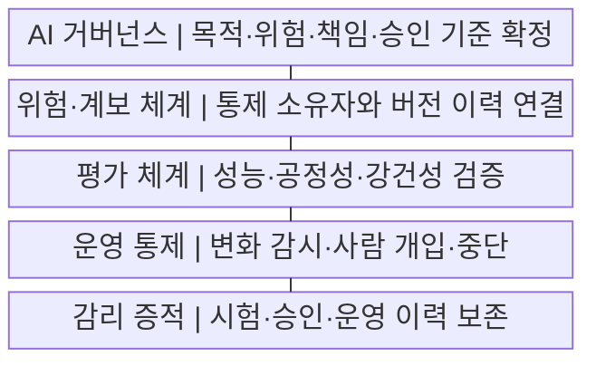
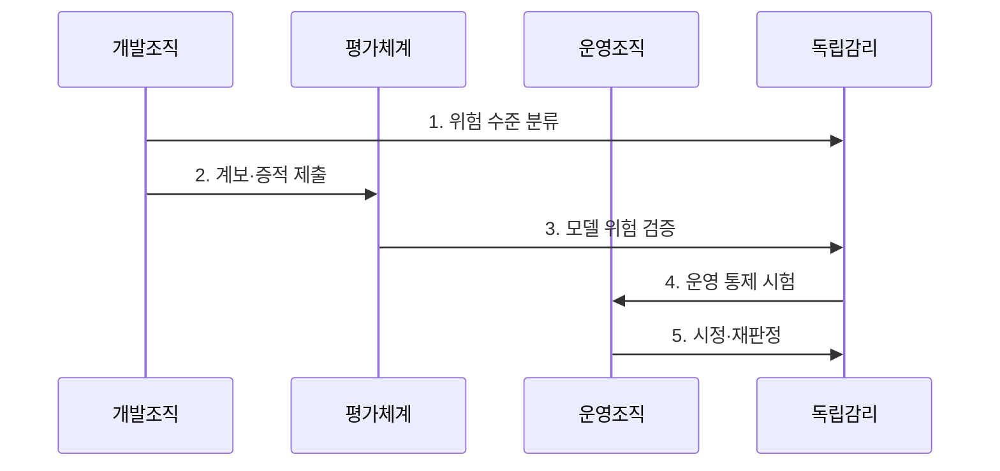

---
sidebar:
  order: 228
  label: "228. AI 소프트웨어 감리 점검 항목 (AI Software Audit)"
  badge:
    text: "기출 · 70%"
    variant: note
title: "AI 소프트웨어 감리 점검 항목 (AI Software Audit)"
date: "2026-07-29T20:30:00+09:00"
tags: ["notes-software"]
weight: 228
extra:
  question_no: "228"
  source_status: "기출"
  source_history: "135회"
  priority: 70
  priority_note: "데이터·모델·윤리 점검이 최근 직접 출제됨"
---

## 미리 알고가기

- **인공지능(Artificial Intelligence, AI) 소프트웨어 감리**: ‘에이아이 소프트웨어 감리’로 읽고 AI는 영문 머리글자를 딴 약어이며, 데이터·모델·서비스의 위험과 통제를 독립적으로 점검한다.
- **AI 생애주기(AI Lifecycle)**: 데이터 수집부터 학습·검증·배포·운영·폐기까지 이어지는 전 과정
- **AI 거버넌스(AI Governance)**: AI의 목적·위험 허용 수준·책임·승인·감독 절차를 정한 관리 체계
- **데이터 계보(Data Lineage)**: 학습 데이터의 출처와 수집·정제·변환·사용 이력을 연결한 추적 정보
- **모델 계보(Model Lineage)**: 코드·데이터·매개변수·평가·배포 버전을 모델 결과와 연결한 추적 정보
- **모델 카드(Model Card)**: 모델의 목적·학습 데이터·평가 결과·제한·권장 사용 범위를 기록한 문서
- **편향(Bias)**: 데이터나 모델의 체계적 치우침으로 특정 집단·조건에 불리한 결과가 발생하는 현상
- **공정성(Fairness)**: 정당한 근거 없이 집단별 결과·오류가 불리하게 달라지지 않도록 관리하는 성질
- **강건성(Robustness)**: 입력 잡음·공격·환경 변화에도 성능과 동작이 허용 범위에 머무는 성질
- **드리프트(Drift)**: 운영 데이터 분포나 입력-결과 관계가 학습 시점과 달라지는 현상
- **사람의 감독(Human Oversight)**: 사람이 AI 결과를 검토하고 필요하면 거부·수정·중단할 수 있게 한 통제
- **감리 증적(Audit Evidence)**: 점검 판단을 재현하도록 보존한 데이터·설정·시험 결과·승인·운영 이력

## Ⅰ. 개요

- 정의/개념: AI 전주기의 **위험·통제·증적을 독립 점검**
- 배경/필요성: 정확도 중심 검증의 **계보·공정성·운영 위험 누락**

### 쉽게 이해하기 (학습용)

- 모델 점수만 보지 않고 누가 어떤 자료로 만들었으며 실제 서비스에서 누가 감시하고 중단할 수 있는지까지 확인한다.

## Ⅱ. 특징

- 위험 영향도 기반의 **점검 범위·깊이 차등화**
- 데이터·모델 계보의 **버전·결정 추적성**
- 개발 조직과 분리된 **증적 기반 독립 판정**

### 쉽게 이해하기 (학습용)

- 사람에게 미치는 영향이 클수록 더 깊게 점검하고 다른 사람도 같은 결론을 재현할 수 있는 기록을 요구한다.

## Ⅲ. 구조 및 구성요소

| 구성요소 | 책임 |
|:---|:---|
| AI 거버넌스 | 목적·위험·책임·승인 기준 확정 |
| 위험·계보 체계 | 통제 소유자와 버전 이력 연결 |
| 평가 체계 | 성능·공정성·강건성 검증 |
| 운영 통제 | 변화 감시·사람 개입·중단 |
| 감리 증적 | 시험·승인·운영 이력 보존 |

### 쉽게 이해하기 (학습용)

- 책임표와 제작 이력, 시험 성적, 운영 경보와 사람의 조치 기록을 한 근거 체계로 연결해 독립적으로 검사한다.

## Ⅳ. 흐름도

**동작 원리**

1. **위험 수준 분류**: 목적·영향으로 점검 깊이 결정
2. **계보·증적 제출**: 데이터·모델·승인 이력 연결
3. **모델 위험 검증**: 성능·공정성·강건성 평가
4. **운영 통제 시험**: 감시·개입·중단 동작 확인
5. **시정·재판정**: 결함 보완·잔여 위험 승인

### 쉽게 이해하기 (학습용)

- 영향이 큰 위험부터 자료와 모델, 실제 중단 장치를 시험하고 문제를 고친 증거와 남은 위험까지 다시 판단한다.

## Ⅴ. 종류 및 비교

| AI 감리 영역 | 데이터 감리 | 모델 감리 | 운영 감리 |
|:---|:---|:---|:---|
| 적용 기준 | 학습 데이터의 **적법·대표성 위험** | 판단 오류의 **성능·차별 위험** | 배포 후 **변화·오남용 위험** |
| 핵심 특징 | 출처·동의·**계보·품질 점검** | 성능·공정성·**강건성·한계 점검** | 드리프트·감독·**중단 통제 점검** |
| 한계 | 숨은 수집 편향·**동의 추적 곤란** | 실제 환경·**미지 입력 미포괄** | 경보 오탐·**사람 개입 실패** |

> 요약: 데이터 생성·모델 판단·운영 변화 위험을 분리 점검

### 쉽게 이해하기 (학습용)

- 학습 재료의 문제는 데이터 감리, 판단 품질은 모델 감리, 실제 사용 중 변화와 개입은 운영 감리로 확인한다.

## Ⅵ. 실무 고려사항 및 대책

| 고려사항 | 대책 | 효과 |
|:---|:---|:---|
| 학습 자료 출처 불명 | 동의·변환·버전 계보 연결 | 데이터 책임 추적 |
| 전체 정확도만 평가 | 집단별 오류·강건성 시험 | 차별 위험 식별 |
| 사람 개입 절차 미작동 | 재심·중단 시나리오 훈련 | 피해 확산 방지 |
| 배포 후 변화 미감시 | 드리프트 경보·재검증 기준 | 운영 위험 통제 |

### 쉽게 이해하기 (학습용)

- 대출 모델이 특정 집단을 더 자주 잘못 거절하는지와 사람이 결과를 뒤집을 수 있는 절차를 함께 확인한다.

## Ⅶ. 결론

- **계보·위험 평가·사람 개입·운영 증적에 따른 AI 감사**

### 쉽게 이해하기 (학습용)

- AI 감리는 정확도뿐 아니라 제작 근거와 운영 변화, 사람의 통제까지 계속 추적해야 한다.
