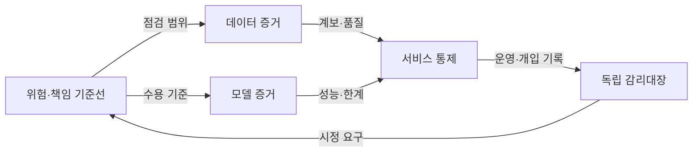
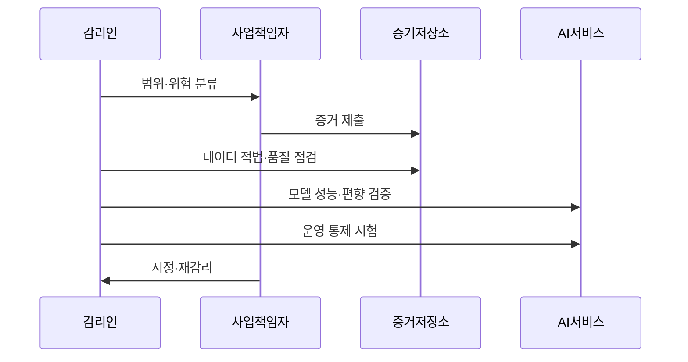

---
sidebar:
  order: 228
  label: "228. AI 소프트웨어 감리 점검 항목 (AI Software Audit)"
  badge:
    text: "기출 · 70%"
    variant: note
title: "AI 소프트웨어 감리 점검 항목 (AI Software Audit)"
date: "2026-07-25T00:30:00+09:00"
tags: ["notes-software"]
weight: 228
extra:
  question_no: "228"
  source_status: "기출"
  source_history: "135회"
  priority: 70
  priority_note: "데이터·모델·윤리 점검이 최근 직접 출제됨"
---

## 미리 알고가기

- **인공지능(Artificial Intelligence, AI) 소프트웨어 감리**: 데이터·모델·서비스의 위험과 통제가 요구사항에 맞는지 독립적으로 점검하고 개선사항을 제시하는 활동이다.
- **인공지능 생애주기**: 데이터 수집부터 모델 학습·검증·배포·운영·폐기까지 이어지는 전 과정이다.
- **데이터 계보(Data Lineage)**: 학습 자료의 출처와 수집·정제·변환·사용 이력을 연결해 추적하는 정보다.
- **모델 카드(Model Card)**: 모델의 목적, 학습 자료, 평가 결과, 제한사항과 권장 사용 범위를 기록한 문서다.
- **편향(Bias)**: 자료나 모델의 체계적 치우침으로 특정 집단이나 조건에서 결과가 불리하게 달라지는 현상이다.
- **강건성(Robustness)**: 입력 잡음이나 작은 환경 변화에도 모델 성능과 동작이 허용 범위에 머무는 성질이다.
- **드리프트(Drift)**: 운영 데이터나 입력과 결과의 관계가 학습 시점과 달라져 모델 성능이 변하는 현상이다.
- **사람의 감독(Human Oversight)**: 사람이 인공지능 결과를 검토하고 필요하면 거부·수정·중단할 수 있게 한 통제다.
- **감리 증거**: 점검 판단을 다른 사람이 재현할 수 있도록 보존한 자료, 설정, 시험 결과와 승인 이력이다.

## Ⅰ. 개요

- **정의/개념**: AI 전주기 위험·통제·증거를 독립 점검
- **배경/필요성**: 데이터·운영 변화의 오판으로 전주기 감리 필요

### 쉽게 이해하기 (학습용)

- 모델 점수만 보는 것이 아니라 어떤 자료로 만들었고 실제 서비스에서 누가 결과를 통제하는지까지 독립적으로 확인한다.

## Ⅱ. 특징

- 위험 수준에 따라 점검 깊이·전문가를 차등화한다.
- 재현 가능한 증거로 판단의 추적성 확보한다.
- 개발 조직과 독립된 시각으로 누락 통제 발견한다.
- 일회성 점검은 운영 중 변화 위험을 놓친다.

### 쉽게 이해하기 (학습용)

- 사람에게 미치는 영향이 클수록 더 깊게 살피고, 나중에도 같은 결론을 확인할 자료와 운영 중 재점검이 필요하다.

## Ⅲ. 아키텍처 및 구성요소

| 설계 요소 | 설명 |
|:---|:---|
| 위험·책임 기준선 | 목적·영향·허용 위험·책임자 확정 |
| 데이터 증거 | 출처·동의·계보·품질 결과 보존 |
| 모델 증거 | 성능·편향·강건성·한계를 기록 |
| 서비스 통제 | 사람 개입·감시·중단 절차 구현 |
| 독립 감리대장 | 점검 결과·시정·잔여 위험 추적 |

> 요약: 데이터·모델 증거를 운영 통제와 연결

### 쉽게 이해하기 (학습용)

- 허용할 위험을 먼저 정하고 데이터와 모델의 근거를 서비스의 사람 개입과 중단 장치까지 연결해 독립 기록으로 남긴다.

## Ⅳ. 원리 및 절차 흐름도

| 절차 | 설명 |
|:---|:---|
| 범위·위험 분류 | 목적·영향도로 점검 수준 결정 |
| 증거 제출 | 자료·설정·시험·승인 이력 확보 |
| 데이터 적법·품질 점검 | 출처·동의·계보·분포를 확인 |
| 모델 성능·편향 검증 | 집단별 성능·강건성·한계 확인 |
| 운영 통제 시험 | 감시·사람 개입·중단 동작 확인 |
| 시정·재감리 | 결함 보완과 잔여 위험을 재판정 |

> 요약: 위험별 증거를 점검하고 시정 후 재판정

### 쉽게 이해하기 (학습용)

- 영향이 큰 부분부터 자료와 모델, 실제 중단 장치를 시험하고 발견한 문제를 고친 증거까지 다시 확인한다.

## Ⅴ. 종류 및 비교

| 판단 기준 | 데이터 감리 | 모델 감리 | 운영 감리 |
|:---|:---|:---|:---|
| 핵심 특징 | 출처·계보·품질·대표성 점검 | 성능·편향·강건성·한계 점검 | 감시·사람 개입·중단 절차 점검 |
| 적용 기준 | 학습 자료의 적법·품질 위험 | 판단 오류의 영향이 큰 모델 | 배포 후 변화·오남용 가능성 |
| 주요 위험 | 무단 자료·대표성 부족 | 집단별 오판·과신 | 드리프트 미탐지·개입 실패 |

> 요약: 자료·판단·운영 위험에 맞춰 감리 배치

### 쉽게 이해하기 (학습용)

- 학습 재료의 문제는 데이터 감리, 판단 성능의 문제는 모델 감리, 실제 사용 중 변화와 중단 문제는 운영 감리로 확인한다.

## Ⅵ. 실무 사례

1. 대출 심사 모델의 집단별 승인 오류 점검
2. 카메라 교체 후 불량 판정 드리프트 점검

### 쉽게 이해하기 (학습용)

- 대출 심사 모델이 특정 집단에서 더 자주 잘못 거절하는지 집단별 오류율과 사람의 재검토 절차로 확인한다.
- 공장 카메라가 바뀐 뒤 입력 영상 분포와 불량 판정 성능이 달라졌는지 운영 기록으로 확인한다.

## Ⅶ. 결론

- 영향도별 데이터·모델·운영 증거로 감리

### 쉽게 이해하기 (학습용)

- 인공지능 감리는 정확도 한 번 확인으로 끝내지 않고 영향이 큰 위험부터 자료 근거와 운영 통제를 계속 추적해야 한다.
