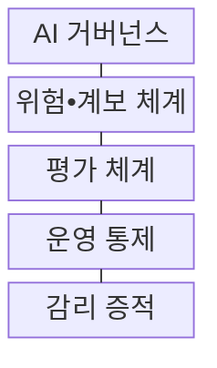
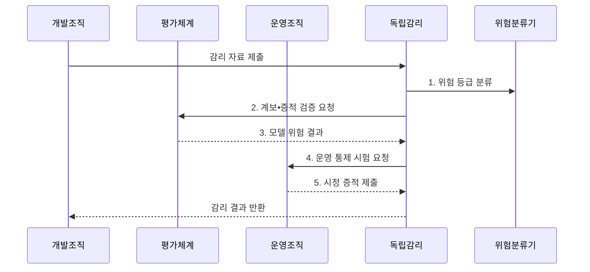

---
sidebar:
  order: 228
  label: "228. AI 소프트웨어 감리 점검 항목 (AI Software Audit)"
  badge:
    text: "기출 • 70%"
    variant: note
title: "AI 소프트웨어 감리 점검 항목 (AI Software Audit)"
date: "2026-08-04T14:45:37+09:00"
tags: ["notes-software"]
weight: 228
extra:
  question_no: "228"
  source_status: "기출"
  source_history: "135회"
  priority: 70
  priority_note: "데이터•모델•윤리 점검이 최근 직접 출제됨"
---

## Ⅰ. 개요

핵심 용어

- **AI 소프트웨어 감리(AI Software Audit)**: 데이터 수집•모델 개발•검증•배포•운영•폐기 전주기의 위험과 통제를 독립된 관점에서 증거로 확인하는 보증 활동이다.
- **인공지능(Artificial Intelligence, AI)**: 데이터에서 패턴을 학습해 예측•분류•생성 등 지능적 결과를 제공하는 기술이다.

- 정의/개념: 데이터•모델•서비스 전주기의 위험과 통제를 증거로 확인하는 **독립 AI 소프트웨어 보증 활동**
- 배경/필요성: 정확도 중심 검증의 **계보•공정성•운영 위험 누락**

#### 한줄 요약

- 모델 점수만 보지 않고 누가 어떤 자료로 만들었으며 실제 서비스에서 누가 감시하고 중단할 수 있는지까지 확인한다.

## Ⅱ. 특징

핵심 용어

- **계보 추적**: 계보 추적은 데이터•코드•모델•평가•배포 버전과 승인 이력을 연결해 판단 근거를 재현하게 한다.
- **위험 기반 감리(Risk-Based Audit)**: 영향도와 발생 가능성에 따라 점검 범위•깊이•표본 크기를 달리하는 접근이다.
- **독립 판정(Independent Assessment)**: 개발 조직과 이해관계를 분리한 주체가 객관적 증거로 적정성을 판단하는 원칙이다.

- **위험 기반**: 영향도에 따라 점검 범위•깊이 차등화
- **계보 추적**: 데이터•모델 버전과 결정 이력 연결
- **독립 판정**: 개발 조직과 분리해 증적으로 판단

#### 한줄 요약

- 사람에게 미치는 영향이 클수록 더 깊게 점검하고 다른 사람도 같은 결론을 재현할 수 있는 기록을 요구한다.

## Ⅲ. 구조 및 구성요소

핵심 용어

- **감리 증적**: 감리 증적은 모델 카드, 데이터•모델 계보, 시험 결과, 승인과 운영 이력을 보존한 판단 근거다.
- **AI 거버넌스(AI Governance)**: AI의 목적•위험•역할•승인•책임 기준을 정하고 이행을 감독하는 체계이다.
- **모델 카드(Model Card)**: 모델의 목적•학습 자료•성능•한계•윤리 고려사항을 기록한 문서이다.
- **강건성(Robustness)**: 입력 변형•잡음•공격•환경 변화에도 허용 가능한 성능을 유지하는 성질이다.

| 구성요소 | 책임 |
|:---|:---|
| AI 거버넌스 | 목적•위험•책임의 **승인 기준 확정** |
| 위험•계보 체계 | 통제 소유자와 **버전 이력 연결** |
| 평가 체계 | 성능•공정성•**강건성 검증** |
| 운영 통제 | 변화 감시•**사람 개입•중단** |
| 감리 증적 | 모델 카드•시험•**승인•운영 이력 보존** |

#### 한줄 요약

- 책임표와 제작 이력, 시험 성적, 운영 경보와 사람의 조치 기록을 한 근거 체계로 연결해 독립적으로 검사한다.

## Ⅳ. 흐름도

핵심 용어

- **4. 운영 통제 시험 요청**: 독립 감리는 운영 조직에 드리프트 감시, 사람의 재심, 중단 통제가 실제로 작동하는지 시험하도록 요청한다.
- **1. 위험 등급 분류**: AI의 목적•영향•피해 가능성으로 감리 깊이를 정하는 단계이다.
- **2. 계보•증적 검증 요청**: 데이터•모델•평가•승인 이력의 완전성과 일관성을 확인하는 단계이다.
- **3. 모델 위험 결과**: 성능•공정성•강건성과 사용 한계를 평가하는 단계이다.
- **5. 시정 증적 제출**: 결함 보완 결과와 수용할 잔여 위험을 기록하는 단계이다.

**동작 원리**

1. **위험 등급 분류**: 목적•영향으로 점검 깊이 결정
2. **계보•증적 검증 요청**: 데이터•모델•승인 이력 전달
3. **모델 위험 결과**: 성능•공정성•강건성 평가
4. **운영 통제 시험 요청**: 감시•개입•중단 동작 확인
5. **시정 증적 제출**: 결함 보완•잔여 위험 기록

#### 한줄 요약

- 영향이 큰 위험부터 자료와 모델, 실제 중단 장치를 시험하고 문제를 고친 증거와 남은 위험까지 다시 판단한다.

## Ⅴ. 종류 및 비교

핵심 용어

- **운영 감리**: 운영 감리는 배포 뒤 드리프트, 오남용, 사람 감독과 중단 통제의 지속 작동 여부를 점검한다.
- **데이터 감리(Data Audit)**: 학습 데이터의 출처•동의•대표성•품질•계보를 점검하는 영역이다.
- **모델 감리(Model Audit)**: 모델의 성능•공정성•강건성•설명 가능성과 한계를 점검하는 영역이다.

| AI 감리 영역 | **데이터 감리** | **모델 감리** | **운영 감리** |
|:---|:---|:---|:---|
| 적용 기준 | 학습 데이터의 **적법•대표성 위험** | 판단 오류의 **성능•차별 위험** | 배포 후 **변화•오남용 위험** |
| 핵심 특징 | 출처•동의•**계보•품질 점검** | 성능•공정성•**강건성•한계 점검** | 드리프트•감독•**중단 통제 점검** |
| 한계 | 숨은 수집 편향•**동의 추적 곤란** | 실제 환경•**미지 입력 미포괄** | 경보 오탐•**사람 개입 실패** |

> 요약: **데이터 생성•모델 판단•운영 변화 위험** 을 분리 점검

#### 한줄 요약

- 학습 재료의 문제는 데이터 감리, 판단 품질은 모델 감리, 실제 사용 중 변화와 개입은 운영 감리로 확인한다.

## Ⅵ. 실무 고려사항 및 대책

핵심 용어

- **집단별 오류 은폐**: 집단별 오류 은폐는 전체 정확도 평균이 특정 집단의 높은 오판율과 차별 위험을 가리는 문제다.
- **드리프트(Drift)**: 운영 데이터 분포나 입력과 정답의 관계가 학습 시점과 달라지는 현상이다.
- **사람 개입(Human Oversight)**: 사람이 AI 판단을 검토•재심•중단하거나 결과를 변경할 수 있도록 하는 통제이다.

| 문제 | 대책 | 효과 |
|:---|:---|:---|
| 학습 자료의 **출처•동의 이력 불명** | **동의•변환•버전 계보** 연결 | 데이터 책임 **추적** |
| 전체 정확도의 **집단별 오류 은폐** | **집단별 오류•강건성** 시험 | 차별 위험 **식별** |
| 사람 개입 절차의 **실제 미작동** | **재심•중단 시나리오** 훈련 | 피해 확산 **방지** |
| 배포 후 **분포 변화 감시 누락** | **드리프트 경보•재검증** 설정 | 운영 위험 **통제** |

#### 한줄 요약

- 대출 모델이 특정 집단을 더 자주 잘못 거절하는지와 사람이 결과를 뒤집을 수 있는 절차를 함께 확인한다.

## Ⅶ. 결론

핵심 용어

- **전주기 심층 감리**: 고영향 AI에는 데이터•모델•운영을 연결한 전주기 심층 감리를 적용하고 저위험은 증적을 표본 점검한다.
- **고영향 인공지능(High-Impact AI)**: 생명•안전•권리 등에 중대한 영향을 줄 수 있어 강화된 위험 통제가 필요한 인공지능이다.

- 고영향은 **전주기 심층 감리**, 저위험은 **증적 표본 점검** 적용

#### 한줄 요약

- AI 감리는 정확도뿐 아니라 제작 근거와 운영 변화, 사람의 통제까지 계속 추적해야 한다.
