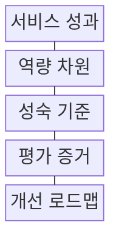
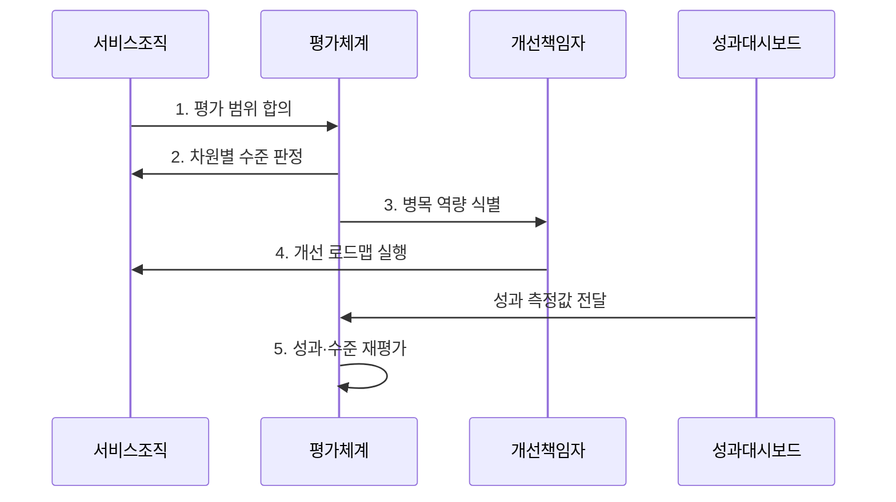

---
sidebar:
  order: 229
  label: "229. 디지털 서비스 성숙도 모형 (Digital Service Maturity Model)"
  badge:
    text: "기출 · 50%"
    variant: note
title: "디지털 서비스 성숙도 모형 (Digital Service Maturity Model)"
date: "2026-08-02T23:39:00+09:00"
tags: ["notes-software"]
weight: 229
extra:
  question_no: "229"
  source_status: "기출"
  source_history: "138회"
  priority: 50
  priority_note: "서비스 단계·성과 측정이 최근 직접 출제됨"
---

## Ⅰ. 개요

핵심 용어

- **디지털 서비스 성숙도 모형(Digital Service Maturity Model)**: 사용자 성과를 만드는 전략·조직·기술·운영 역량의 현재 수준과 목표 수준 및 개선 경로를 단계별로 진단하는 모형이다.

- 정의/개념: 사용자 성과를 만드는 조직의 디지털 서비스 역량 수준과 개선 경로를 정하는 **단계별 성숙도 진단 모형**
- 배경/필요성: 기술 투자 규모만으로는 **사용자 성과 판단 불가**

#### 한줄 요약

- 새 기술을 얼마나 샀는지가 아니라 사용자가 일을 끝내는 능력이 어느 단계인지 증거로 확인하고 다음 개선 순서를 정한다.

## Ⅱ. 특징

핵심 용어

- **병목 식별**: 병목 식별은 역량 차원별 수준 편차에서 서비스 성과 향상을 가장 제한하는 취약 능력을 찾는다.

- **단계 표현**: 역량의 반복 가능성과 관리 수준 구분
- **병목 식별**: 차원별 편차에서 성과 제약 역량 탐색
- **목표 설정**: 사업 성과·투자 여건으로 목표 수준 결정

#### 한줄 요약

- 모든 영역을 최고 단계로 만들기보다 서비스 결과를 막는 약한 영역을 찾아 필요한 수준까지만 먼저 높인다.

## Ⅲ. 구조 및 구성요소

핵심 용어

- **성숙 기준**: 성숙 기준은 사용자 경험·운영·데이터·기술 등 각 역량 차원의 단계와 통과 조건을 정의한다.

| 구성요소 | 책임 |
|:---|:---|
| 서비스 성과 | 사용자·업무 **결과와 범위 확정** |
| 역량 차원 | 경험·운영·데이터·**기술 분리** |
| 성숙 기준 | 차원별 **단계·통과 조건 정의** |
| 평가 증거 | 산출물·운영 자료·**측정값 수집** |
| 개선 로드맵 | 격차별 **과제·책임·순서 결정** |

#### 한줄 요약

- 원하는 서비스 결과를 정하고 여러 능력을 증거로 평가한 뒤 가장 큰 수준 차이를 줄일 과제를 순서대로 배치한다.

## Ⅳ. 흐름도

핵심 용어

- **3. 병목 역량 식별**: 평가체계는 차원별 수준과 서비스 성과의 관계를 비교해 결과 향상을 제한하는 병목 역량을 선정한다.

**동작 원리**

1. **평가 범위 합의**: 서비스·성과·차원 확정
2. **차원별 수준 판정**: 단계 조건과 증거 대조
3. **병목 역량 식별**: 성과 제한 차원 선정
4. **개선 로드맵 실행**: 과제·책임·순서 적용
5. **성과·수준 재평가**: 결과 지표·단계 변화 확인

#### 한줄 요약

- 현재 능력을 자료로 판정하고 서비스 결과를 가장 막는 약점을 먼저 고친 뒤 실제 성과가 나아졌는지 다시 측정한다.

## Ⅴ. 종류 및 비교

핵심 용어

- **관리 단계**: 관리 단계는 공통 절차와 지표가 조직에 정착돼 서비스를 반복 가능하게 측정·운영하는 수준이다.

| 디지털 서비스 성숙도 | **초기 단계** | **관리 단계** | **최적화 단계** |
|:---|:---|:---|:---|
| 적용 기준 | 절차·책임·**증거 불명확** | 공통 방식과 **측정 정착** | 예측·실험 기반 **개선 반복** |
| 핵심 특징 | 개인 경험에 의존한 **임시 대응** | 표준 절차·지표의 **반복 관리** | 성과 자료 기반 **지속 개선** |
| 한계 | 품질 편차·**담당자 의존** | 절차 준수의 **목적화** | 과도한 자동화·**지표 최적화** |

> 요약: **반복 가능성·성과 환류**를 기준으로 단계 판정

#### 한줄 요약

- 사람마다 다르게 처리하면 초기, 같은 절차와 지표로 관리하면 관리, 결과 자료로 방법을 계속 바꾸면 최적화 단계다.

## Ⅵ. 실무 고려사항 및 대책

핵심 용어

- **단계 자가평가**: 단계 자가평가는 산출물과 운영 지표의 교차 확인 없이 조직 의견만으로 성숙 수준을 높게 판정하는 문제다.

| 문제 | 대책 | 효과 |
|:---|:---|:---|
| 평균 점수의 **취약 차원 은폐** | **성과 제약 역량** 식별 | 개선 우선순위 **명확화** |
| 증거 없는 **단계 자가평가** | **산출물·운영 지표** 교차 확인 | 판정 신뢰성 **확보** |
| 모든 차원의 **최고 단계 추구** | **사업 목표별 목표 수준** 설정 | 투자 낭비 **방지** |
| 일회성 평가 후 **개선 효과 미확인** | **성과 대시보드·수준 재측정** | 지속 개선 **정착** |

#### 한줄 요약

- 온라인 민원 신청의 중도 이탈이 본인확인 단계에 몰리면 그 구간의 사용 경험을 먼저 개선한다.

## Ⅶ. 결론

핵심 용어

- **성과 제약 역량**: 평균 등급보다 서비스 결과를 막는 성과 제약 역량을 찾아 현실적인 목표 수준까지 우선 개선해야 한다.

- 평균 등급보다 **성과 제약 역량**을 우선 목표 수준까지 개선

#### 한줄 요약

- 전체 평균보다 사용자 결과를 막는 역량을 찾아 현실적인 목표와 개선 순서를 정해야 한다.
