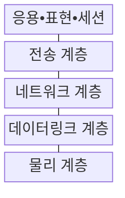
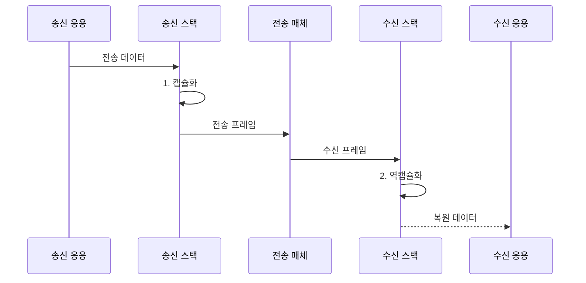

---
sidebar:
  order: 1
  label: "001. OSI 7계층 모델 (OSI 7-Layer Model)"
  badge:
    text: "기출 • 70%"
    variant: note
title: "OSI 7계층 모델 (OSI 7-Layer Model)"
date: "2026-08-03T15:05:00+09:00"
tags:
  - "notes-network"
weight: 1
extra:
  question_no: "001"
  source_status: "기출"
  source_history: "120회, 125회, 134회"
  priority: 70
  priority_note: "설명형: 120•134회 단답•서술, 계층 기능•PDU"
---

## Ⅰ. 개요

핵심 용어

- **개방형 시스템 간 상호접속 7계층 모델(Open Systems Interconnection 7-Layer Model, OSI 7계층 모델)**: 통신 기능과 책임을 일곱 계층으로 나누어 이기종 시스템의 상호운용 기준을 제공하는 참조 모델이다.

- 정의/개념: 통신 기능과 책임을 **OSI 7계층**으로 분리한 참조 모델
- 배경/필요성: 공통 계층 기준 없이는 이기종 장비의 **상호운용 제약**

#### 한줄 요약

- 서로 다른 장비도 같은 계층의 약속을 따르면 통신하고 장애 위치도 계층별로 좁힐 수 있다

## Ⅱ. 특징

핵심 용어

- **계층 인터페이스**: 인접한 두 계층이 서비스를 요청하고 처리 결과를 전달하는 경계이다.
- **프로토콜 데이터 단위(Protocol Data Unit, PDU)**: 각 계층이 자신의 제어 정보를 붙여 처리하는 데이터 단위이다.
- **캡슐화와 역캡슐화**: 송신 계층이 제어 정보를 붙이고 수신 계층이 반대 순서로 제거하는 과정이다.

- 계층 인터페이스의 **구현 변경 영향 격리**
- 계층별 PDU의 **처리 책임•장애 범위 분리**
- 캡슐화•역캡슐화의 **제어 정보 대칭 처리**

#### 한줄 요약

- 각 층의 내부 구현이 바뀌어도 약속된 연결 규칙을 지키면 다른 층은 그대로 동작한다

## Ⅲ. 구조 및 구성요소

핵심 용어

- **전송 제어 프로토콜(Transmission Control Protocol, TCP)**: 포트로 응용을 구분하고 순서와 재전송을 제어하는 전송 계층 프로토콜이다.
- **인터넷 프로토콜(Internet Protocol, IP)**: 출발지와 목적지 주소를 사용하여 패킷 전달 경로를 정하는 네트워크 계층 프로토콜이다.
- **매체 접근 제어(Media Access Control, MAC)**: 같은 링크의 장치를 식별하고 프레임을 전달하는 데이터링크 계층 기능이다.

| 구성요소 | 책임 |
|:---|:---|
| 응용•표현•세션 | 서비스•형식•**대화 상태** 처리 |
| 전송 계층 | 포트 기반 **종단 간 전달** 제어 |
| 네트워크 계층 | **IP 주소** 기반 경로 선택 |
| 데이터링크 계층 | **MAC 주소** 기반 프레임 전달 |
| 물리 계층 | 비트를 **전기•광•무선 신호** 로 전송 |

#### 한줄 요약

- 위층은 사용자 데이터의 의미를 다루고 아래층으로 갈수록 전달 경로와 실제 신호를 다룬다

## Ⅳ. 흐름도

핵심 용어

- **세그먼트•패킷•프레임•비트**: 각각 전송•네트워크•데이터링크•물리 계층이 처리하는 데이터 단위이다.

**동작 원리**

1. **캡슐화**: 계층별 헤더를 붙여 PDU 생성
2. **역캡슐화**: 계층 역순으로 헤더를 제거해 원본 복원

#### 한줄 요약

- 송신자는 계층별 주소표를 붙여 보내고 수신자는 아래층부터 주소표를 떼어 원본을 복원한다

## Ⅴ. 종류 및 비교

핵심 용어

- **전송 제어 프로토콜/인터넷 프로토콜 모델(Transmission Control Protocol/Internet Protocol Model, TCP/IP 모델)**: 인터넷에서 실제 사용하는 프로토콜을 응용•전송•인터넷•네트워크 접근의 네 계층으로 묶는다.

| 계층 모델 | OSI 7계층 | TCP/IP 4계층 |
|:---|:---|:---|
| 적용 기준 | **계층 책임•장애** 분석 | 실제 **인터넷 통신** 구현 |
| 핵심 특징 | 기능•책임을 **7계층**으로 분리 | 실제 프로토콜을 **4계층**으로 통합 |
| 한계 | 실제 프로토콜과 **경계 불일치** | 세부 **계층 책임** 분석 제한 |

> 요약: 책임 분석은 OSI, 구현은 TCP/IP

#### 한줄 요약

- OSI는 통신 업무를 세밀히 나눈 설계도이고 TCP/IP는 인터넷에서 실제 쓰는 묶음이다

## Ⅵ. 실무 고려사항 및 대책

핵심 용어

- **최대 전송 단위(Maximum Transmission Unit, MTU)**: 한 링크에서 단편화 없이 전달할 수 있는 최대 패킷 크기이다.
- **방화벽**: 주소•포트•연결 상태 등의 규칙으로 네트워크 트래픽을 허용하거나 차단한다.

| 문제 | 대책 | 효과 |
|:---|:---|:---|
| 계층 간 증상이 혼재된 장애 | 물리 계층부터 **PDU** 상향 추적 | **장애 범위** 축소 |
| 주소•포트•응용 필드가 혼재된 정책 | 통제 대상에 맞춰 **방화벽 계층** 배치 | **정책 오탐•누락** 감소 |
| 헤더 누적으로 MTU 초과 | 계층별 헤더를 포함한 **MTU** 산정 | **단편화•폐기** 예방 |
| 실제 프로토콜 경계와 모델 불일치 | **TCP/IP 경계** 로 구현 재매핑 | **설계 해석 오류** 감소 |

#### 한줄 요약

- 케이블부터 IP와 포트까지 계층 순서로 확인하면 장애 범위를 빠르게 좁힐 수 있다

## Ⅶ. 결론

핵심 용어

- **계층별 장애 분석**: 관찰한 프로토콜 데이터 단위와 주소 종류를 기준으로 문제가 시작된 통신 계층을 좁히는 방법이다.
- **점검 시작점 결정**: 오류 데이터 단위와 주소 종류에 해당하는 OSI 계층부터 장애 원인을 확인하는 판단이다.

- PDU•주소를 기준으로 **OSI 계층**별 장애 시작점 선택

#### 한줄 요약

- 오류가 난 데이터 단위와 주소를 확인하면 어느 계층부터 점검할지 정할 수 있다.
