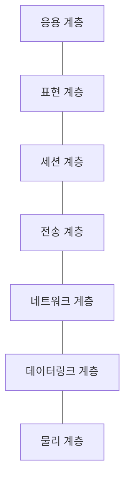
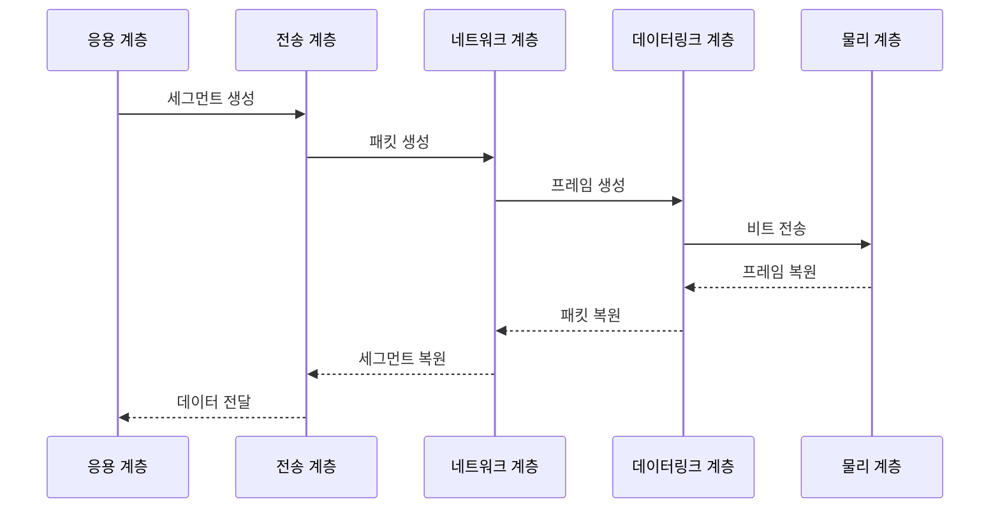

---
sidebar:
  order: 1
  label: "001. OSI 7계층 모델 (OSI 7-Layer Model)"
  badge:
    text: "기출 · 70%"
    variant: note
title: "OSI 7계층 모델 (OSI 7-Layer Model)"
date: "2026-07-27T23:59:59+09:00"
tags:
  - "notes-network"
weight: 1
extra:
  question_no: "001"
  source_status: "기출"
  source_history: "120회, 125회, 134회"
  priority: 70
  priority_note: "설명형: 120·134회 단답·서술, 계층 기능·PDU"
---

## 미리 알고가기

- **개방형 시스템 상호연결 OSI(오에스아이, Open Systems Interconnection)**: 영어 세 낱말의 첫 글자를 쓴 표기로 통신 기능과 책임을 7개 계층으로 나눈 참조 모델
- **프로토콜 데이터 단위 PDU(피디유, Protocol Data Unit)**: 영어 세 낱말의 첫 글자를 쓴 표기로 각 계층이 제어 정보를 붙여 처리하는 데이터 단위
- **캡슐화·역캡슐화**: 송신 계층이 제어 정보를 붙이고 수신 계층이 반대 순서로 제거하는 과정
- **계층 인터페이스**: 인접한 두 계층이 서비스를 요청하고 결과를 전달하는 경계
- **전송 제어 프로토콜(Transmission Control Protocol, TCP)**: 포트로 응용을 구분하고 순서·재전송을 제어하는 전송 계층 프로토콜
- **인터넷 프로토콜(Internet Protocol, IP)**: 출발지·목적지 주소로 패킷 전달 경로를 정하는 네트워크 계층 프로토콜
- **매체 접근 제어(Media Access Control, MAC)**: 같은 링크에서 장치를 식별하고 프레임을 전달하는 데이터링크 계층 기능
- **세그먼트·패킷·프레임·비트**: 전송·네트워크·데이터링크·물리 계층이 각각 처리하는 데이터 단위
- **오류 검출값**: 전송 중 프레임의 비트가 바뀌었는지 수신 측이 확인하는 값
- **인터넷 프로토콜 모음(Transmission Control Protocol/Internet Protocol, TCP/IP)**: 실제 인터넷 통신에 쓰는 프로토콜을 4개 계층으로 묶은 모델
- **방화벽**: 주소·포트·연결 상태 같은 규칙으로 네트워크 트래픽을 허용하거나 차단하는 보안 장비
- **웹 응용 방화벽(Web Application Firewall, WAF)**: 웹 요청의 주소·매개변수·본문을 검사해 공격 요청을 차단하는 보안 장비

## Ⅰ. 개요

- **정의/개념**: 통신 기능·책임을 **7개 계층으로 분리한 참조 모델**
- **배경/필요성**: 이기종 장비의 **상호운용·장애 분리 한계** 해소

### 쉽게 이해하기 (학습용)

- 서로 다른 장비도 같은 계층의 약속을 따르면 통신하고 장애 위치도 계층별로 좁힐 수 있다

## Ⅱ. 특징

- 계층 인터페이스의 **구현 변경 영향 격리**
- 계층별 PDU의 **처리 책임·장애 범위 분리**
- 캡슐화·역캡슐화의 **제어 정보 대칭 처리**

### 쉽게 이해하기 (학습용)

- 각 층의 내부 구현이 바뀌어도 약속된 연결 규칙을 지키면 다른 층은 그대로 동작한다

## Ⅲ. 아키텍처 및 구성요소

| 설계 요소 | 설명 |
|:---|:---|
| 응용 계층 | 사용자 응용에 네트워크 서비스 제공 |
| 표현 계층 | 데이터 형식 변환·암호화·압축 |
| 세션 계층 | 통신 세션 연결·동기화·종료 |
| 전송 계층 | 포트 기반 종단 간 전송 제어 |
| 네트워크 계층 | IP 주소 기반 경로 선택 |
| 데이터링크 계층 | MAC 주소 기반 프레임 전달 |
| 물리 계층 | 비트를 전기·광·무선 신호로 전송 |

> 요약: 7계층이 통신 책임을 경계별로 분담

### 쉽게 이해하기 (학습용)

- 위층은 사용자 데이터의 의미를 다루고 아래층으로 갈수록 전달 경로와 실제 신호를 다룬다

## Ⅳ. 원리 및 절차 흐름도

| 절차 | 설명 |
|:---|:---|
| 세그먼트 생성 | 포트·전송 제어 정보를 결합 |
| 패킷 생성 | 출발지·목적지 IP 주소를 결합 |
| 프레임 생성 | MAC 주소와 오류 검출값을 결합 |
| 비트 전송 | 프레임을 물리 신호로 변환 |
| 프레임 복원 | 물리 신호에서 프레임을 추출 |
| 패킷 복원 | 프레임 헤더를 제거해 패킷 추출 |
| 세그먼트 복원 | IP 헤더를 제거해 세그먼트 추출 |
| 데이터 전달 | 전송 헤더를 제거해 응용에 전달 |

> 요약: 송신은 캡슐화, 수신은 역캡슐화

### 쉽게 이해하기 (학습용)

- 송신자는 계층별 주소표를 붙여 보내고 수신자는 아래층부터 주소표를 떼어 원본을 복원한다

## Ⅴ. 종류 및 비교

| 계층 모델 | OSI 7계층 | TCP/IP 4계층 |
|:---|:---|:---|
| 적용 기준 | 계층 책임·장애 분석 | 실제 인터넷 통신 구현 |
| 핵심 특징 | 기능·책임을 7계층으로 분리 | 실제 프로토콜을 4계층으로 통합 |
| 한계 | 실제 프로토콜과 경계 불일치 | 세부 계층 책임 분석 제한 |

> 요약: 책임 분석은 OSI, 구현은 TCP/IP

### 쉽게 이해하기 (학습용)

- OSI는 통신 업무를 세밀히 나눈 설계도이고 TCP/IP는 인터넷에서 실제 쓰는 묶음이다

## Ⅵ. 실무 사례

1. 장애를 **물리→링크→IP→전송 순으로 진단**
2. 방화벽은 3·4계층, **WAF는 7계층 검사**

### 쉽게 이해하기 (학습용)

- 케이블부터 IP와 포트까지 계층 순서로 확인하면 장애 범위를 빠르게 좁힐 수 있다
- 방화벽은 주소와 포트를, WAF는 웹 요청 내용을 보고 차단한다

## Ⅶ. 결론

- **PDU·주소·프로토콜**로 장애 계층 식별

### 쉽게 이해하기 (학습용)

- 오류가 난 데이터 단위와 주소를 보면 어느 계층부터 점검할지 바로 정할 수 있다
