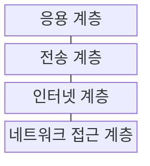
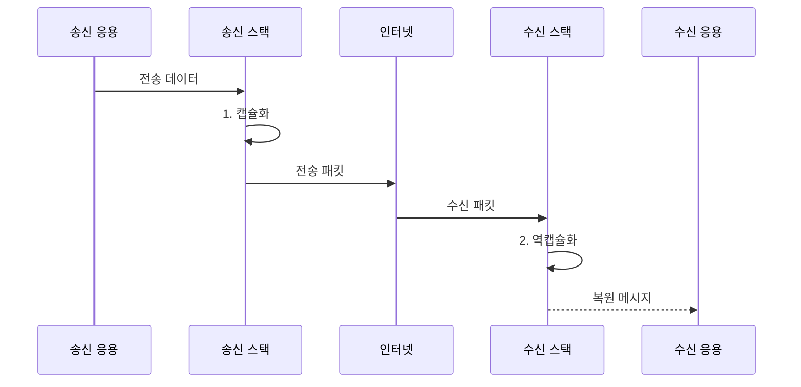

---
sidebar:
  order: 2
  label: "002. TCP/IP 4계층 모델 (TCP/IP Model)"
  badge:
    text: "기출 · 70%"
    variant: note
title: "TCP/IP 4계층 모델 (TCP/IP Model)"
date: "2026-07-31T11:00:12+09:00"
tags:
  - "notes-network"
weight: 2
extra:
  question_no: "002"
  source_status: "기출"
  source_history: "120회, 125회, 128회, 129회, 132회"
  priority: 70
  priority_note: "비교형: 다회차 전송 문제의 공통 4계층 기준"
---

## 미리 알고가기

- **인터넷 프로토콜 모음(Transmission Control Protocol/Internet Protocol, TCP/IP)**: 인터넷 통신 기능을 공통 IP 중심의 4개 계층으로 묶은 구현 모델
- **전송 제어 프로토콜(Transmission Control Protocol, TCP)**: 포트로 응용을 구분하고 순서·재전송을 제어하는 전송 계층 프로토콜
- **인터넷 프로토콜(Internet Protocol, IP)**: 출발지·목적지 주소로 패킷을 여러 네트워크에 전달하는 인터넷 계층 프로토콜
- **사용자 데이터그램 프로토콜(User Datagram Protocol, UDP)**: 연결 설정과 재전송 없이 데이터그램을 보내는 전송 계층 프로토콜
- **종단 간 원칙(End-to-End Principle)**: 신뢰성·보안 같은 기능을 중간망보다 송수신 호스트에서 완성하는 설계 원칙
- **최선형 전달(Best Effort)**: IP가 패킷의 도착·순서·중복 제거를 보장하지 않고 가능한 범위에서 전달하는 방식
- **얇은 허리 구조(Thin Waist)**: 다양한 응용과 통신 매체가 공통 IP 계층을 사이에 두고 독립적으로 발전하는 구조
- **포트**: 한 호스트 안에서 패킷을 받을 응용 프로세스를 구분하는 번호
- **패킷·프레임**: IP 주소로 네트워크 간 이동하는 단위와 한 링크에서 장치 사이를 이동하는 단위
- **캡슐화·역캡슐화**: 송신 계층이 제어 정보를 붙이고 수신 계층이 반대 순서로 제거하는 과정
- **최대 전송 단위(Maximum Transmission Unit, MTU)**: 한 링크에서 단편화 없이 전달할 수 있는 최대 패킷 크기
- **개방형 시스템 상호연결(Open Systems Interconnection, OSI)**: 통신 기능과 책임을 7개 계층으로 나눈 참조 모델

> **키워드:** TCP/IP 4계층 모델 (TCP/IP Model)

## Ⅰ. 개요

- 정의/개념: 인터넷 통신 기능을 공통 IP 중심의 **TCP/IP 4계층**으로 묶은 구현 모델
- 배경/필요성: 응용·매체별 전용 규약은 **이기종 통신 확장 제약**

### 쉽게 이해하기 (학습용)

- 다양한 앱과 유무선 장비가 가운데의 같은 IP 규칙을 사용해 서로 통신한다

## Ⅱ. 특징

- 공통 IP의 **얇은 허리 구조**로 응용·통신 매체 결합 완화
- IP의 **비연결·최선형 전달**
- **종단 간 원칙**에 따른 신뢰성·혼잡 제어

### 쉽게 이해하기 (학습용)

- 중간망은 패킷 전달에 집중하고 송수신 컴퓨터가 누락과 순서를 처리한다

## Ⅲ. 구조 및 구성요소

| 구성요소 | 책임 |
|:---|:---|
| 응용 계층 | 응용 간 **메시지·동작** 정의 |
| 전송 계층 | 포트 기반 **종단 간 전달** 제어 |
| 인터넷 계층 | **IP 주소** 기반 네트워크 간 전달 |
| 네트워크 접근 계층 | **링크 규칙**으로 인접 장치 전달 |

### 쉽게 이해하기 (학습용)

- 앱의 메시지는 포트와 IP 주소를 차례로 붙인 뒤 링크에 맞는 프레임으로 전달된다

## Ⅳ. 흐름도

**동작 원리**

1. **캡슐화**: 포트·IP·링크 제어 정보를 계층별 결합
2. **역캡슐화**: 계층 역순으로 제어 정보를 제거해 메시지 복원

### 쉽게 이해하기 (학습용)

- 송신 측이 계층별 배송표를 붙이면 수신 측은 반대 순서로 떼어 앱에 원문을 준다

## Ⅴ. 종류 및 비교

| 계층 모델 | TCP/IP 4계층 | OSI 7계층 |
|:---|:---|:---|
| 적용 기준 | **인터넷 통신** 구현·분석 | **계층 책임·장애** 분석 |
| 핵심 특징 | 실제 프로토콜을 **4계층**으로 통합 | 통신 책임을 **7계층**으로 세분 |
| 한계 | 세부 **계층 책임**이 함께 묶임 | 실제 프로토콜과 **경계 불일치** |

> 요약: 구현은 TCP/IP, 책임 분석은 OSI

### 쉽게 이해하기 (학습용)

- TCP/IP는 실제 인터넷 묶음이고 OSI는 통신 업무를 더 잘게 나눈 설명 도구다

## Ⅵ. 실무 고려사항 및 대책

| 고려사항 | 대책 | 효과 |
|:---|:---|:---|
| 여러 계층의 장애 증상이 혼재 | 링크·IP·포트·응용 순 **계층 진단** | **원인 범위** 축소 |
| 손실·순서·지연 요구가 불명확 | 요구별 **TCP·UDP** 선택 | **전송 동작**과 요구 일치 |
| 캡슐화 헤더로 MTU 초과 | 경로 **MTU·헤더 크기** 산정 | **단편화·전송 실패** 예방 |
| 중간망의 응용별 상태 의존 증가 | **종단 간 원칙**으로 중간망 기능 최소화 | 새 응용·매체의 **추가 영향** 감소 |

### 쉽게 이해하기 (학습용)

- 웹이 열리지 않으면 연결선부터 IP 주소, 포트, 웹 응용 순서로 범위를 좁힌다

## Ⅶ. 결론

- 손실 불허는 **TCP**, 지연 최소화는 **UDP** 선택

### 쉽게 이해하기 (학습용)

- 데이터의 손실 허용 여부와 지연 요구에 맞춰 전송 방식을 선택해야 한다.
