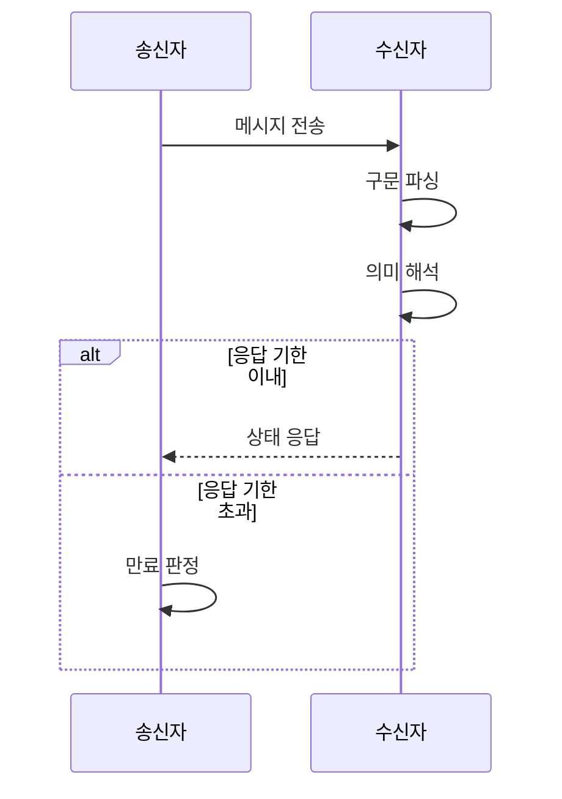

---
sidebar:
  order: 3
  label: "003. 네트워크 프로토콜 3요소 (Protocol 3 Elements)"
  badge:
    text: "기출 · 30%"
    variant: note
title: "네트워크 프로토콜 3요소 (Protocol 3 Elements)"
date: "2026-07-27T23:59:59+09:00"
tags:
  - "notes-network"
weight: 3
extra:
  question_no: "003"
  source_status: "기출"
  source_history: "134회"
  priority: 30
  priority_note: "설명형: 134회 서술, 구문·의미·타이밍 직접 요구"
---

## 미리 알고가기

- **프로토콜(Protocol)**: 서로 다른 통신 주체가 메시지를 같은 방식으로 만들고 해석하도록 합의한 규칙 집합
- **구문(Syntax)**: 메시지를 구성하는 필드의 순서·길이·표현 형식을 정하는 규칙
- **의미(Semantics)**: 필드값과 제어 코드가 요구하는 동작·응답·상태 변화를 정하는 규칙
- **타이밍(Timing)**: 메시지를 보내고 받을 순서·속도·대기 시간을 정하는 규칙
- **필드·인코딩**: 메시지에서 한 정보를 담는 구역과 그 정보를 비트나 문자로 표현하는 방식
- **파싱(Parsing)**: 수신 메시지의 경계와 필드를 구문 규칙에 따라 분리하는 작업
- **상태 전이**: 현재 상태에서 메시지와 조건에 따라 다음 상태로 바뀌는 동작
- **타임아웃(Timeout)**: 정해진 대기 시간 안에 응답이 없으면 실패로 판정하는 조건
- **상호운용성**: 서로 다른 구현이 같은 규칙을 따라 통신할 수 있는 성질

## Ⅰ. 개요

- 정의/개념: 통신 규칙의 **구문·의미·타이밍 3요소**
- **배경/필요성**: 구현별 **메시지 해석·교환 불일치** 해소

### 쉽게 이해하기 (학습용)

- 같은 문장 모양을 써도 뜻과 말할 순서가 다르면 대화가 어긋나므로 세 규칙을 모두 맞춘다

## Ⅱ. 특징

- 구문의 **메시지 형식·필드 경계 정의**
- 의미의 **필드값·제어 동작 정의**
- 타이밍의 **교환 순서·속도 정의**

### 쉽게 이해하기 (학습용)

- 메시지 모양·뜻·교환 시점 중 하나라도 다르면 두 장치는 같은 요청을 다르게 처리한다

## Ⅲ. 아키텍처 및 구성요소

| 설계 요소 | 설명 |
|:---|:---|
| 구문 | 필드 순서·길이·인코딩을 정의 |
| 의미 | 필드값별 동작·응답·상태를 정의 |
| 타이밍 | 송수신 순서·대기 시간을 정의 |

> 요약: 형식·해석·교환 조건이 프로토콜을 완성

### 쉽게 이해하기 (학습용)

- 구문은 편지 양식, 의미는 내용의 뜻, 타이밍은 보내고 답할 순서를 맡는다

## Ⅳ. 원리 및 절차 흐름도

| 절차 | 설명 |
|:---|:---|
| 메시지 전송 | 구문·타이밍에 맞춰 필드값 송신 |
| 구문 파싱 | 메시지 경계와 필드를 분리 |
| 의미 해석 | 필드값으로 동작과 상태를 결정 |
| 상태 응답 | 다음 상태와 결과를 메시지로 반환 |
| 만료 판정 | 대기 시간 초과 시 교환 실패 처리 |

> 요약: 구문 해석 후 의미대로 응답·만료 처리

### 쉽게 이해하기 (학습용)

- 받는 쪽이 정해진 양식으로 내용을 읽고 뜻에 맞게 답하며 늦으면 실패로 끝낸다

## Ⅴ. 종류 및 비교

| 프로토콜 요소 | 구문 | 의미 | 타이밍 |
|:---|:---|:---|:---|
| 적용 기준 | 필드 파싱·인코딩 | 상태 전이·응답 해석 | 순서·속도·대기 시간 |
| 핵심 특징 | 메시지 표현 형식 | 필드값별 동작 | 교환 순서·시간 |
| 한계 | 필드 오분리 | 명령 오해석 | 타임아웃·순서 위반 |

> 요약: 구문은 형식, 의미는 동작, 타이밍은 시간을 일치시킴

### 쉽게 이해하기 (학습용)

- 메시지를 못 읽으면 구문, 다르게 행동하면 의미, 늦거나 순서가 틀리면 타이밍을 점검한다

## Ⅵ. 실무 사례

1. 장치 연동 시 **필드·상태·응답 시간 대조**

### 쉽게 이해하기 (학습용)

- 장치끼리 통신이 어긋나면 메시지 모양, 코드 뜻, 응답 시점을 차례로 비교한다

## Ⅶ. 결론

- 이기종 장치 간 통신 해석 차이를 극복하기 위해 메시지 형식·필드 의미·상태 전이·응답 시간을 검토하여, 구문·의미·타이밍을 모두 갖춘 프로토콜을 설계해야 한다.

### 쉽게 이해하기 (학습용)

- 메시지 모양과 뜻과 시점을 따로 확인하면 두 장치가 왜 다르게 동작했는지 찾을 수 있다
