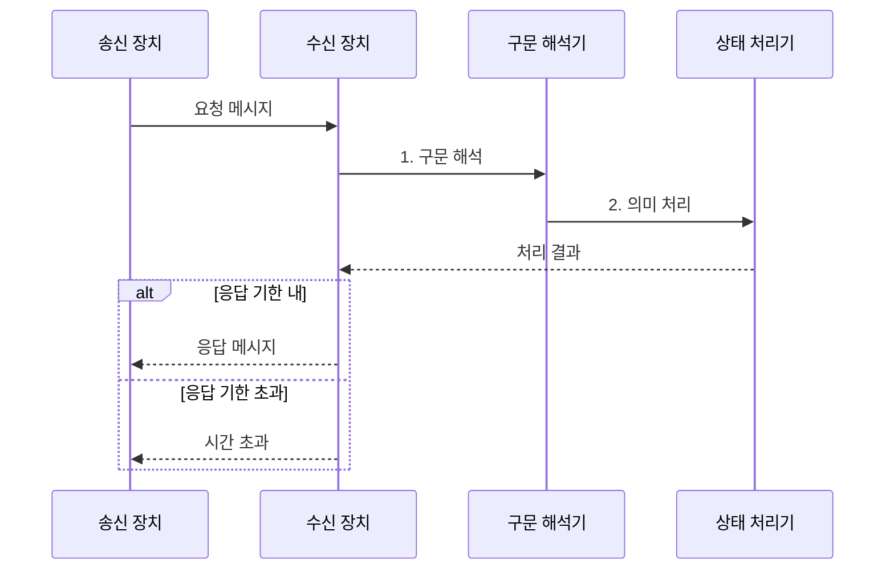

---
sidebar:
  order: 3
  label: "003. 네트워크 프로토콜 3요소 (Protocol 3 Elements)"
  badge:
    text: "기출 · 30%"
    variant: note
title: "네트워크 프로토콜 3요소 (Protocol 3 Elements)"
date: "2026-08-02T09:24:00+09:00"
tags:
  - "notes-network"
weight: 3
extra:
  question_no: "003"
  source_status: "기출"
  source_history: "134회"
  priority: 30
  priority_note: "설명형: 134회 서술, 구문·의미·타이밍 직접 요구"
---

## Ⅰ. 개요

핵심 용어

- **프로토콜**: 서로 다른 통신 주체가 메시지를 같은 방식으로 만들고 해석하도록 합의한 규칙의 집합이다.
- **상호운용성**: 서로 다른 구현이 같은 프로토콜을 따라 올바르게 통신할 수 있는 성질이다.

- 정의/개념: 메시지 형식·동작·교환 시점을 **구문·의미·타이밍**으로 규정하는 통신 규칙
- 배경/필요성: 메시지 형식만 맞춰서는 구현별 동작·교환 시점의 **일관된 상호운용을 보장하기 어려움**

#### 한줄 요약

- 같은 문장 모양을 써도 뜻과 말할 순서가 다르면 대화가 어긋나므로 세 규칙을 모두 맞춘다

## Ⅱ. 특징

핵심 용어

- **구문**: 메시지 필드의 순서·길이와 표현 형식을 정의한다.
- **의미**: 필드값과 제어 코드에 대응하는 동작·응답·상태 변화를 정의한다.
- **타이밍**: 메시지의 송수신 순서·속도와 대기 시간을 정의한다.

- 구문의 **메시지 형식·필드 경계 정의**
- 의미의 **필드값·제어 동작 정의**
- 타이밍의 **교환 순서·속도 정의**

#### 한줄 요약

- 메시지 모양·뜻·교환 시점 중 하나라도 다르면 두 장치는 같은 요청을 다르게 처리한다

## Ⅲ. 구조 및 구성요소

핵심 용어

- **필드**: 메시지 안에서 하나의 정보를 담는 구역이다.
- **인코딩**: 필드의 정보를 비트나 문자로 표현하는 방식이다.

| 구성요소 | 책임 |
|:---|:---|
| 구문 | **필드 순서·길이·인코딩** 정의 |
| 의미 | 필드값별 **동작·응답·상태** 정의 |
| 타이밍 | **송수신 순서·대기 시간** 정의 |

#### 한줄 요약

- 구문은 편지 양식, 의미는 내용의 뜻, 타이밍은 보내고 답할 순서를 맡는다

## Ⅳ. 흐름도

핵심 용어

- **파싱**: 수신 메시지의 경계와 필드를 구문 규칙에 따라 분리하는 작업이다.
- **상태 전이**: 현재 상태에서 수신한 메시지와 조건에 따라 다음 상태를 결정하는 동작이다.
- **타임아웃**: 정해진 대기 시간 안에 응답이 없을 때 통신 실패로 판정하는 조건이다.

**동작 원리**

1. **구문 해석**: 경계·길이 규칙에 따라 필드 분리
2. **의미 처리**: 필드값에 따른 동작·상태 전이 결정

#### 한줄 요약

- 받는 쪽이 정해진 양식으로 내용을 읽고 뜻에 맞게 답하며 늦으면 실패로 끝낸다

## Ⅴ. 종류 및 비교

핵심 용어

- **형식·동작·시간의 독립 검증**: 메시지를 읽지 못하는 오류, 다르게 처리하는 오류, 순서나 기한이 어긋나는 오류를 구분한다.

| 프로토콜 요소 | 구문 | 의미 | 타이밍 |
|:---|:---|:---|:---|
| 적용 기준 | **필드 파싱·인코딩** 불일치 | **상태 전이·응답** 불일치 | **순서·속도·대기 시간** 불일치 |
| 핵심 특징 | **메시지 표현 형식** 규정 | **필드값별 동작** 규정 | **교환 순서·시간** 규정 |
| 한계 | 형식 일치만으로 **동작 보장 불가** | 동작 일치만으로 **교환 시점 보장 불가** | 시간 일치만으로 **메시지 해석 보장 불가** |

> 요약: 구문은 형식, 의미는 동작, 타이밍은 시간을 일치시킴

#### 한줄 요약

- 메시지를 못 읽으면 구문, 다르게 행동하면 의미, 늦거나 순서가 틀리면 타이밍을 점검한다

## Ⅵ. 실무 고려사항 및 대책

핵심 용어

- **상태표**: 메시지와 현재 상태별로 수행할 동작과 다음 상태를 명시하여 구현 간 의미 차이를 줄인다.
- **버전 협상**: 통신 주체가 지원하는 프로토콜 버전을 확인하여 함께 사용할 규칙 범위를 정한다.

| 문제 | 대책 | 효과 |
|:---|:---|:---|
| 송수신 구현의 필드 경계가 불일치 | 길이·순서·**인코딩 명세** 고정 | **파싱 오류** 감소 |
| 같은 코드에 여러 동작이 대응 | 값별 **동작·상태표** 관리 | **상태 전이 불일치** 감소 |
| 응답 순서·대기 시간이 규격과 불일치 | **상태 전이·타임아웃** 시험 | **교환 순서 위반** 예방 |
| 버전별 구문·의미 규칙이 혼용 | **버전 협상·호환 범위** 명시 | **연동 장애** 감소 |

#### 한줄 요약

- 장치끼리 통신이 어긋나면 메시지 모양, 코드 뜻, 응답 시점을 차례로 비교한다

## Ⅶ. 결론

핵심 용어

- **프로토콜 적합성**: 구현이 구문·의미·타이밍 규칙을 모두 준수할 때 확보된다.
- **검증 순서 결정**: 파싱 오류는 구문, 동작 차이는 의미, 순서·시간 위반은 타이밍을 먼저 확인하는 판단이다.

- 파싱·동작·시간 오류별 **구문·의미·타이밍** 우선 검증

#### 한줄 요약

- 메시지 모양과 뜻, 교환 시점을 따로 확인하면 장치 간 동작 차이를 찾을 수 있다.
