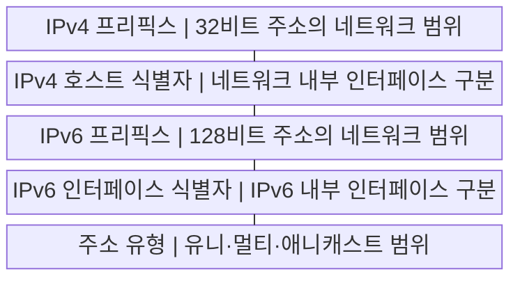
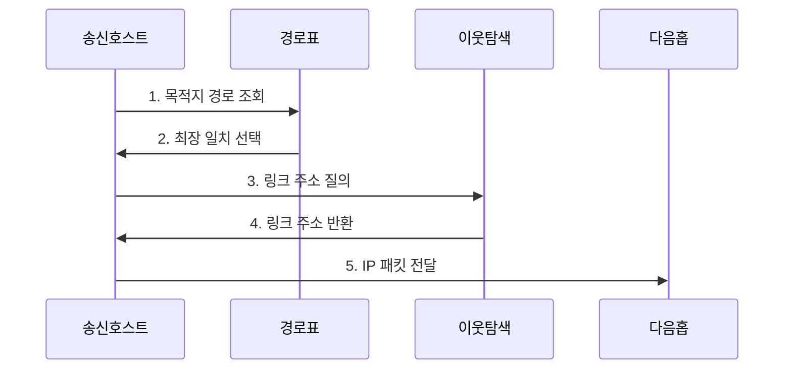

---
sidebar:
  order: 4
  label: "004. IP 주소 체계: IPv4·IPv6 (IP Addressing IPv4 IPv6)"
  badge:
    text: "기출 · 30%"
    variant: note
title: "IP 주소 체계: IPv4·IPv6 (IP Addressing IPv4 IPv6)"
date: "2026-07-29T20:30:00+09:00"
tags:
  - "notes-network"
weight: 4
extra:
  question_no: "004"
  source_status: "기출"
  source_history: "128회"
  priority: 30
  priority_note: "설명형: 128회 주소 구조 문항의 IP 핵심축"
---

## 미리 알고가기

- **인터넷 프로토콜 주소(Internet Protocol Address, IP 주소)**: 네트워크와 인터페이스를 식별해 패킷의 출발지와 목적지를 나타내는 논리 주소
- **인터넷 프로토콜 버전 4 IPv4(아이피 브이포, Internet Protocol version 4)**: IP 약어에 버전 4를 붙인 표기로 32비트 주소를 점 구분 10진수로 표현함
- **인터넷 프로토콜 버전 6 IPv6(아이피 브이식스, Internet Protocol version 6)**: IP 약어에 버전 6을 붙인 표기로 128비트 주소를 콜론 구분 16진수로 표현함
- **프리픽스·인터페이스 식별자**: 주소 앞부분의 네트워크 범위와 뒷부분의 개별 인터페이스를 나타내는 비트 영역
- **클래스 없는 도메인 간 라우팅(Classless Inter-Domain Routing, CIDR)**: `/길이`를 '슬래시 길이'로 읽고 슬래시 뒤 숫자로 네트워크 프리픽스의 비트 수를 구분해 주소를 가변 크기로 할당·집약하는 방식
- **주소 결정 프로토콜(Address Resolution Protocol, ARP)**: IPv4 주소에 대응하는 같은 링크의 매체 접근 제어 주소를 찾는 프로토콜
- **이웃 탐색 프로토콜(Neighbor Discovery Protocol, NDP)**: IPv6에서 이웃 주소 확인·라우터 탐색·주소 중복 검사를 수행하는 프로토콜
- **상태 비보존 주소 자동 구성(Stateless Address Autoconfiguration, SLAAC)**: 라우터가 알린 프리픽스로 호스트가 IPv6 주소를 스스로 만드는 방식
- **동적 호스트 구성 프로토콜 버전 6(Dynamic Host Configuration Protocol version 6, DHCPv6)**: 서버가 IPv6 주소와 네트워크 설정을 호스트에 배포하는 프로토콜
- **네트워크 주소 변환(Network Address Translation, NAT)**: 사설 IPv4 주소와 공인 IPv4 주소를 경계 장비에서 변환하는 기법
- **듀얼 스택·터널링**: IPv4와 IPv6를 함께 실행하는 방식과 한 프로토콜 패킷을 다른 프로토콜 안에 넣어 전달하는 전환 방식
- **유니캐스트·멀티캐스트·애니캐스트**: 각각 한 수신자·수신자 그룹·같은 주소의 가까운 수신자에게 패킷을 보내는 주소 유형
- **최장 프리픽스 일치**: 목적지 주소와 가장 많은 앞 비트가 일치하는 경로를 선택하는 라우팅 규칙
- **확장 헤더**: IPv6 기본 헤더 뒤에 필요한 기능만 연결해 추가하는 선택 헤더
- **매체 접근 제어(Media Access Control, MAC)**: 같은 링크에서 장치를 식별하고 프레임을 전달하는 데이터링크 계층 기능

## Ⅰ. 개요

- 정의/개념: 네트워크·인터페이스를 식별하는 **계층형 논리 주소**
- 배경/필요성: IPv4의 **주소 고갈·NAT 의존 한계** 해소

### 쉽게 이해하기 (학습용)

- 우편번호와 상세 주소처럼 앞부분은 네트워크를, 뒷부분은 그 안의 인터페이스를 가리킨다

## Ⅱ. 특징

- 계층형 프리픽스의 **경로 집약**
- 최장 프리픽스 일치의 **최구체 경로 선택**
- IPv6의 **128비트 주소·자동 구성**

### 쉽게 이해하기 (학습용)

- 목적지와 앞자리 비트가 가장 길게 맞는 경로가 더 구체적인 배송 구역을 가리킨다

## Ⅲ. 구조 및 구성요소

| 구성요소 | 책임 |
|:---|:---|
| IPv4 프리픽스 | 32비트 주소의 네트워크 범위 |
| IPv4 호스트 식별자 | 네트워크 내부 인터페이스 구분 |
| IPv6 프리픽스 | 128비트 주소의 네트워크 범위 |
| IPv6 인터페이스 식별자 | IPv6 내부 인터페이스 구분 |
| 주소 유형 | 유니·멀티·애니캐스트 범위 |

### 쉽게 이해하기 (학습용)

- 주소 앞부분으로 목적지 네트워크를 찾고 뒷부분으로 그 안의 인터페이스를 구분한다

## Ⅳ. 흐름도

**동작 원리**

1. **목적지 경로 조회**: 목적지와 경로 프리픽스 비교
2. **최장 일치 선택**: 가장 구체적인 다음 홉 결정
3. **링크 주소 질의**: ARP·NDP로 다음 홉 확인
4. **링크 주소 반환**: 이웃 캐시 주소 제공
5. **IP 패킷 전달**: 링크 프레임으로 패킷 전송

### 쉽게 이해하기 (학습용)

- 목적지와 가장 길게 맞는 주소 앞부분을 선택한 뒤 바로 다음 장치의 링크 주소로 보낸다

## Ⅴ. 종류 및 비교

| IP 주소 체계 | IPv4 | IPv6 |
|:---|:---|:---|
| 적용 기준 | IPv4 전용 기존망과 호환 | 주소 확장·자동 구성이 필요한 망 |
| 핵심 특징 | 32비트·점 구분 10진수 | 128비트·콜론 구분 16진수 |
| 한계 | 주소 고갈·NAT 의존 | 전환 구간·보안 정책 누락 |

> 요약: IPv6 전환은 주소 구성·이웃 탐색 변경

### 쉽게 이해하기 (학습용)

- IPv4는 주소가 좁어 변환이 잦고 IPv6는 주소가 넓지만 운영 규칙을 함께 바꿔야 한다

## Ⅵ. 실무 고려사항 및 대책

| 고려사항 | 대책 | 효과 |
|:---|:---|:---|
| IPv4 주소 고갈 | 수요 산정·NAT·IPv6 전환 | 주소 지속성 확보 |
| IPv6 경로 정책 누락 | 듀얼 스택 경로·필터 동시 검증 | 우회 노출 방지 |
| DNS의 단일 주소 체계 | A·AAAA 응답과 응용 지원 시험 | 전환 호환성 확보 |
| 주소 자동 구성 오남용 | RA·DHCPv6 신뢰 경계 설정 | 비인가 설정 차단 |

### 쉽게 이해하기 (학습용)

- 기존 IPv4 서비스를 유지하면서 IPv6 주소와 경로를 함께 제공해 두 주소 체계의 연결을 검증한다

## Ⅶ. 결론

- **주소 수요·호환성·경로 정책을 반영한 IPv4·IPv6 전환**

### 쉽게 이해하기 (학습용)

- 기존 장비가 남아 있으면 두 주소 체계를 함께 검증하며 단계적으로 전환해야 한다.
