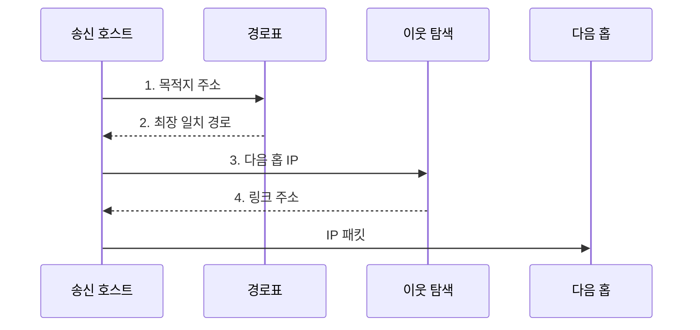

---
sidebar:
  order: 4
  label: "004. IP 주소 체계: IPv4•IPv6 (IP Addressing IPv4 IPv6)"
  badge:
    text: "기출 • 30%"
    variant: note
title: "IP 주소 체계: IPv4•IPv6 (IP Addressing IPv4 IPv6)"
date: "2026-08-03T08:48:47+09:00"
tags:
  - "notes-network"
weight: 4
extra:
  question_no: "004"
  source_status: "기출"
  source_history: "128회"
  priority: 30
  priority_note: "설명형: 128회 주소 구조 문항의 IP 핵심축"
---

## Ⅰ. 개요

핵심 용어

- **인터넷 프로토콜(Internet Protocol, IP) 주소**: 네트워크와 인터페이스를 식별하여 패킷의 출발지와 목적지를 나타내는 계층형 논리 주소이다.

- 정의/개념: 네트워크•인터페이스를 식별하는 **계층형 논리 주소**
- 배경/필요성: 32비트 IPv4 주소 고갈로 단말별 **공인 주소 할당 제약**

#### 한줄 요약

- 우편번호와 상세 주소처럼 앞부분은 네트워크를, 뒷부분은 그 안의 인터페이스를 가리킨다

## Ⅱ. 특징

핵심 용어

- **최장 프리픽스 일치**: 목적지 주소와 가장 많은 앞 비트가 일치하는 경로를 선택하는 라우팅 규칙이다.
- **무상태 주소 자동 설정(Stateless Address Autoconfiguration, SLAAC)**: 라우터가 알린 프리픽스를 사용하여 호스트가 자신의 IPv6 주소를 자동으로 구성하는 방식이다.

- 계층형 프리픽스의 **경로 집약**
- 최장 프리픽스 일치의 **최구체 경로 선택**
- IPv6의 128비트 주소와 **SLAAC 자동 구성**

#### 한줄 요약

- 목적지와 앞자리 비트가 가장 길게 맞는 경로가 더 구체적인 배송 구역을 가리킨다

## Ⅲ. 구조 및 구성요소

핵심 용어

- **네트워크 프리픽스**: 주소 앞부분에서 목적지가 속한 네트워크 범위를 식별한다.
- **인터페이스 식별자**: 프리픽스가 나타내는 네트워크 안에서 개별 인터페이스를 구분한다.

| 구성요소 | 책임 |
|:---|:---|
| 네트워크 프리픽스 | 계층형 주소의 **네트워크 범위** 식별 |
| 인터페이스 식별자 | 네트워크 내부의 **개별 인터페이스** 구분 |

#### 한줄 요약

- 주소 앞부분으로 목적지 네트워크를 찾고 뒷부분으로 그 안의 인터페이스를 구분한다

## Ⅳ. 흐름도

핵심 용어

- **주소 결정 프로토콜(Address Resolution Protocol, ARP)**: IPv4 주소에 대응하는 같은 링크의 매체 접근 제어 주소를 찾는다.
- **이웃 탐색 프로토콜(Neighbor Discovery Protocol, NDP)**: IPv6에서 이웃 주소 확인•라우터 탐색•주소 중복 검사를 수행한다.
- **다음 홉**: 목적지까지의 경로에서 호스트가 패킷을 직접 전달할 인접 라우터나 장치이다.

**동작 원리**

1. **목적지 주소**: 목적지와 경로 프리픽스의 앞 비트 비교
2. **최장 일치 경로**: 일치 길이가 가장 긴 다음 홉 결정
3. **다음 홉 IP**: ARP•NDP에 링크 주소 해석 요청
4. **링크 주소**: 이웃 캐시의 다음 홉 주소 반환

#### 한줄 요약

- 목적지와 가장 길게 맞는 주소 앞부분을 선택한 뒤 바로 다음 장치의 링크 주소로 보낸다

## Ⅴ. 종류 및 비교

핵심 용어

- **인터넷 프로토콜 버전 4(Internet Protocol version 4, IPv4)**: 32비트 주소를 점으로 구분한 10진수로 표현한다.
- **인터넷 프로토콜 버전 6(Internet Protocol version 6, IPv6)**: 128비트 주소를 콜론으로 구분한 16진수로 표현하여 주소 공간을 확장한다.
- **네트워크 주소 변환(Network Address Translation, NAT)**: 경계 장비에서 사설 IPv4 주소와 공인 IPv4 주소를 변환한다.

| IP 주소 체계 | IPv4 | IPv6 |
|:---|:---|:---|
| 적용 기준 | **IPv4 전용 기존망** 과 호환 | **주소 확장•자동 구성** 이 필요한 망 |
| 핵심 특징 | **32비트•점 구분 10진수** | **128비트•콜론 구분 16진수** |
| 한계 | **주소 고갈•NAT 의존** | 기존 IPv4 장비와 **전환 복잡도** |

> 요약: IPv6 전환은 주소 구성•이웃 탐색 변경

#### 한줄 요약

- IPv4는 주소가 좁어 변환이 잦고 IPv6는 주소가 넓지만 운영 규칙을 함께 바꿔야 한다

## Ⅵ. 실무 고려사항 및 대책

핵심 용어

- **듀얼 스택**: 하나의 장비와 네트워크에서 IPv4와 IPv6를 함께 실행하는 전환 방식이다.
- **라우터 광고**: IPv6 라우터가 호스트에 네트워크 프리픽스와 기본 경로 정보를 전달하는 메시지이다.
- **동적 호스트 구성 프로토콜 버전 6(Dynamic Host Configuration Protocol version 6, DHCPv6)**: 서버가 IPv6 주소와 네트워크 설정을 호스트에 배포하는 프로토콜이다.

| 문제 | 대책 | 효과 |
|:---|:---|:---|
| IPv4 주소 풀이 서비스 수요보다 작음 | 수요 산정 후 **NAT•IPv6** 단계 전환 | **공인 주소 부족** 완화 |
| IPv6 경로•필터 정책이 IPv4와 불일치 | **듀얼 스택 경로•필터** 동시 검증 | **비인가 트래픽 허용** 방지 |
| 이름 해석이 IPv4 주소만 반환 | IPv4•IPv6 주소 응답과 **응용 지원** 시험 | **전환 호환성** 확보 |
| 비인가 장치가 자동 구성 정보를 배포 | **라우터 광고•DHCPv6** 신뢰 경계 설정 | **비인가 주소 설정** 차단 |

#### 한줄 요약

- 기존 IPv4 서비스를 유지하면서 IPv6 주소와 경로를 함께 제공해 두 주소 체계의 연결을 검증한다

## Ⅶ. 결론

핵심 용어

- **IPv6 전환**: 기존 IPv4 호환성을 유지하면서 주소•경로•보안 정책을 단계적으로 IPv6에 적용하는 과정이다.
- **전환 방식 결정**: 기존망 호환성과 주소 수요를 기준으로 듀얼 스택을 검증한 뒤 단계적으로 IPv6로 전환하는 판단이다.

- 기존망 호환성•주소 수요를 기준으로 **듀얼 스택** 후 **IPv6 전환**

#### 한줄 요약

- 기존 장비가 남아 있으면 두 주소 체계를 함께 검증하며 단계적으로 전환해야 한다.
