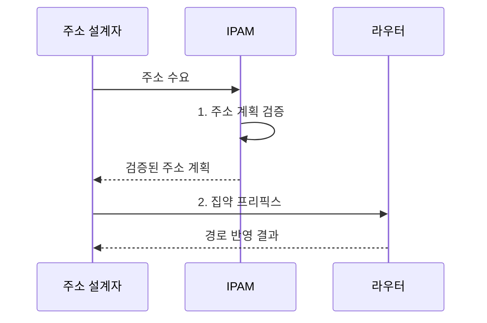

---
sidebar:
  order: 5
  label: "005. 서브네팅•CIDR (Subnetting CIDR)"
  badge:
    text: "미출 • 30%"
    variant: note
title: "서브네팅•CIDR (Subnetting CIDR)"
date: "2026-08-05T01:23:27+09:00"
tags:
  - "notes-network"
weight: 5
extra:
  question_no: "005"
  source_status: "미출"
  source_history: ""
  priority: 30
  priority_note: "설명•계산형: CIDR 주소 설계의 필수 기반"
---

## Ⅰ. 개요

<details>
<summary>핵심 용어</summary>

- **서브네팅**: 하나의 인터넷 프로토콜 주소 블록을 더 긴 프리픽스의 작은 논리 네트워크로 나누는 기법이다.
- **클래스 없는 도메인 간 라우팅(Classless Inter-Domain Routing, CIDR)**: 프리픽스 길이로 주소 블록과 경로를 표현하고 연속된 경로를 집약하는 방식이다.

</details>

- 정의/개념: 프리픽스로 주소 블록을 분할•집약하는 **서브네팅•CIDR 기법**
- 배경/필요성: 고정 크기 주소 할당은 수요 차이로 **주소 낭비•경로 수 증가**

#### 한줄 요약

- 큰 주소 구역을 필요한 크기로 나누고 공통 앞자리는 하나의 경로로 묶는다

## Ⅱ. 특징

<details>
<summary>핵심 용어</summary>

- **프리픽스 길이**: 주소 앞에서 네트워크를 나타내는 비트 수이며 길어질수록 주소 블록은 작아진다.
- **가변 길이 서브넷 마스크(Variable Length Subnet Mask, VLSM)**: 같은 상위 주소 블록을 호스트 수요에 따라 서로 다른 프리픽스 길이로 나눈다.
- **경로 집약**: 연속된 하위 경로의 공통 앞 비트를 하나의 상위 경로로 광고한다.

</details>


> `/24`를 같은 크기로 분할한 파란 선은 생성 서브넷 수, 붉은 선은 서브넷당 주소 블록 크기의 정규화 비율이며 `/26`에서는 4개 서브넷과 각 64개 주소가 되는 관계를 나타낸다.

- **긴 프리픽스** 는 주소 수•브로드캐스트 범위를 축소
- **VLSM** 은 수요별 블록 할당으로 주소 낭비 절감
- **경로 집약** 은 공통 프리픽스로 라우팅 경로 수 축소

#### 한줄 요약

- 주소 앞부분을 더 길게 네트워크 이름으로 쓰면 장치에 나눠 줄 뒷부분이 줄어든다

## Ⅲ. 구조 및 구성요소

<details>
<summary>핵심 용어</summary>

- **서브넷 마스크**: 인터넷 프로토콜 주소에서 네트워크 프리픽스와 호스트 비트의 경계를 나타낸다.
- **호스트 범위**: 한 서브넷에서 장치 인터페이스에 배정할 수 있는 주소 구간이다.

</details>

```text
주소 블록
+---[네트워크 프리픽스]---+---[호스트 비트]---+
             |
        [집약 경로]
```

선의 의미: 바깥선은 프리픽스와 호스트 비트로 구성된 주소 블록 경계이고, 아래 선은 공통 네트워크 프리픽스와 하위 주소 블록을 대표하는 집약 경로의 포함 관계이다.

| 구성요소 | 책임 |
|:---|:---|
| 네트워크 프리픽스 | 주소 블록의 **네트워크 범위•서브넷 경계** 식별 |
| 호스트 비트 | 서브넷에서 장치에 배정할 **호스트 범위** 결정 |
| 집약 경로 | 공통 프리픽스로 **하위 경로** 광고 |

#### 한줄 요약

- `/24` 구역을 `/26`으로 나누면 네 구역이 생기고 외부에는 다시 `/24` 하나로 알릴 수 있다

## Ⅳ. 흐름도

<details>
<summary>핵심 용어</summary>

- **인터넷 프로토콜 주소 관리(Internet Protocol Address Management, IPAM)**: 주소 블록의 할당•사용•중복 상태를 기록하고 주소 계획을 통제하는 체계이다.
- **집약 프리픽스**: 여러 연속 하위 블록의 공통 앞 비트로 만든 상위 경로이다.

</details>



**동작 원리**

1. **주소 계획 검증**: 수요별 블록의 경계•중복•상위 범위 확인
2. **집약 프리픽스**: 연속 하위 블록의 공통 앞 비트로 경로 축약

#### 한줄 요약

- 큰 부서 주소부터 정확한 경계에 놓아야 작은 부서 공간이 잘리지 않고 경로도 묶을 수 있다

## Ⅴ. 종류 및 비교

<details>
<summary>핵심 용어</summary>

- **서브넷**: 서브네팅으로 나뉜 논리 네트워크이며 하나의 브로드캐스트 범위를 이룬다.
- **가변 프리픽스**: 고정된 클래스 경계 대신 필요한 주소 수에 맞는 블록 크기를 표현한다.

</details>

| 주소 설계 방식 | 서브네팅 | CIDR |
|:---|:---|:---|
| 적용 기준 | 내부 **브로드캐스트 범위** 분리 | 주소 할당•외부 **경로 집약** |
| 핵심 특징 | 한 주소 블록을 **하위 망으로 분할** | **가변 프리픽스** 로 블록•경로 표현 |
| 한계 | 작은 블록의 **조기 고갈** | 비연속 블록의 **집약 불가** |

> 요약: 서브네팅은 분할, CIDR은 가변 할당•집약

#### 한줄 요약

- 서브네팅은 내부 구역을 나누고 CIDR은 크기가 다른 주소 구역과 경로를 표현한다

## Ⅵ. 실무 고려사항 및 대책

<details>
<summary>핵심 용어</summary>

- **주소 재설계**: 기존 블록이 부족하거나 겹칠 때 서비스 인터페이스의 주소를 새 계획으로 옮기는 작업이다.
- **브로드캐스트 범위**: 한 장치가 보낸 브로드캐스트 프레임을 직접 받는 같은 링크의 장치 집합이다.

</details>

| 문제 | 대책 | 효과 |
|:---|:---|:---|
| 현재 호스트 수만 반영해 블록 조기 고갈 | 성장률•예비 주소를 포함한 **수요 산정** | **재주소화** 방지 |
| 하위 블록이 비연속으로 배정 | 큰 블록부터 **연속 배치** | **경로 집약** 가능 |
| 여러 조직이 같은 서브넷을 중복 할당 | **IPAM 중복•경계 검사** 자동화 | **주소 충돌** 예방 |
| 대형 서브넷에 브로드캐스트가 집중 | **브로드캐스트•보안 경계** 분리 | **장애 영향 범위** 축소 |

#### 한줄 요약

- 클라우드 네트워크는 큰 확장 구역부터 연속 배치해야 나중에 주소를 다시 옮기지 않고 경로를 묶을 수 있다

## Ⅶ. 결론

<details>
<summary>핵심 용어</summary>

- **주소 수요 산정**: 현재 호스트 수와 증가율 및 예비 주소를 반영하여 필요한 서브넷 크기를 결정한다.
- **주소 블록 결정**: 호스트 수•증가율로 서브넷 크기를 정하고 연속 블록은 CIDR로 집약하는 판단이다.

</details>

- 호스트 수•증가율로 **서브넷 크기** 를 정하고 연속 블록은 **CIDR 집약**

#### 한줄 요약

- 현재 장치 수와 확장 공간, 묶어 광고할 경계를 함께 보고 주소 블록을 정해야 한다.
