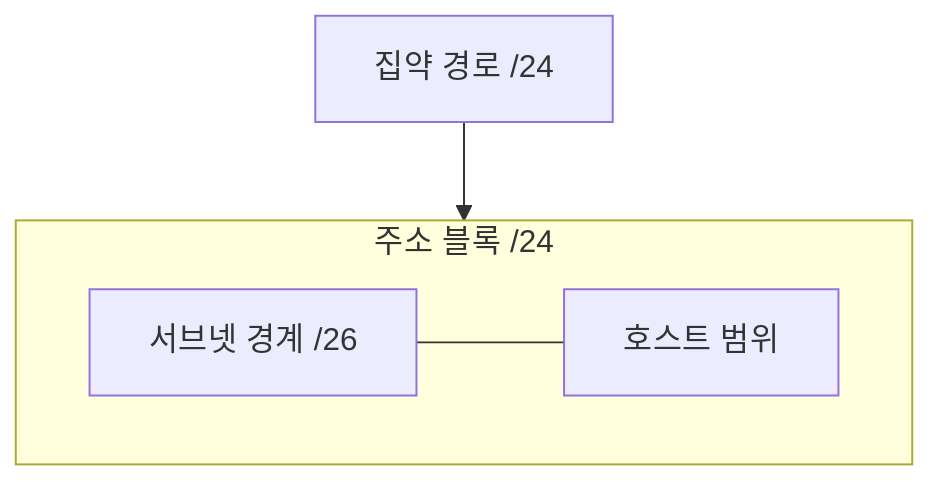
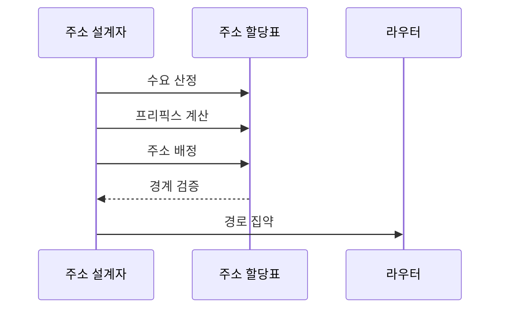

---
sidebar:
  order: 5
  label: "005. 서브네팅·CIDR (Subnetting CIDR)"
  badge:
    text: "미출제 · 30%"
    variant: note
title: "서브네팅·CIDR (Subnetting CIDR)"
date: "2026-07-25T02:13:00+09:00"
tags:
  - "notes-network"
weight: 5
extra:
  question_no: "005"
  source_status: "미출제"
  source_history: ""
  priority: 30
  priority_note: "설명·계산형: CIDR 주소 설계의 필수 기반"
---

## 미리 알고가기

- **서브네팅(Subnetting)**: 하나의 인터넷 프로토콜 주소 블록을 더 긴 프리픽스의 작은 네트워크들로 나누는 기법
- **서브넷**: 서브네팅으로 나뉜 각 논리 네트워크이며 하나의 브로드캐스트 범위를 이룸
- **서브넷 마스크**: 인터넷 프로토콜 주소에서 네트워크 비트와 호스트 비트의 경계를 나타내는 값
- **클래스 없는 도메인 간 라우팅(Classless Inter-Domain Routing, CIDR)**: `/길이`를 '슬래시 길이'로 읽고 슬래시 뒤 숫자로 프리픽스 비트 수를 구분해 주소 블록과 경로를 표현·집약하는 방식
- **가변 길이 서브넷 마스크(Variable Length Subnet Mask, VLSM)**: 같은 상위 주소 블록을 호스트 수요에 따라 서로 다른 프리픽스 길이로 나누는 방식
- **프리픽스 길이**: 주소 앞에서 네트워크를 나타내는 비트 수이며 길수록 주소 블록이 작아짐
- **네트워크 주소·호스트 범위**: 서브넷 자체를 식별하는 첫 주소와 장치에 배정할 수 있는 주소 구간
- **경로 집약**: 연속된 여러 하위 경로의 공통 앞 비트를 하나의 상위 경로로 광고하는 기법
- **브로드캐스트 범위**: 한 장치가 보낸 브로드캐스트 프레임을 직접 받는 같은 링크의 장치 집합
- **가상 사설 클라우드(Virtual Private Cloud, VPC)**: 공용 클라우드 안에서 주소 범위와 라우팅을 독립적으로 구성한 논리 네트워크

## Ⅰ. 개요

- **정의/개념**: 프리픽스로 주소 블록을 분할·집약하는 기법
- **배경/필요성**: 주소 낭비와 라우팅 경로 수 증가를 억제

### 쉽게 이해하기 (학습용)

- 큰 주소 구역을 필요한 크기로 나누고 공통 앞자리는 하나의 경로로 묶는다

## Ⅱ. 특징

- 긴 프리픽스는 주소 수·브로드캐스트 범위를 줄인다
- VLSM은 수요별 블록으로 주소 낭비를 줄인다
- 공통 프리픽스 집약은 라우팅 경로 수를 줄인다

### 쉽게 이해하기 (학습용)

- 주소 앞부분을 더 길게 네트워크 이름으로 쓰면 장치에 나눠 줄 뒷부분이 줄어든다

## Ⅲ. 아키텍처 및 구성요소

| 설계 요소 | 설명 |
|:---|:---|
| 집약 경로 | 하위 블록의 공통 프리픽스를 광고 |
| 주소 블록 | 할당 가능한 연속 주소 전체 |
| 서브넷 경계 | 프리픽스 길이로 하위 블록을 구분 |
| 호스트 범위 | 서브넷 안에서 장치에 배정할 주소 |

> 요약: 긴 프리픽스로 분할하고 공통 비트로 집약

### 쉽게 이해하기 (학습용)

- `/24` 구역을 `/26`으로 나누면 네 구역이 생기고 외부에는 다시 `/24` 하나로 알릴 수 있다

## Ⅳ. 원리 및 절차 흐름도

| 절차 | 설명 |
|:---|:---|
| 수요 산정 | 네트워크별 현재·확장 호스트 수 산정 |
| 프리픽스 계산 | 호스트 수를 수용하는 최소 블록 결정 |
| 주소 배정 | 큰 블록부터 경계에 맞춰 배치 |
| 경계 검증 | 주소 중복·누락·범위 초과 확인 |
| 경로 집약 | 연속 블록의 공통 프리픽스 광고 |

> 요약: 큰 수요부터 배치하고 연속 경로를 집약

### 쉽게 이해하기 (학습용)

- 큰 부서 주소부터 정확한 경계에 놓아야 작은 부서 공간이 잘리지 않고 경로도 묶을 수 있다

## Ⅴ. 종류 및 비교

| 판단 기준 | 서브네팅 | CIDR |
|:---|:---|:---|
| 핵심 특징 | 한 주소 블록을 하위 망으로 분할 | 가변 프리픽스로 블록·경로 표현 |
| 적용 기준 | 내부 브로드캐스트 범위 분리 | 주소 할당·외부 경로 집약 |
| 주요 위험 | 작은 블록의 조기 고갈 | 비연속 블록은 집약 불가 |

> 요약: 서브네팅은 분할, CIDR은 가변 할당·집약

### 쉽게 이해하기 (학습용)

- 서브네팅은 내부 구역을 나누고 CIDR은 크기가 다른 주소 구역과 경로를 표현한다

## Ⅵ. 실무 사례

1. VPC는 확장 수요별 VLSM 배정 후 상위 경로 집약

### 쉽게 이해하기 (학습용)

- 클라우드 네트워크는 큰 확장 구역부터 연속 배치해야 나중에 주소를 다시 옮기지 않고 경로를 묶을 수 있다

## Ⅶ. 결론

- 호스트 수·확장량·집약 경계로 프리픽스 결정

### 쉽게 이해하기 (학습용)

- 지금 필요한 장치 수뿐 아니라 늘어날 공간과 묶어 알릴 경계까지 보고 주소 크기를 정한다
