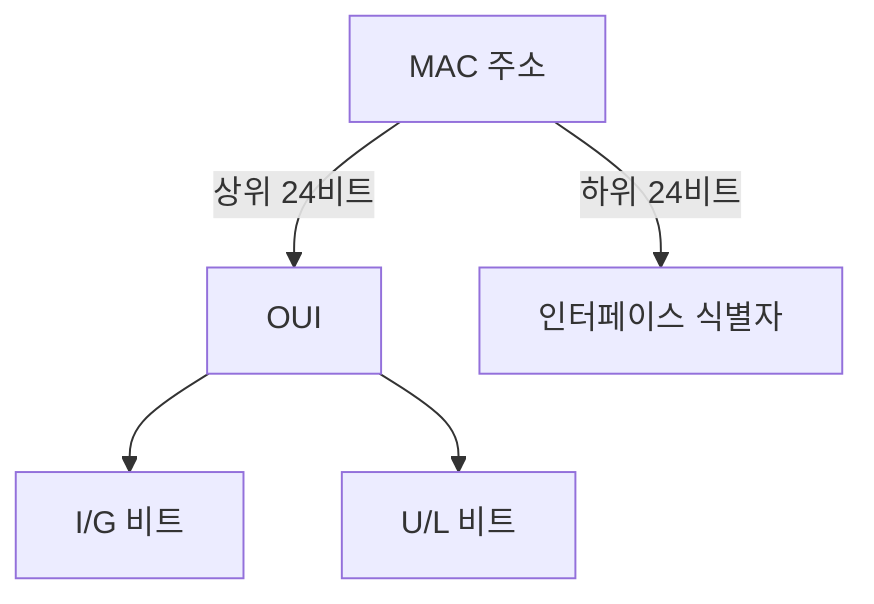
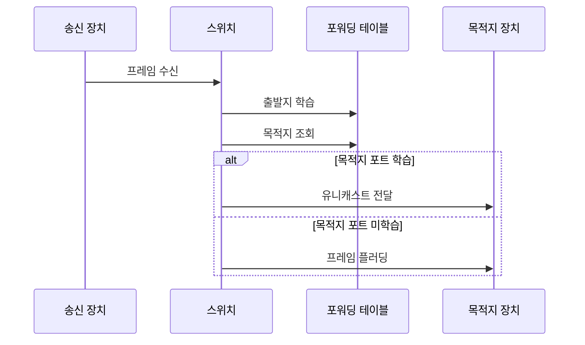

---
sidebar:
  order: 6
  label: "006. MAC 주소 구조 (MAC Address)"
  badge:
    text: "기출 · 30%"
    variant: note
title: "MAC 주소 구조 (MAC Address)"
date: "2026-07-27T23:59:59+09:00"
tags:
  - "notes-network"
weight: 6
extra:
  question_no: "006"
  source_status: "기출"
  source_history: "128회"
  priority: 30
  priority_note: "설명형: 128회 주소 구조의 2계층 식별 요소"
---

## 미리 알고가기

- **매체 접근 제어 주소 MAC(맥, Media Access Control Address)**: 영어 핵심어의 첫 글자를 쓴 표기로 같은 링크에서 프레임의 출발지·목적지 인터페이스를 식별함
- **이더넷(Ethernet)**: 유선 근거리 통신망에서 프레임 형식과 매체 접근 방식을 정한 표준
- **국제전기전자기술자협회(Institute of Electrical and Electronics Engineers, IEEE)**: 이더넷과 802.1X 같은 네트워크 표준을 제정하는 국제 전문 단체
- **조직 고유 식별자(Organizationally Unique Identifier, OUI)**: 국제전기전자기술자협회가 조직에 할당하는 MAC 주소 상위 24비트 식별자
- **범용·로컬 비트(Universal/Local Bit, U/L 비트)**: '유 슬래시 엘'로 읽고 두 대안의 머리글자를 슬래시로 나눠 첫 옥텟에서 전역 할당과 로컬 관리 주소를 구분하는 비트
- **개별·그룹 비트(Individual/Group Bit, I/G 비트)**: '아이 슬래시 지'로 읽고 두 대안의 머리글자를 슬래시로 나눠 첫 옥텟에서 개별 수신자와 그룹 수신자 주소를 구분하는 비트
- **옥텟(Octet)**: 8비트 묶음이며 일반 이더넷 MAC 주소는 6개 옥텟으로 구성된다.
- **포워딩 테이블**: 스위치가 출발지 MAC 주소를 학습해 해당 주소와 입력 포트를 연결해 둔 표
- **플러딩(Flooding)**: 목적지 MAC 주소를 모를 때 수신 포트를 제외한 같은 영역의 모든 포트로 프레임을 보내는 동작
- **스푸핑(Spoofing)**: 다른 장치의 MAC 주소로 출발지 주소를 위조하는 공격
- **IEEE 802.1X**: '아이 트리플 이 팔공이 점 일 엑스'로 읽고 802 계열의 포트 기반 접근 제어 규격임을 번호와 X로 표시해 사용자나 장치를 인증하는 표준
- **포트 보안**: 스위치 포트에서 허용할 MAC 주소 수와 위반 시 동작을 제한하는 기능
- **프라이버시 MAC**: 무선 탐색·접속 때 장기 식별 추적을 줄이려고 임시 로컬 MAC 주소를 사용하는 기능

## Ⅰ. 개요

- 정의/개념: 같은 링크의 인터페이스를 식별하는 **2계층 주소**
- **배경/필요성**: 공유 링크의 **프레임 수신 인터페이스 구분**

### 쉽게 이해하기 (학습용)
- MAC 주소는 같은 건물 안에서 프레임을 정확한 장치 포트로 보내는 호실 번호처럼 쓰인다

## Ⅱ. 특징

- 이더넷 MAC의 **48비트·6옥텟 표현**
- I/G·U/L 비트의 **수신 범위·관리 주체 구분**
- 주소 변경 가능성에 따른 **신원 증명 한계**

### 쉽게 이해하기 (학습용)
- 장치가 주소를 바꿔 다른 장치처럼 보일 수 있으므로 MAC 주소만 보고 사람이나 장치를 믿을 수는 없다

## Ⅲ. 아키텍처 및 구성요소

| 설계 요소 | 설명 |
|:---|:---|
| MAC 주소 | OUI와 인터페이스 식별자로 구성 |
| OUI | 전역 주소에서 할당 조직을 식별 |
| I/G 비트 | 개별·그룹 수신 범위를 구분 |
| U/L 비트 | 전역·로컬 주소 관리를 구분 |
| 인터페이스 식별자 | 조직이 개별 인터페이스에 할당 |

> 요약: 제어 비트·조직·인터페이스 식별자로 구성

### 쉽게 이해하기 (학습용)
- 주소 앞의 두 제어 비트가 성격을 밝히고 나머지 부분이 할당 조직과 인터페이스를 구분한다

## Ⅳ. 원리 및 절차 흐름도

| 절차 | 설명 |
|:---|:---|
| 프레임 수신 | 출발지·목적지 MAC 주소 확인 |
| 출발지 학습 | 출발지 MAC과 입력 포트를 저장 |
| 목적지 조회 | 목적지 MAC의 출력 포트를 검색 |
| 유니캐스트 전달 | 학습된 출력 포트로만 전송 |
| 프레임 플러딩 | 미학습 시 다른 모든 포트로 전송 |

> 요약: 출발지를 학습하고 목적지 조회 결과로 전달

### 쉽게 이해하기 (학습용)
- 스위치는 들어온 주소로 위치표를 배우고 목적지 위치를 알면 그 포트에만, 모르면 여러 포트에 보낸다

## Ⅴ. 종류 및 비교

| MAC 관리 방식 | 전역 관리 MAC | 로컬 관리 MAC |
|:---|:---|:---|
| 적용 기준 | 장치 기본 주소 식별 | 가상 인터페이스·추적 완화 |
| 핵심 특징 | OUI 기반 조직·장치 할당 | U/L 비트로 로컬 관리 표시 |
| 한계 | 장기 식별자 노출·추적 | 같은 링크의 주소 중복 |

> 요약: 전역·로컬 MAC은 할당 주체와 범위가 다름

### 쉽게 이해하기 (학습용)
- 전역 주소는 할당 기관이 나눠 주고 로컬 주소는 운영자가 만들지만 같은 링크에서 겹치면 전달이 어긋난다

## Ⅵ. 실무 사례

1. 사내 스위치는 **802.1X 인증 후 포트 개방**
2. 프라이버시 MAC과 **단말 인증 기록 연결**

### 쉽게 이해하기 (학습용)
- 사내망은 MAC 주소만 믿지 않고 사용자나 장치 인증이 성공한 포트만 열어 준다
- 휴대전화가 임시 주소를 바꿔도 인증 기록을 연결하면 관리 대상 단말을 구분할 수 있다

## Ⅶ. 결론

- **MAC은 링크 전달**, 신원은 802.1X로 검증

### 쉽게 이해하기 (학습용)
- MAC 주소는 바꿀 수 있는 배달표이므로 출입 신분증으로 쓰려면 별도 인증이 필요하다
