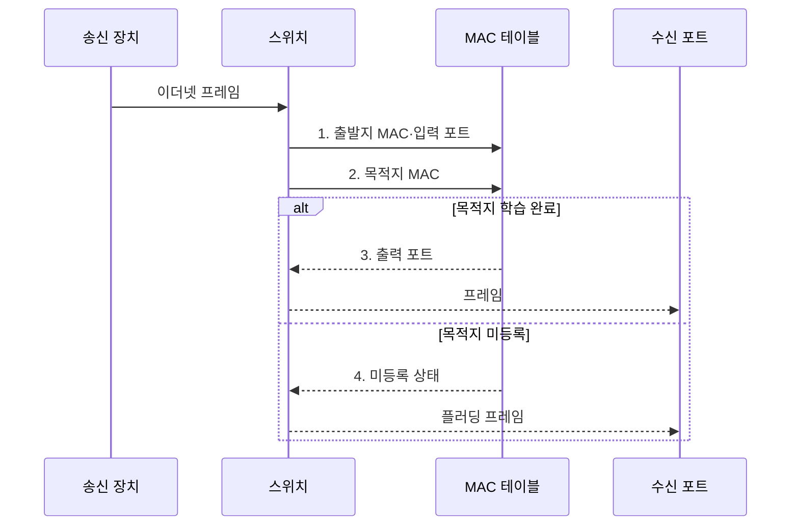

---
sidebar:
  order: 6
  label: "006. MAC 주소 구조 (MAC Address)"
  badge:
    text: "기출 · 30%"
    variant: note
title: "MAC 주소 구조 (MAC Address)"
date: "2026-07-31T11:03:03+09:00"
tags:
  - "notes-network"
weight: 6
extra:
  question_no: "006"
  source_status: "기출"
  source_history: "128회"
  priority: 30
  priority_note: "설명형: 128회 주소 구조의 2계층 식별 요소"
---

## 미리 알고가기

- **매체 접근 제어 주소(Media Access Control Address, MAC 주소)**: 같은 링크에서 프레임의 출발지·목적지 인터페이스를 식별하는 주소
- **이더넷(Ethernet)**: 유선 근거리 통신망에서 프레임 형식과 매체 접근 방식을 정한 표준
- **국제전기전자기술자협회(Institute of Electrical and Electronics Engineers, IEEE)**: 이더넷과 802.1X 같은 네트워크 표준을 제정하는 국제 전문 단체
- **조직 고유 식별자(Organizationally Unique Identifier, OUI)**: 국제전기전자기술자협회가 조직에 할당하는 MAC 주소 상위 24비트 식별자
- **범용/로컬 비트(Universal/Local Bit, U/L 비트)**: '유 슬래시 엘'로 읽으며 첫 옥텟에서 전역 할당과 로컬 관리 주소를 구분하는 비트
- **개별/그룹 비트(Individual/Group Bit, I/G 비트)**: '아이 슬래시 지'로 읽으며 첫 옥텟에서 개별 수신자와 그룹 수신자 주소를 구분하는 비트
- **옥텟(Octet)**: 8비트 묶음이며 일반 이더넷 MAC 주소는 6개 옥텟으로 구성된다.
- **포워딩 테이블**: 스위치가 출발지 MAC 주소를 학습해 해당 주소와 입력 포트를 연결해 둔 표
- **플러딩(Flooding)**: 목적지 MAC 주소를 모를 때 수신 포트를 제외한 같은 영역의 모든 포트로 프레임을 보내는 동작
- **스푸핑(Spoofing)**: 다른 장치의 MAC 주소로 출발지 주소를 위조하는 공격
- **IEEE 802.1X**: 네트워크 포트에 접속하는 사용자나 장치를 인증하는 접근 제어 표준
- **포트 보안**: 스위치 포트에서 허용할 MAC 주소 수와 위반 시 동작을 제한하는 기능
- **프라이버시 MAC**: 무선 탐색·접속 때 장기 식별 추적을 줄이려고 임시 로컬 MAC 주소를 사용하는 기능
- **가상 근거리 통신망(Virtual Local Area Network, VLAN)**: 하나의 물리 스위치 망을 여러 논리적 브로드캐스트 영역으로 분리하는 기술

> **키워드:** MAC 주소 구조 (MAC Address)

## Ⅰ. 개요

- 정의/개념: 같은 링크의 인터페이스를 식별하는 **2계층 주소**
- 배경/필요성: IP 주소만으로는 같은 링크의 **프레임 수신 포트 결정 불가**

### 쉽게 이해하기 (학습용)

- MAC 주소는 같은 건물 안에서 프레임을 정확한 장치 포트로 보내는 호실 번호처럼 쓰인다

## Ⅱ. 특징

- 이더넷 MAC의 **48비트·6옥텟 표현**
- I/G·U/L 비트의 **수신 범위·관리 주체 구분**
- 주소 변경 가능성에 따른 **신원 증명 한계**

### 쉽게 이해하기 (학습용)

- 장치가 주소를 바꿔 다른 장치처럼 보일 수 있으므로 MAC 주소만 보고 사람이나 장치를 믿을 수는 없다

## Ⅲ. 구조 및 구성요소

| 구성요소 | 책임 |
|:---|:---|
| 상위 24비트 OUI | 전역 주소의 **할당 조직** 식별 |
| 하위 24비트 인터페이스 식별자 | 조직 내부의 **개별 인터페이스** 구분 |
| 첫 옥텟 I/G·U/L 비트 | **수신 범위·관리 주체** 구분 |

### 쉽게 이해하기 (학습용)

- 주소 앞의 두 제어 비트가 성격을 밝히고 나머지 부분이 할당 조직과 인터페이스를 구분한다

## Ⅳ. 흐름도

**동작 원리**

1. **출발지 MAC·입력 포트**: 주소와 수신 포트의 대응 관계 학습
2. **목적지 MAC**: 포워딩 테이블에서 대응 포트 조회
3. **출력 포트**: 학습된 단일 포트로 전달 범위 제한
4. **미등록 상태**: 수신 포트를 제외한 같은 영역으로 플러딩

### 쉽게 이해하기 (학습용)

- 스위치는 들어온 주소로 위치표를 배우고 목적지 위치를 알면 그 포트에만, 모르면 여러 포트에 보낸다

## Ⅴ. 종류 및 비교

| MAC 관리 방식 | 전역 관리 MAC | 로컬 관리 MAC |
|:---|:---|:---|
| 적용 기준 | 장치의 **기본 주소** 식별 | 가상 인터페이스·**프라이버시 MAC** |
| 핵심 특징 | **OUI** 기반 조직·장치 할당 | **U/L 비트**로 로컬 관리 표시 |
| 한계 | 장기 식별자 **노출·추적** | 같은 링크의 **주소 중복** |

> 요약: 전역·로컬 MAC은 할당 주체와 범위가 다름

### 쉽게 이해하기 (학습용)

- 전역 주소는 할당 기관이 나눠 주고 로컬 주소는 운영자가 만들지만 같은 링크에서 겹치면 전달이 어긋난다

## Ⅵ. 실무 고려사항 및 대책

| 고려사항 | 대책 | 효과 |
|:---|:---|:---|
| MAC 주소만으로 장치 신원을 판정 | **IEEE 802.1X**로 접속 주체 인증 | **주소 위조 접속** 차단 |
| 대량 위조 주소로 MAC 테이블 고갈 | 포트별 **MAC 학습 수** 제한 | **플러딩 전환** 방지 |
| 가상 머신 이동으로 MAC 포트가 변경 | 이동 통지 후 **MAC 재학습** | **잘못된 포트 전달 시간** 단축 |
| 대형 링크에 브로드캐스트가 확산 | **VLAN**으로 링크 영역 분리 | **장애·공격 확산 범위** 축소 |

### 쉽게 이해하기 (학습용)

- 스위치는 출발지 MAC 주소를 학습하고 목적지 MAC 주소에 대응하는 포트로만 프레임을 전달한다

## Ⅶ. 결론

- 프레임 전달에는 **MAC 주소**, 접속 허용에는 **IEEE 802.1X** 선택

### 쉽게 이해하기 (학습용)

- MAC 주소는 바꿀 수 있는 전달표이므로 신원 확인에는 별도 인증이 필요하다.
