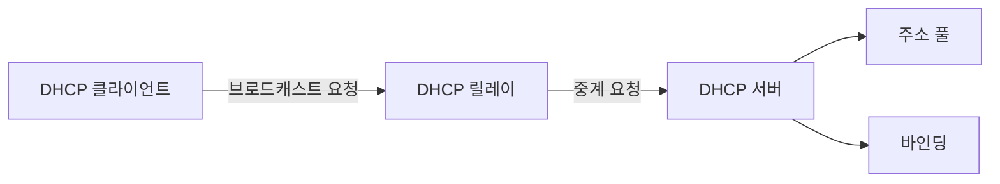
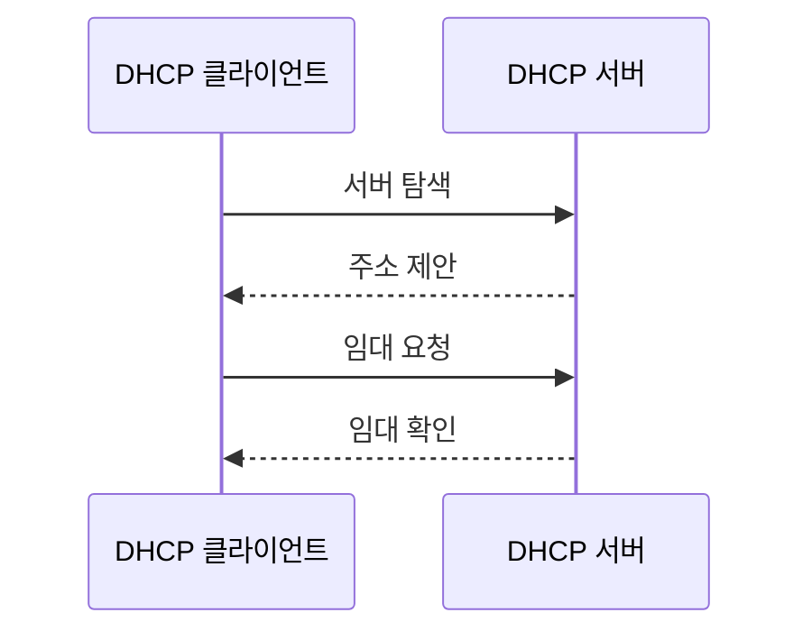

---
sidebar:
  order: 7
  label: "007. DHCP (Dynamic Host Configuration Protocol)"
  badge:
    text: "미출제 · 30%"
    variant: note
title: "DHCP (Dynamic Host Configuration Protocol)"
date: "2026-07-25T02:17:00+09:00"
tags:
  - "notes-network"
weight: 7
extra:
  question_no: "007"
  source_status: "미출제"
  source_history: ""
  priority: 30
  priority_note: "설명형: DORA·Lease 갱신의 주소 할당 절차"
---

## 미리 알고가기

- **동적 호스트 구성 프로토콜(Dynamic Host Configuration Protocol, DHCP)**: 서버가 단말에 인터넷 프로토콜 주소와 네트워크 설정을 일정 기간 자동 임대하는 프로토콜
- **임대 시간(Lease Time)**: 단말이 할당받은 주소를 갱신 없이 사용할 수 있는 유효 시간
- **DHCP 릴레이(DHCP Relay)**: 다른 서브넷의 단말이 보낸 DHCP 요청을 중앙 서버까지 중계하는 기능
- **주소 풀(Address Pool)**: DHCP 서버가 단말에 임대할 수 있도록 보유한 연속 주소 범위
- **바인딩(Binding)**: 임대한 주소를 단말 식별자·임대 만료 시각과 연결해 저장한 기록
- **옵션(Option)**: 주소와 함께 전달하는 프리픽스·기본 게이트웨이·도메인 이름 서버 같은 네트워크 설정
- **서브넷·기본 게이트웨이**: 같은 프리픽스를 공유하는 논리 네트워크와 그 밖의 네트워크로 패킷을 보내는 첫 라우터
- **도메인 이름 시스템(Domain Name System, DNS)**: 사람이 읽는 도메인 이름을 인터넷 프로토콜 주소로 변환하는 체계
- **브로드캐스트·유니캐스트**: 같은 링크의 모든 장치에 보내는 방식과 특정 한 장치에 보내는 방식
- **갱신 시점 T1·재결합 시점 T2**: '티 원·티 투'로 읽고 시간(Time)의 머리글자와 순번으로 표시하며 기존 서버 갱신과 모든 서버 재할당 요청 시점을 구분
- **DHCP 스누핑(DHCP Snooping)**: 스위치가 신뢰 포트의 DHCP 서버 응답만 허용하고 주소·단말·포트 바인딩을 기록하는 보안 기능

## Ⅰ. 개요

- **정의/개념**: 주소·네트워크 옵션을 일정 기간 자동 임대
- **배경/필요성**: 수동 설정의 주소 중복·오입력·회수 누락 방지

### 쉽게 이해하기 (학습용)
- 단말이 네트워크에 들어오면 서버가 빈 주소와 이용 규칙을 정해진 기간 동안 빌려준다

## Ⅱ. 특징

- 주소 풀·바인딩이 중복 임대를 방지한다
- 초기 브로드캐스트가 서버 없는 단말을 구성한다
- 릴레이가 여러 서브넷을 중앙 서버에 연결한다
- T1·T2 갱신이 주소 유지·회수 시점을 정한다

### 쉽게 이해하기 (학습용)
- 단말은 먼저 빌려줄 서버를 찾고 주소를 받은 뒤 만료 전에 연장을 요청한다

## Ⅲ. 아키텍처 및 구성요소

| 설계 요소 | 설명 |
|:---|:---|
| DHCP 클라이언트 | 주소·옵션을 요청하고 임대를 갱신 |
| DHCP 릴레이 | 서브넷 사이의 요청·응답을 중계 |
| DHCP 서버 | 주소·옵션 선택과 임대·회수를 관리 |
| 주소 풀 | 임대 가능한 주소 범위를 보관 |
| 바인딩 | 단말·주소·임대 만료 관계를 보관 |

> 요약: 릴레이가 지점 단말과 중앙 서버를 연결

### 쉽게 이해하기 (학습용)
- 지점 단말의 요청을 릴레이가 중앙 서버에 전하면 서버가 빈 주소와 설정을 찾아 돌려준다

## Ⅳ. 원리 및 절차 흐름도

| 절차 | 설명 |
|:---|:---|
| 서버 탐색 | 사용 가능한 DHCP 서버를 탐색 |
| 주소 제안 | 후보 주소·옵션·임대 시간을 제시 |
| 임대 요청 | 선택한 서버와 주소를 명시해 요청 |
| 임대 확인 | 바인딩 저장 후 임대 정보를 확정 |

> 요약: 서버 탐색·주소 제안·요청·확인으로 임대

### 쉽게 이해하기 (학습용)
- 단말이 빈 주소를 문의하면 서버가 후보를 내고 단말이 하나를 요청한 뒤 서버가 임대를 확정한다

## Ⅴ. 종류 및 비교

| 판단 기준 | DHCP | 수동 설정 |
|:---|:---|:---|
| 핵심 특징 | 서버가 주소·옵션을 자동 임대 | 관리자가 장치마다 고정 입력 |
| 적용 기준 | 접속·이탈이 잦은 다수 단말 | 주소가 고정된 소수 기반 장비 |
| 주요 위험 | 가짜 서버·주소 풀 고갈 | 중복 주소·설정 누락 |

> 요약: 변동 단말은 DHCP, 고정 인프라는 수동

### 쉽게 이해하기 (학습용)
- 자주 드나드는 단말은 빈 번호를 자동으로 빌리고 늘 같은 장비는 관리자가 번호를 고정한다

## Ⅵ. 실무 사례

1. 접속 스위치는 DHCP 스누핑으로 가짜 서버 응답 차단
2. 방문자망은 동시 접속 수·체류 시간으로 풀·임대 설정

### 쉽게 이해하기 (학습용)
- 스위치는 관리자가 지정한 포트에서 온 주소 배부 응답만 단말에 전달한다
- 방문자가 많고 빨리 바뀌면 주소를 넉넉히 두고 떠난 단말의 주소를 일찍 회수한다

## Ⅶ. 결론

- 동시 접속·체류 시간으로 주소 풀·임대 시간 설정

### 쉽게 이해하기 (학습용)
- 동시에 쓸 단말 수와 머무는 시간을 알아야 주소가 모자라거나 오래 묶이지 않게 정할 수 있다
