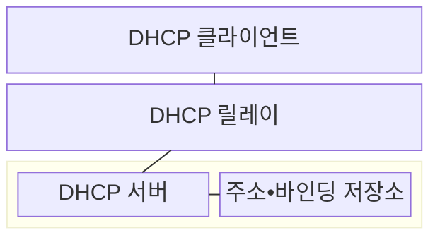
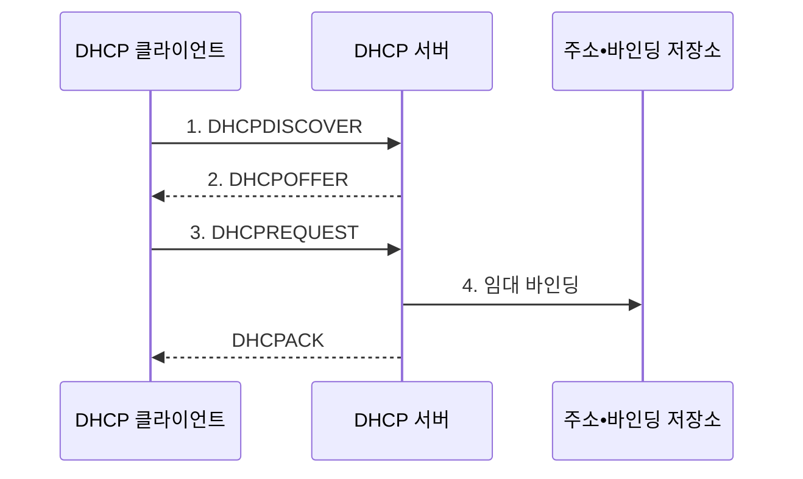

---
sidebar:
  order: 7
  label: "007. DHCP (Dynamic Host Configuration Protocol)"
  badge:
    text: "미출 • 30%"
    variant: note
title: "DHCP (Dynamic Host Configuration Protocol)"
date: "2026-08-03T08:48:47+09:00"
tags:
  - "notes-network"
weight: 7
extra:
  question_no: "007"
  source_status: "미출"
  source_history: ""
  priority: 30
  priority_note: "설명형: DORA•Lease 갱신의 주소 할당 절차"
---

## Ⅰ. 개요

핵심 용어

- **동적 호스트 구성 프로토콜(Dynamic Host Configuration Protocol, DHCP)**: 서버가 단말에 인터넷 프로토콜 주소와 네트워크 설정을 일정 기간 자동으로 임대하는 프로토콜이다.

- 정의/개념: 서버가 IP 주소•네트워크 옵션을 일정 기간 자동 임대하는 **DHCP 프로토콜**
- 배경/필요성: 단말별 수동 설정은 **주소 중복•오입력•회수 누락** 발생

#### 한줄 요약

- 단말이 네트워크에 들어오면 서버가 빈 주소와 이용 규칙을 정해진 기간 동안 빌려준다

## Ⅱ. 특징

핵심 용어

- **주소 풀**: DHCP 서버가 단말에 임대할 수 있도록 보유한 주소 범위이다.
- **바인딩**: 임대한 주소를 단말 식별자와 만료 시각에 연결하여 저장한 기록이다.
- **DHCP 릴레이**: 다른 서브넷의 단말이 보낸 DHCP 요청과 서버 응답을 중앙 서버까지 중계한다.

- **주소 풀•바인딩**으로 중복 임대 방지
- **초기 브로드캐스트** 로 주소가 없는 단말 구성
- **DHCP 릴레이** 로 여러 서브넷과 중앙 서버 연결

#### 한줄 요약

- 단말은 먼저 빌려줄 서버를 찾고 주소를 받은 뒤 만료 전에 연장을 요청한다

## Ⅲ. 구조 및 구성요소

핵심 용어

- **DHCP 클라이언트**: 주소와 옵션을 탐색하고 서버에 임대를 요청한다.
- **DHCP 옵션**: 인터넷 프로토콜 주소와 함께 프리픽스•기본 게이트웨이•도메인 이름 시스템 서버 등의 네트워크 설정을 전달한다.

| 구성요소 | 책임 |
|:---|:---|
| DHCP 클라이언트 | 주소•옵션 **탐색•임대 요청** |
| DHCP 릴레이 | 서브넷 간 **요청•응답 중계** |
| DHCP 서버 | 주소 풀•정책에 따른 **임대 승인** |
| 주소•바인딩 저장소 | 가용 주소와 단말•주소•**만료 시각** 관리 |

#### 한줄 요약

- 지점 단말의 요청을 릴레이가 중앙 서버에 전하면 서버가 빈 주소와 설정을 찾아 돌려준다

## Ⅳ. 흐름도

핵심 용어

- **탐색•제안•요청•승인(Discover, Offer, Request, Acknowledge, DORA)**: DHCPDISCOVER로 서버를 찾고 DHCPOFFER를 받은 뒤 DHCPREQUEST를 보내 DHCPACK으로 임대를 확정하는 절차이다.
- **브로드캐스트**: 주소가 없는 초기 단말이 같은 링크의 모든 DHCP 서버 후보에 탐색 요청을 보내게 한다.

**동작 원리**

1. **DHCPDISCOVER**: 브로드캐스트로 사용 가능한 서버 탐색
2. **DHCPOFFER**: 가용 주소•옵션•임대 시간을 후보로 제시
3. **DHCPREQUEST**: 선택한 서버와 주소의 임대를 요청
4. **임대 바인딩**: 단말•주소•만료 시각을 연결해 중복 할당 방지

#### 한줄 요약

- 단말이 빈 주소를 문의하면 서버가 후보를 내고 단말이 하나를 요청한 뒤 서버가 임대를 확정한다

## Ⅴ. 종류 및 비교

핵심 용어

- **동적 임대**: 접속과 이탈이 잦은 단말에 주소를 일정 기간 배정하고 회수하여 주소 풀을 재사용한다.
- **수동 설정**: 관리자가 장치에 주소와 네트워크 옵션을 직접 고정하여 입력한다.

| 주소 구성 방식 | DHCP | 수동 설정 |
|:---|:---|:---|
| 적용 기준 | 접속•이탈이 잦은 **다수 단말** | 주소가 고정된 **소수 기반 장비** |
| 핵심 특징 | 서버가 주소•옵션을 **자동 임대** | 관리자가 장치마다 **고정 입력** |
| 한계 | **가짜 서버•주소 풀 고갈** | **중복 주소•설정 누락** |

> 요약: 변동 단말은 DHCP, 고정 인프라는 수동

#### 한줄 요약

- 자주 드나드는 단말은 빈 번호를 자동으로 빌리고 늘 같은 장비는 관리자가 번호를 고정한다

## Ⅵ. 실무 고려사항 및 대책

핵심 용어

- **DHCP 스누핑**: 스위치가 신뢰 포트의 서버 응답만 허용하고 주소•단말•포트 바인딩을 기록한다.
- **릴레이 에이전트 정보 옵션(Relay Agent Information Option, Option 82)**: 릴레이가 단말의 접속 회선과 장치 정보를 DHCP 서버에 전달하는 옵션이다.
- **갱신 시점(T1)과 재결합 시점(T2)**: 단말이 각각 기존 서버에 임대를 갱신하고 모든 서버에 재결합을 요청하는 시점이다.

| 문제 | 대책 | 효과 |
|:---|:---|:---|
| 동시 접속 단말이 주소 풀을 초과 | 접속량•체류시간 기반 **주소 풀 산정** | **주소 할당 실패** 감소 |
| 비인가 서버가 악성 옵션을 응답 | **DHCP 스누핑 신뢰 포트** 지정 | **가짜 서버 응답** 차단 |
| 릴레이가 접속 위치 정보를 위조 | **Option 82** 와 신뢰 릴레이 검증 | **할당 위치 신뢰성** 확보 |
| 장기 임대로 미사용 주소가 묶임 | 이동성별 임대 시간•**T1•T2** 차등 | **주소 회수 시간** 단축 |

#### 한줄 요약

- 스위치는 관리자가 지정한 포트에서 온 주소 배부 응답만 단말에 전달한다

## Ⅶ. 결론

핵심 용어

- **임대 시간**: 단말이 갱신 없이 주소를 사용할 수 있는 기간이며 주소 회수 속도와 갱신 트래픽을 함께 좌우한다.
- **임대 정책 결정**: 동시 접속 단말 수와 체류시간을 기준으로 주소 풀 크기와 임대 시간을 정하는 판단이다.

- 동시 접속•체류시간을 기준으로 **DHCP 주소 풀•임대 시간** 설정

#### 한줄 요약

- 동시에 접속할 단말 수와 체류시간을 알아야 주소 풀과 임대시간을 정할 수 있다.
