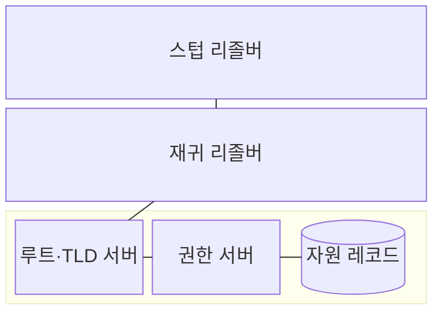
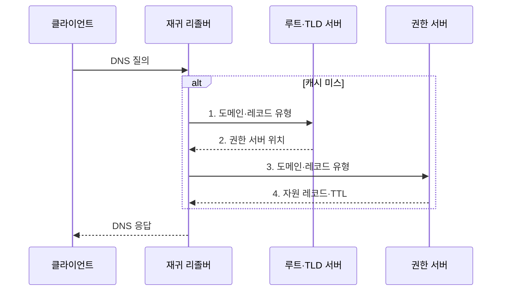

---
sidebar:
  order: 8
  label: "008. DNS 구조·동작 (DNS Domain Name System)"
  badge:
    text: "기출 · 50%"
    variant: note
title: "DNS 구조·동작 (DNS Domain Name System)"
date: "2026-07-31T00:55:49+09:00"
tags:
  - "notes-network"
weight: 8
extra:
  question_no: "008"
  source_status: "기출"
  source_history: "122회, 137회"
  priority: 50
  priority_note: "설계·운영형: 계층·재귀·Cache·장애 대응"
---

## 미리 알고가기

- **도메인 이름 시스템(Domain Name System, DNS)**: 계층형 이름을 IP 주소 등 자원 정보로 변환하는 분산 데이터베이스
- **자원 레코드(Resource Record)**: 도메인 이름·레코드 유형·값·유효 기간을 저장하는 DNS 데이터 단위
- **재귀 질의(Recursive Query)**: 클라이언트가 재귀 리졸버에 최종 답이나 오류를 반환해 달라고 요청하는 방식
- **반복 질의(Iterative Query)**: 리졸버가 루트부터 위임받은 다음 서버를 차례로 직접 조회하는 방식
- **생존 시간(Time To Live, TTL)**: 리졸버가 자원 레코드를 새로 조회하지 않고 캐시에 보관할 수 있는 시간
- **최상위 도메인(Top-Level Domain, TLD)**: 루트 바로 아래의 도메인 계층이며 하위 권한 서버 정보를 위임함
- **재귀 리졸버(Recursive Resolver)**: 클라이언트 대신 DNS 계층을 조회하고 결과를 캐시에 저장하는 서버
- **스텁 리졸버(Stub Resolver)**: 단말에서 재귀 리졸버에 이름 조회를 요청하고 최종 응답을 받는 최소 해석기
- **권한 서버(Authoritative Server)**: 자신이 관리하는 존의 자원 레코드에 최종 권한 응답을 제공하는 서버
- **존(Zone)·위임(Delegation)**: 한 권한 서버가 관리하는 이름 영역과 하위 영역의 권한을 다른 서버에 넘기는 관계
- **도메인 레이블(Label)**: 점으로 구분한 도메인 이름의 각 부분이며 루트부터 하위 이름 계층을 이룸
- **캐시 미스(Cache Miss)**: 요청한 이름의 유효한 자원 레코드가 리졸버 캐시에 없는 상태
- **DNS 증폭 공격**: 공격자가 출발지 주소를 위조한 작은 질의로 큰 DNS 응답을 피해자에게 보내 트래픽을 증폭하는 공격
- **DNS 보안 확장(Domain Name System Security Extensions, DNSSEC)**: 전자서명 체인으로 DNS 응답의 출처와 무결성을 검증하는 확장
- **트랜잭션 서명(Transaction Signature, TSIG)**: 공유 비밀키 기반 메시지 인증 코드로 DNS 서버 간 요청의 출처와 무결성을 확인하는 방식

## Ⅰ. 개요

- 정의/개념: 계층형 이름을 **자원 레코드**로 해석하는 **DNS 분산 데이터베이스**
- 배경/필요성: 중앙 이름 관리의 **확장·장애 집중 한계** 해소

### 쉽게 이해하기 (학습용)

- 인터넷 이름을 한 장부에 몰아두지 않고 구역별 담당 서버가 나눠 관리하며 주소를 알려 준다

## Ⅱ. 특징

- 루트·TLD·권한 서버의 **계층형 위임**
- TTL 캐시의 **조회 지연·변경 전파 상충**
- DNSSEC의 **응답 출처·무결성 검증**

### 쉽게 이해하기 (학습용)

- 한번 찾은 주소를 오래 기억하면 빠르지만 서버 주소가 바뀌어도 기억이 끝날 때까지 옛 주소를 줄 수 있다

## Ⅲ. 구조 및 구성요소

| 구성요소 | 책임 |
|:---|:---|
| 스텁 리졸버 | 단말의 **이름 조회 요청** 생성 |
| 재귀 리졸버 | **위임 추적·응답 캐시** 관리 |
| 루트·TLD 서버 | 하위 **권한 서버 위치** 위임 |
| 권한 서버 | 관리 존의 **원본 레코드** 응답 |
| 자원 레코드 | **이름·주소·메일·별칭** 정보 표현 |

### 쉽게 이해하기 (학습용)

- 리졸버는 루트 안내소에서 시작해 하위 안내소를 거쳐 이름을 맡은 최종 서버에서 주소를 받는다

## Ⅳ. 흐름도

**동작 원리**

1. **도메인·레코드 유형**: 루트부터 질의 이름의 위임 경로 탐색
2. **권한 서버 위치**: 다음 위임 서버의 이름·주소 반환
3. **도메인·레코드 유형**: 최종 권한 서버에 원본 값 요청
4. **자원 레코드·TTL**: 응답 값을 유효 시간 동안 캐시에 저장

### 쉽게 이해하기 (학습용)

- 기억한 답이 없으면 루트부터 담당 서버를 안내받아 최종 답을 찾고 다음 요청을 위해 저장한다

## Ⅴ. 종류 및 비교

| DNS 질의 방식 | 재귀 질의 | 반복 질의 |
|:---|:---|:---|
| 적용 기준 | 클라이언트가 **최종 응답**을 위임 | 리졸버가 **DNS 계층**을 직접 추적 |
| 핵심 특징 | 최종 답·오류를 반환하는 **단일 요청** | 다음 위임 서버를 **반복 조회** |
| 한계 | 공개 재귀 서버의 **증폭 공격 악용** | 다중 왕복에 따른 **조회 지연** |

> 요약: 클라이언트는 재귀, 리졸버는 반복 질의

### 쉽게 이해하기 (학습용)

- 클라이언트는 최종 답을 맡기고 리졸버는 안내받은 서버를 직접 따라가며 답을 찾는다

## Ⅵ. 실무 고려사항 및 대책

| 고려사항 | 대책 | 효과 |
|:---|:---|:---|
| 긴 TTL로 변경 전 옛 레코드가 잔존 | 전환 전 **TTL 선제 단축** | **주소 전환 지연** 통제 |
| 단일 권한 서버 장애로 존 응답 중단 | 다중 망·사업자에 **권한 서버 이중화** | **질의 가용성** 확보 |
| 위조된 DNS 응답을 정상 값으로 수용 | **DNSSEC 서명 체인** 검증 | **응답 출처·무결성** 확보 |
| 비인가 서버가 존 전송을 요청 | 허용 서버 제한·**TSIG 인증** | **내부 자원 정보** 노출 방지 |

### 쉽게 이해하기 (학습용)

- 서버 주소를 바꾸기 전에 허용 가능한 전파 시간만큼 기억 시간을 줄인다

## Ⅶ. 결론

- 변경 전파 허용 시간으로 **TTL**을 설정하고 위조 위험 구간은 **DNSSEC 검증**

### 쉽게 이해하기 (학습용)

- 주소 변경 허용 시간에 맞춰 TTL을 정해야 조회 속도와 최신성을 맞출 수 있다.
