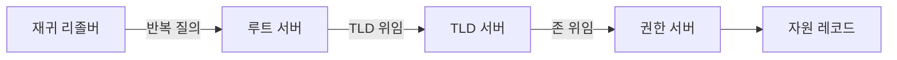
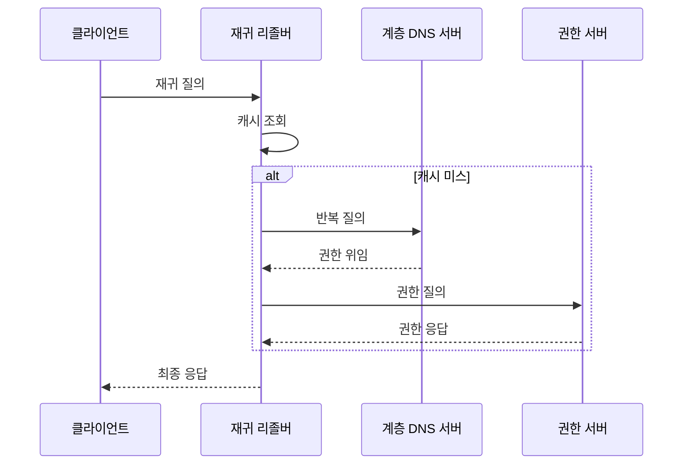

---
sidebar:
  order: 8
  label: "008. DNS 구조·동작 (DNS Domain Name System)"
  badge:
    text: "기출 · 50%"
    variant: note
title: "DNS 구조·동작 (DNS Domain Name System)"
date: "2026-07-27T23:59:59+09:00"
tags:
  - "notes-network"
weight: 8
extra:
  question_no: "008"
  source_status: "기출"
  source_history: "122회, 137회"
  priority: 50
  priority_note: "설계·운영형: 계층·재귀·Cache·장애 대응"
---

## 미리 알고가기

- **도메인 이름 시스템 DNS(디엔에스, Domain Name System)**: 영어 세 낱말의 첫 글자를 쓴 표기로 계층형 이름을 IP 주소 등 자원 정보로 변환하는 분산 데이터베이스
- **자원 레코드(Resource Record)**: 도메인 이름·레코드 유형·값·유효 기간을 저장하는 DNS 데이터 단위
- **재귀 질의(Recursive Query)**: 클라이언트가 재귀 리졸버에 최종 답이나 오류를 반환해 달라고 요청하는 방식
- **반복 질의(Iterative Query)**: 리졸버가 루트부터 위임받은 다음 서버를 차례로 직접 조회하는 방식
- **생존 시간(Time To Live, TTL)**: 리졸버가 자원 레코드를 새로 조회하지 않고 캐시에 보관할 수 있는 시간
- **최상위 도메인(Top-Level Domain, TLD)**: 루트 바로 아래의 도메인 계층이며 하위 권한 서버 정보를 위임함
- **재귀 리졸버(Recursive Resolver)**: 클라이언트 대신 DNS 계층을 조회하고 결과를 캐시에 저장하는 서버
- **권한 서버(Authoritative Server)**: 자신이 관리하는 존의 자원 레코드에 최종 권한 응답을 제공하는 서버
- **존(Zone)·위임(Delegation)**: 한 권한 서버가 관리하는 이름 영역과 하위 영역의 권한을 다른 서버에 넘기는 관계
- **도메인 레이블(Label)**: 점으로 구분한 도메인 이름의 각 부분이며 루트부터 하위 이름 계층을 이룸
- **캐시 미스(Cache Miss)**: 요청한 이름의 유효한 자원 레코드가 리졸버 캐시에 없는 상태
- **DNS 증폭 공격**: 공격자가 출발지 주소를 위조한 작은 질의로 큰 DNS 응답을 피해자에게 보내 트래픽을 증폭하는 공격
- **DNS 보안 확장(Domain Name System Security Extensions, DNSSEC)**: 전자서명 체인으로 DNS 응답의 출처와 무결성을 검증하는 확장
- **HTTPS 기반 DNS(DNS over HTTPS, DoH)**: DNS 질의를 암호화된 웹 통신 안에 넣어 전달하는 방식
- **전송 계층 보안 기반 DNS(DNS over Transport Layer Security, DoT)**: DNS 질의를 전송 계층 보안 연결로 암호화하는 방식

## Ⅰ. 개요

- 정의/개념: 계층형 이름의 **자원 레코드 분산 해석 체계**
- **배경/필요성**: 중앙 이름 관리의 **확장·장애 집중 한계** 해소

### 쉽게 이해하기 (학습용)
- 인터넷 이름을 한 장부에 몰아두지 않고 구역별 담당 서버가 나눠 관리하며 주소를 알려 준다

## Ⅱ. 특징

- 루트·TLD·권한 서버의 **계층형 위임**
- TTL 캐시의 **조회 지연·변경 전파 상충**
- DNSSEC의 **응답 출처·무결성 검증**

### 쉽게 이해하기 (학습용)
- 한번 찾은 주소를 오래 기억하면 빠르지만 서버 주소가 바뀌어도 기억이 끝날 때까지 옛 주소를 줄 수 있다

## Ⅲ. 아키텍처 및 구성요소

| 설계 요소 | 설명 |
|:---|:---|
| 재귀 리졸버 | 계층 질의를 대신 수행하고 결과를 캐시 |
| 루트 서버 | 질의 이름의 TLD 서버를 위임 |
| TLD 서버 | 하위 존의 권한 서버를 위임 |
| 권한 서버 | 관리 존의 최종 권한 응답을 제공 |
| 자원 레코드 | 이름·유형·값·TTL을 저장 |

> 요약: 리졸버가 위임 경로를 따라 권한 답을 획득

### 쉽게 이해하기 (학습용)
- 리졸버는 루트 안내소에서 시작해 하위 안내소를 거쳐 이름을 맡은 최종 서버에서 주소를 받는다

## Ⅳ. 원리 및 절차 흐름도

| 절차 | 설명 |
|:---|:---|
| 재귀 질의 | 최종 답이나 오류 반환을 요청 |
| 캐시 조회 | TTL이 유효한 레코드를 검색 |
| 반복 질의 | 루트부터 다음 위임 서버를 조회 |
| 권한 위임 | 하위 존을 맡은 서버 정보를 반환 |
| 권한 질의 | 최종 레코드를 권한 서버에 요청 |
| 권한 응답 | 자원 레코드와 TTL을 반환 |
| 최종 응답 | 결과를 캐시하고 클라이언트에 반환 |

> 요약: 캐시 미스면 위임을 따라 권한 답을 조회

### 쉽게 이해하기 (학습용)
- 기억한 답이 없으면 루트부터 담당 서버를 안내받아 최종 답을 찾고 다음 요청을 위해 저장한다

## Ⅴ. 종류 및 비교

| DNS 질의 방식 | 재귀 질의 | 반복 질의 |
|:---|:---|:---|
| 적용 기준 | 클라이언트가 리졸버에 요청 | 리졸버가 DNS 계층을 추적 |
| 핵심 특징 | 최종 답·오류 반환 요청 | 다음 위임 서버 반복 조회 |
| 한계 | 공개 재귀의 증폭 공격 악용 | 위임 오류로 해석 실패 |

> 요약: 클라이언트는 재귀, 리졸버는 반복 질의

### 쉽게 이해하기 (학습용)
- 클라이언트는 최종 답을 맡기고 리졸버는 안내받은 서버를 직접 따라가며 답을 찾는다

## Ⅵ. 실무 사례

1. 서비스 이전 전 **허용 시간만큼 TTL 단축**
2. 공개 리졸버의 **재귀 질의 대상 제한**
3. 검증 리졸버는 DNSSEC 서명 체인 검증

### 쉽게 이해하기 (학습용)
- 서버 주소를 바꾸기 전에 허용 가능한 전파 시간만큼 기억 시간을 줄인다
- 공개 리졸버는 정해진 이용자의 이름만 대신 조회해 증폭 공격 악용을 줄인다
- 검증 리졸버는 서명 연결을 따라가며 받은 주소가 권한 서버의 답인지 확인한다

## Ⅶ. 결론

- **변경 전파 허용 시간**으로 TTL·캐시 설정

### 쉽게 이해하기 (학습용)
- 주소 변경이 얼마나 늦게 퍼져도 되는지에 따라 기억 시간을 정해야 속도와 최신성을 맞출 수 있다
