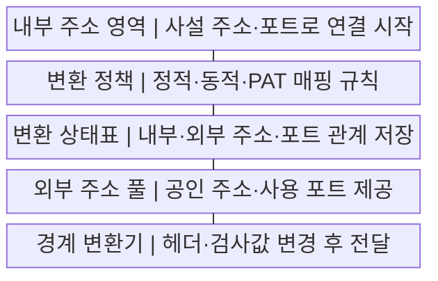
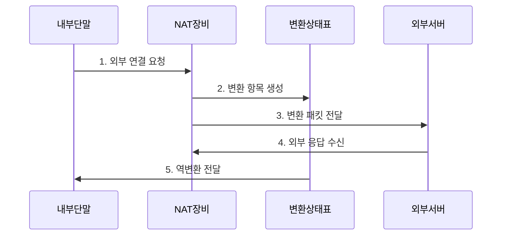

---
sidebar:
  order: 9
  label: "009. NAT·PAT (NAT PAT Network Address Translation)"
  badge:
    text: "미출 · 30%"
    variant: note
title: "NAT·PAT (NAT PAT Network Address Translation)"
date: "2026-07-29T20:30:00+09:00"
tags:
  - "notes-network"
weight: 9
extra:
  question_no: "009"
  source_status: "미출"
  source_history: ""
  priority: 30
  priority_note: "비교·설계형: NAT/PAT 주소 절감·추적 한계"
---

## 미리 알고가기

- **네트워크 주소 변환(Network Address Translation, NAT)**: 경계 장비가 패킷의 내부·외부 인터넷 프로토콜 주소를 변환해 서로 다른 주소 영역을 연결하는 기술
- **포트 주소 변환(Port Address Translation, PAT)**: 여러 내부 연결의 주소·포트를 하나 또는 소수의 공인 주소·서로 다른 포트로 변환하는 NAT 방식
- **사설 인터넷 프로토콜 주소(Private Internet Protocol Address)**: 인터넷에서 직접 라우팅하지 않고 조직 내부에서 사용하는 예약 주소
- **공인 인터넷 프로토콜 주소(Public Internet Protocol Address)**: 인터넷에서 전역적으로 고유하며 외부 라우팅에 사용하는 주소
- **NAT 변환 테이블(NAT Translation Table)**: 변환 전후의 프로토콜·주소·포트와 만료 시각을 연결해 저장한 표
- **상태 기반 NAT(Stateful NAT)**: 연결별 변환 항목을 만들고 응답 패킷을 같은 항목으로 역변환하는 방식
- **정적 NAT·동적 NAT**: 내부·외부 주소를 미리 고정해 연결하는 방식과 요청 시 공인 주소 풀에서 선택해 연결하는 방식
- **포트 포워딩(Port Forwarding)**: 공인 주소의 특정 포트로 들어온 새 연결을 미리 정한 내부 서버로 전달하는 규칙
- **튜플(Tuple)**: 프로토콜과 출발지·목적지 주소·포트를 묶어 하나의 연결을 식별하는 값
- **체크섬(Checksum)**: 전송 중 인터넷 프로토콜·전송 계층 헤더가 손상됐는지 확인하는 계산값
- **주소 풀(Address Pool)**: NAT 장비가 변환에 할당할 수 있도록 보유한 공인 주소 범위
- **1:1·다대일 매핑**: `1:1`은 '일 대 일'로 읽고 콜론으로 양쪽 주소 수의 대응 비율을 표시하며 정적·동적 NAT와 PAT의 공유 범위를 구분

## Ⅰ. 개요

- 정의/개념: 경계 장비가 패킷의 주소·포트를 변환하는 기술
- 배경/필요성: IPv4 주소 절약과 내부·외부 주소 체계 연결

### 쉽게 이해하기 (학습용)

- 회사 대표번호가 여러 내선 통화를 외부 번호와 연결하듯 공인 주소가 내부 단말의 연결을 구분해 중계한다

## Ⅱ. 특징

- 주소 변환의 **내부·외부 주소 분리**
- PAT 포트 구분의 **공인 주소 공유**
- 상태 항목의 **응답 역변환 보장**

### 쉽게 이해하기 (학습용)

- 변환 장비는 연결마다 내선과 외부 번호의 대응표를 남겨 돌아온 응답을 원래 단말에 보낸다

## Ⅲ. 구조 및 구성요소

| 구성요소 | 책임 |
|:---|:---|
| 내부 주소 영역 | 사설 주소·포트로 연결 시작 |
| 변환 정책 | 정적·동적·PAT 매핑 규칙 |
| 변환 상태표 | 내부·외부 주소·포트 관계 저장 |
| 외부 주소 풀 | 공인 주소·사용 포트 제공 |
| 경계 변환기 | 헤더·검사값 변경 후 전달 |

### 쉽게 이해하기 (학습용)

- 변환 장비는 내부 연결에 공인 주소와 포트를 배정하고 두 값을 대응표에 함께 적는다

## Ⅳ. 흐름도

**동작 원리**

1. **외부 연결 요청**: 사설 주소·포트 패킷 전송
2. **변환 항목 생성**: 공인 주소·포트 대응 저장
3. **변환 패킷 전달**: 헤더·검사값 변경 후 전송
4. **외부 응답 수신**: 공인 주소·포트로 응답
5. **역변환 전달**: 원래 사설 주소·포트 복원

### 쉽게 이해하기 (학습용)

- 나가는 연결에 대응표가 없으면 공인 번호를 새로 배정하고 돌아온 응답은 그 표로 원래 단말을 찾는다

## Ⅴ. 종류 및 비교

| 판단 기준 | 정적 NAT | 동적 NAT | PAT |
|:---|:---|:---|:---|
| 적용 기준 | 외부에서 접근할 고정 서버 | 동시 접속 수만큼 공인 주소 보유 | 다수 단말의 외부 접속 공유 |
| 핵심 특징 | 주소 간 1:1 고정 매핑 | 풀에서 주소 간 1:1 임시 매핑 | 주소·포트 간 다대일 매핑 |
| 한계 | 공인 주소 상시 점유 | 주소 풀 고갈 | 포트·변환 테이블 고갈 |

> 요약: 주소·포트 공유 범위로 NAT 방식 선택

### 쉽게 이해하기 (학습용)

- 고정 서버는 번호를 예약하고 여유 공인 주소는 필요할 때 빌리며 많은 단말은 포트로 한 주소를 나눠 쓴다

## Ⅵ. 실무 고려사항 및 대책

| 고려사항 | 대책 | 효과 |
|:---|:---|:---|
| PAT 포트 고갈 | 동시 연결·목적지별 용량 산정 | 외부 연결 지속성 |
| 외부 시작 연결 필요 | 정적 매핑·보안 규칙 함께 설정 | 서비스 도달성 확보 |
| 응용 본문 주소 포함 | ALG 회피·응용 프록시 검토 | 프로토콜 호환성 |
| 사용자 추적 곤란 | 변환 시각·매핑 로그 보존 | 사고 조사 가능 |

### 쉽게 이해하기 (학습용)

- 동시에 연결하는 단말이 많으면 공인 주소마다 나눠 줄 포트가 부족하지 않은지 계산한다

## Ⅶ. 결론

- **연결 방향·동시 세션·포트 용량에 따른 NAT·PAT 선택**

### 쉽게 이해하기 (학습용)

- 외부 시작 연결과 내부 동시 세션 수에 따라 주소·포트 변환 방식을 선택해야 한다.
