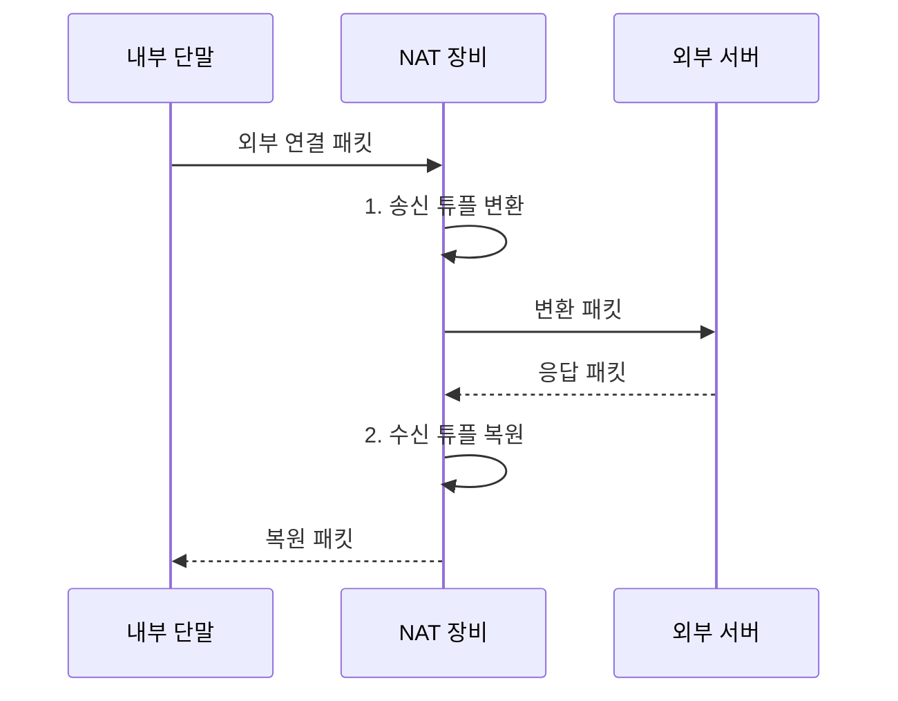

---
sidebar:
  order: 9
  label: "009. NAT·PAT (NAT PAT Network Address Translation)"
  badge:
    text: "미출 · 30%"
    variant: note
title: "NAT·PAT (NAT PAT Network Address Translation)"
date: "2026-08-02T09:36:00+09:00"
tags:
  - "notes-network"
weight: 9
extra:
  question_no: "009"
  source_status: "미출"
  source_history: ""
  priority: 30
  priority_note: "비교·설계형: NAT/PAT 주소 절감·추적 한계"
---

## Ⅰ. 개요

핵심 용어

- **NAT**는 경계 장비가 패킷의 사설 IP 주소와 공인 IP 주소를 변환하여 서로 다른 주소 영역을 연결한다.
- **PAT**는 여러 내부 연결을 하나 또는 소수의 공인 주소와 서로 다른 포트로 구분하여 변환한다.

- 정의/개념: 경계 장비가 사설·공인 주소와 포트를 대응시키는 **NAT·PAT 변환 기술**
- 배경/필요성: 공인 IPv4 주소 고갈로 단말별 **전역 주소 할당 제약**

#### 한줄 요약

- 회사 대표번호가 여러 내선 통화를 외부 번호와 연결하듯 공인 주소가 내부 단말의 연결을 구분해 중계한다

## Ⅱ. 특징

핵심 용어

- **상태 기반 NAT**는 연결별 변환 항목을 만들고 응답 패킷을 같은 항목으로 역변환한다.
- **변환 테이블**은 변환 전후의 프로토콜·주소·포트와 만료 시각을 연결하여 저장한다.

- 주소 변환의 **내부·외부 주소 분리**
- PAT 포트 구분의 **공인 주소 공유**
- 상태 항목의 **응답 역변환 보장**

#### 한줄 요약

- 변환 장비는 연결마다 내선과 외부 번호의 대응표를 남겨 돌아온 응답을 원래 단말에 보낸다

## Ⅲ. 구조 및 구성요소

핵심 용어

- **사설 IP 주소**는 인터넷에서 직접 라우팅하지 않고 조직 내부에서 사용하는 예약 주소이다.
- **공인 IP 주소**는 인터넷에서 전역적으로 고유하며 외부 라우팅에 사용하는 주소이다.
- **주소 풀**은 NAT 장비가 변환에 할당할 수 있도록 보유한 공인 주소 범위이다.

| 구성요소 | 책임 |
|:---|:---|
| 내부 주소 영역 | **사설 주소·포트**로 연결 시작 |
| 변환 정책 | **정적·동적·PAT** 매핑 규칙 |
| 변환 상태표 | 내부·외부 **주소·포트 관계** 저장 |
| 외부 주소 풀 | 변환에 쓸 **공인 주소·포트** 제공 |
| 경계 변환기 | **헤더·체크섬** 변경 후 전달 |

#### 한줄 요약

- 변환 장비는 내부 연결에 공인 주소와 포트를 배정하고 두 값을 대응표에 함께 적는다

## Ⅳ. 흐름도

핵심 용어

- **튜플**은 프로토콜과 출발지·목적지 주소 및 포트를 묶어 하나의 연결을 식별하는 값이다.
- **체크섬 갱신**은 NAT가 주소나 포트를 바꾼 뒤 변경된 헤더의 무결성 검증값을 다시 계산하는 과정이다.

**동작 원리**

1. **송신 튜플 변환**: 공인 튜플을 할당하고 체크섬 갱신
2. **수신 튜플 복원**: 변환 상태표로 사설 주소·포트 복원

#### 한줄 요약

- 나가는 연결에 대응표가 없으면 공인 번호를 새로 배정하고 돌아온 응답은 그 표로 원래 단말을 찾는다

## Ⅴ. 종류 및 비교

핵심 용어

- **정적 NAT**는 내부 주소와 외부 주소를 일대일로 미리 고정하여 연결한다.
- **동적 NAT**는 연결 요청이 발생할 때 공인 주소 풀에서 주소를 선택하여 일대일로 임시 연결한다.
- **PAT**는 여러 내부 주소·포트를 하나의 공인 주소에서 서로 다른 포트로 다대일 매핑한다.

| NAT 매핑 방식 | 정적 NAT | 동적 NAT | PAT |
|:---|:---|:---|:---|
| 적용 기준 | 외부에서 접근할 **고정 서버** | 동시 접속 수만큼 **공인 주소** 보유 | 다수 단말의 **외부 접속 공유** |
| 핵심 특징 | 주소 간 **1:1 고정 매핑** | 풀에서 주소 간 **1:1 임시 매핑** | 주소·포트 간 **다대일 매핑** |
| 한계 | **공인 주소 상시 점유** | **주소 풀 고갈** | **포트·변환 테이블 고갈** |

> 요약: 주소·포트 공유 범위로 NAT 방식 선택

#### 한줄 요약

- 고정 서버는 번호를 예약하고 여유 공인 주소는 필요할 때 빌리며 많은 단말은 포트로 한 주소를 나눠 쓴다

## Ⅵ. 실무 고려사항 및 대책

핵심 용어

- **포트 포워딩**은 공인 주소의 특정 포트로 들어온 새 연결을 미리 지정한 내부 서버로 전달한다.
- **ALG**는 패킷 본문의 주소와 포트를 해석하여 NAT의 헤더 변환과 일치하도록 보정한다.
- **변환 매핑 로그**는 시각과 튜플 및 변환 결과를 기록하여 공인 주소를 공유한 내부 사용자를 추적하게 한다.

| 문제 | 대책 | 효과 |
|:---|:---|:---|
| 동시 연결 수가 PAT 포트 범위를 초과 | 공인 주소·목적지별 **포트 용량 산정** | **외부 연결 실패** 감소 |
| 외부 시작 연결에 변환 상태가 없음 | **정적 매핑·출발지 제한** 설정 | **서비스 도달성·노출 범위** 통제 |
| 응용 본문의 주소가 헤더 변환과 불일치 | 필요한 프로토콜만 **ALG·프록시** 적용 | **응용 프로토콜 호환성** 확보 |
| 여러 사용자가 같은 공인 주소를 공유 | 시각·튜플·**변환 매핑 로그** 보존 | **접속 사용자 추적** 가능 |

#### 한줄 요약

- 동시에 연결하는 단말이 많으면 공인 주소마다 나눠 줄 포트가 부족하지 않은지 계산한다

## Ⅶ. 결론

핵심 용어

- **NAT 방식 선택**은 외부에서 시작하는 고정 연결의 필요성과 내부 동시 세션 수를 기준으로 결정한다.

- 외부 고정 연결은 **정적 NAT**, 다수 내부 연결은 **PAT** 선택

#### 한줄 요약

- 외부 시작 연결과 내부 동시 세션 수에 따라 주소·포트 변환 방식을 선택해야 한다.
