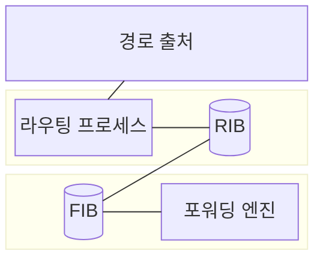
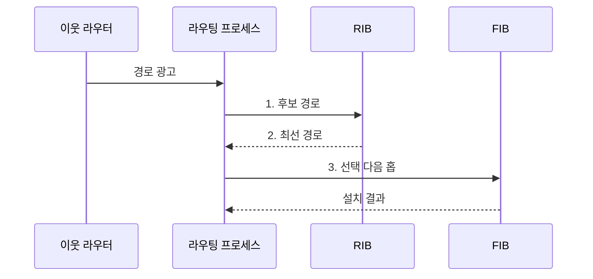

---
sidebar:
  order: 10
  label: "010. 라우팅 기본: 정적•동적 라우팅 (Routing Static Dynamic)"
  badge:
    text: "미출 • 30%"
    variant: note
title: "라우팅 기본: 정적•동적 라우팅 (Routing Static Dynamic)"
date: "2026-08-03T08:48:47+09:00"
tags:
  - "notes-network"
weight: 10
extra:
  question_no: "010"
  source_status: "미출"
  source_history: ""
  priority: 30
  priority_note: "비교형: 정적•동적 경로의 선택 기준"
---

## Ⅰ. 개요

핵심 용어

- **라우팅**: 목적지 인터넷 프로토콜 주소에 도달할 다음 홉과 출력 인터페이스를 결정하는 네트워크 계층 기능이다.

- 정의/개념: 목적지 IP에 따라 다음 홉•출력 인터페이스를 정하는 **라우팅 기능**
- 배경/필요성: 직접 연결 정보만으로는 다중 네트워크의 **원격 목적지 경로를 결정할 수 없음**

#### 한줄 요약

- 라우터는 목적지 주소와 경로 우선순위를 보고 패킷을 어느 이웃에게 넘길지 정한다

## Ⅱ. 특징

핵심 용어

- **관리 거리**: 서로 다른 경로 출처가 같은 목적지 경로를 제시할 때 출처의 신뢰 우선순위를 비교하는 값이다.
- **메트릭**: 같은 라우팅 프로토콜 안에서 대역폭•지연•홉 수 등의 기준으로 경로 비용을 비교하는 값이다.
- **제어 평면과 데이터 평면**: 각각 경로를 교환•선택하고 선택한 경로로 실제 패킷을 전달한다.

- 경로 출처별 **관리 거리 신뢰도 비교**
- 프로토콜별 **메트릭 최선 경로 선택**
- FIB 설치의 **제어•전달 기능 분리**

#### 한줄 요약

- 먼저 안내 정보를 준 출처의 신뢰도를 보고 같은 출처끼리는 비용을 비교해 실제 길 안내표에 올린다

## Ⅲ. 구조 및 구성요소

핵심 용어

- **라우팅 정보 베이스(Routing Information Base, RIB)**: 정적 설정과 라우팅 프로토콜에서 받은 후보 경로 및 선택 경로를 보관하는 제어 평면 표이다.
- **포워딩 정보 베이스(Forwarding Information Base, FIB)**: 선택된 경로를 실제 패킷 전달에서 빠르게 조회하도록 만든 데이터 평면 표이다.
- **동일 비용 다중 경로(Equal-Cost Multi-Path, ECMP)**: 같은 목적지의 동일 비용 경로 여러 개를 FIB에 설치하여 트래픽을 분산한다.

| 구성요소 | 책임 |
|:---|:---|
| 경로 출처 | 정적 설정•프로토콜의 **후보 경로** 제공 |
| 라우팅 프로세스 | **관리 거리•메트릭**으로 최선 경로 선택 |
| RIB | 후보 경로와 **선택 경로** 보관 |
| FIB | 선택 경로를 **LPM•ECMP** 전달 항목으로 변환 |
| 포워딩 엔진 | FIB 조회로 **다음 홉•출력 인터페이스** 결정 |

#### 한줄 요약

- 여러 안내 정보는 제어용 장부에서 비교되고 최종 경로만 실제 패킷이 조회하는 빠른 표로 옮겨진다

## Ⅳ. 흐름도

핵심 용어

- **최장 프리픽스 일치(Longest Prefix Match, LPM)**: 목적지 주소와 가장 많은 앞 비트가 일치하는 FIB 경로를 선택하는 규칙이다.
- **다음 홉**: 선택한 경로에서 패킷을 넘길 인접 라우터이며 출력 인터페이스는 패킷이 나갈 장치 포트이다.

**동작 원리**

1. **후보 경로**: 목적지•다음 홉•출처 속성을 RIB에 저장
2. **최선 경로**: 관리 거리와 메트릭으로 설치 후보 결정
3. **선택 다음 홉**: 최선 경로를 패킷 조회용 FIB에 반영

#### 한줄 요약

- 후보 길은 출처와 비용으로 하나를 정해 전달표에 올리고 패킷은 목적지와 가장 길게 맞는 길을 따른다

## Ⅴ. 종류 및 비교

핵심 용어

- **정적 라우팅**: 관리자가 경로를 직접 설정하므로 경로가 고정된 스텁 네트워크에 적합하다.
- **동적 라우팅**: 라우팅 프로토콜이 경로를 자동으로 교환하고 네트워크 변화에 따라 갱신한다.
- **수렴**: 네트워크 변화 뒤 라우터들이 일관된 최신 경로를 다시 갖게 되는 과정이다.

| 라우팅 방식 | 정적 라우팅 | 동적 라우팅 |
|:---|:---|:---|
| 적용 기준 | 단일 출구 **스텁망•기본 경로** | 경로가 많고 변화하는 **중계망** |
| 핵심 특징 | 관리자가 경로를 **직접 설정** | 프로토콜이 경로를 **자동 교환** |
| 한계 | 장애 후 **수동 전환 지연** | **수렴 지연•잘못된 경로 전파** |

> 요약: 고정 끝단은 정적, 변화 중계망은 동적

#### 한줄 요약

- 갈 길이 하나뿐인 끝단은 길을 고정하고 여러 길이 자주 바뀌는 망은 라우터끼리 자동으로 알린다

## Ⅵ. 실무 고려사항 및 대책

핵심 용어

- **경로 추적**: 다음 홉의 도달성을 확인하여 정적 경로의 설치와 제거를 자동으로 바꾼다.
- **경로 재분배**: 서로 다른 라우팅 프로토콜이나 경로 출처 사이에 경로 정보를 변환하여 주입한다.
- **비대칭 라우팅**: 한 연결의 왕복 패킷이 서로 다른 경로를 사용하여 상태 기반 장비의 처리를 어긋나게 할 수 있다.

| 문제 | 대책 | 효과 |
|:---|:---|:---|
| 다수 정적 경로의 수동 변경이 누적 | 소규모 고정 경로로 제한하고 **경로 추적** 적용 | **설정 누락•전환 지연** 감소 |
| 장애 탐지가 늦어 동적 경로가 잔존 | 탐지 타이머•대체 경로의 **수렴 시험** | **경로 복구 시간** 단축 |
| 양방향 재분배로 경로가 되돌아옴 | **경로 태그•필터** 로 단방향 주입 | **재분배 루프** 방지 |
| 비대칭 경로로 한 방향이 상태 장비를 미경유 | **왕복 경로•상태 정책** 동시 검증 | **연결 단절** 예방 |

#### 한줄 요약

- 연결이 많은 데이터센터는 라우터들이 장애 정보를 교환해 우회 경로를 다시 계산한다

## Ⅶ. 결론

핵심 용어

- **기본 경로**: 목적지에 대한 더 구체적인 경로가 없을 때 사용하는 최후의 경로이다.
- **라우팅 방식 결정**: 경로 수와 변화 빈도가 낮으면 정적 라우팅, 자동 수렴이 필요하면 동적 라우팅을 선택하는 판단이다.

- 경로 수•변화 빈도가 낮으면 **정적 라우팅**, 자동 수렴이 필요하면 **동적 라우팅**

#### 한줄 요약

- 경로가 고정된 소규모망은 정적, 변화가 잦은 대규모망은 동적 라우팅이 유리하다.
