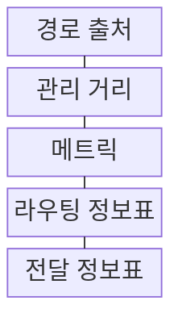
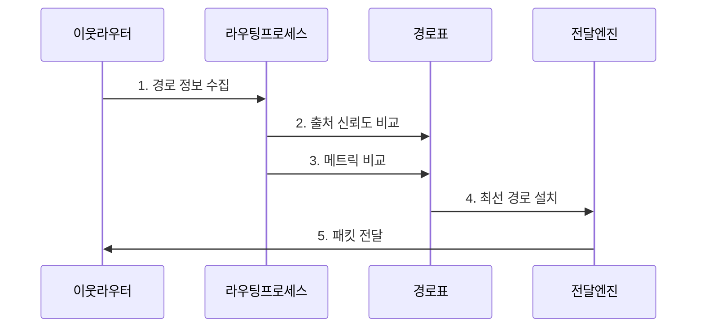

---
sidebar:
  order: 10
  label: "010. 라우팅 기본: 정적·동적 라우팅 (Routing Static Dynamic)"
  badge:
    text: "미출 · 30%"
    variant: note
title: "라우팅 기본: 정적·동적 라우팅 (Routing Static Dynamic)"
date: "2026-07-30T18:00:00+09:00"
tags:
  - "notes-network"
weight: 10
extra:
  question_no: "010"
  source_status: "미출"
  source_history: ""
  priority: 30
  priority_note: "비교형: 정적·동적 경로의 선택 기준"
---

## 미리 알고가기

- **라우팅(Routing)**: 목적지 인터넷 프로토콜 주소에 도달할 다음 홉과 출력 인터페이스를 결정하는 네트워크 계층 기능
- **라우팅 정보 베이스(Routing Information Base, RIB)**: 정적 설정과 라우팅 프로토콜에서 받은 후보 경로와 선택 경로를 보관하는 제어 평면 표
- **포워딩 정보 베이스(Forwarding Information Base, FIB)**: 선택된 경로를 실제 패킷 전달에 빠르게 조회하도록 만든 데이터 평면 표
- **최장 프리픽스 일치(Longest Prefix Match, LPM)**: 목적지 주소와 가장 많은 앞 비트가 일치하는 FIB 경로를 선택하는 규칙
- **관리 거리(Administrative Distance, AD)**: 서로 다른 경로 출처가 같은 목적지 경로를 제시할 때 장비가 신뢰 우선순위를 비교하는 값
- **메트릭(Metric)**: 같은 라우팅 프로토콜 안에서 대역폭·지연·홉 수 같은 기준으로 경로 비용을 비교하는 값
- **동일 비용 다중 경로(Equal-Cost Multi-Path, ECMP)**: 같은 목적지의 동일 비용 경로 여러 개를 FIB에 설치해 트래픽을 분산하는 방식
- **프리픽스·다음 홉·출력 인터페이스**: 목적지 주소 범위, 패킷을 넘길 인접 라우터, 패킷이 나갈 장치 포트
- **정적·동적 라우팅**: 관리자가 경로를 직접 설정하는 방식과 라우팅 프로토콜이 경로를 교환·갱신하는 방식
- **수렴(Convergence)**: 네트워크 변화 후 라우터들이 일관된 최신 경로를 다시 갖게 되는 과정
- **기본 경로(Default Route)**: 더 구체적인 경로가 없을 때 사용하는 최후의 경로
- **스텁 네트워크(Stub Network)**: 외부로 나가는 경로가 하나이거나 다른 망의 중계 경로로 쓰이지 않는 끝단 네트워크
- **경로 추적(Route Tracking)**: 다음 홉 도달성을 확인해 정적 경로의 설치·제거를 자동으로 바꾸는 기능
- **제어 평면·데이터 평면**: 경로 정보를 교환·선택하는 영역과 선택된 경로로 실제 패킷을 전달하는 영역

## Ⅰ. 개요

- 정의/개념: 목적지별 다음 홉·출력 인터페이스를 결정
- 배경/필요성: 다중 네트워크에서 도달성·우회·정책 경로 선택

### 쉽게 이해하기 (학습용)

- 라우터는 목적지 주소와 경로 우선순위를 보고 패킷을 어느 이웃에게 넘길지 정한다

## Ⅱ. 특징

- 경로 출처별 **관리 거리 신뢰도 비교**
- 프로토콜별 **메트릭 최선 경로 선택**
- FIB 설치의 **제어·전달 기능 분리**

### 쉽게 이해하기 (학습용)

- 먼저 안내 정보를 준 출처의 신뢰도를 보고 같은 출처끼리는 비용을 비교해 실제 길 안내표에 올린다

## Ⅲ. 구조 및 구성요소

| 구성요소 | 책임 |
|:---|:---|
| 경로 출처 | 정적·동적 후보 경로 제공 |
| 관리 거리 | 서로 다른 출처의 신뢰도 비교 |
| 메트릭 | 같은 프로토콜 후보 비용 비교 |
| 라우팅 정보표 | 후보·최선 경로 보관 |
| 전달 정보표 | 선택 경로로 패킷 다음 홉 결정 |

### 쉽게 이해하기 (학습용)

- 여러 안내 정보는 제어용 장부에서 비교되고 최종 경로만 실제 패킷이 조회하는 빠른 표로 옮겨진다

## Ⅳ. 흐름도

**동작 원리**

1. **경로 정보 수집**: 목적지·다음 홉·속성 전달
2. **출처 신뢰도 비교**: 관리 거리로 후보 우선순위 판정
3. **메트릭 비교**: 동일 출처의 최저 비용 선택
4. **최선 경로 설치**: 목적지별 다음 홉 반영
5. **패킷 전달**: 최장 일치 경로로 전송

### 쉽게 이해하기 (학습용)

- 후보 길은 출처와 비용으로 하나를 정해 전달표에 올리고 패킷은 목적지와 가장 길게 맞는 길을 따른다

## Ⅴ. 종류 및 비교

| 판단 기준 | 정적 라우팅 | 동적 라우팅 |
|:---|:---|:---|
| 적용 기준 | 경로가 단순·고정된 끝단망 | 경로가 많고 변화하는 중계망 |
| 핵심 특징 | 관리자가 경로를 직접 설정 | 프로토콜이 경로를 자동 교환 |
| 한계 | 장애 후 수동 전환 지연 | 수렴 지연·잘못된 경로 전파 |

> 요약: 고정 끝단은 정적, 변화 중계망은 동적

### 쉽게 이해하기 (학습용)

- 갈 길이 하나뿐인 끝단은 길을 고정하고 여러 길이 자주 바뀌는 망은 라우터끼리 자동으로 알린다

## Ⅵ. 실무 고려사항 및 대책

| 고려사항 | 대책 | 효과 |
|:---|:---|:---|
| 정적 경로 누적 관리 | 소규모·고정 경로에만 제한 | 운영 오류 감소 |
| 동적 경로 수렴 지연 | 장애 탐지·타이머·대체 경로 시험 | 복구 시간 단축 |
| 경로 재분배 루프 | 태그·필터·단방향 정책 적용 | 순환 경로 방지 |
| 비대칭 경로 통제 누락 | 방화벽 상태·회귀 경로 확인 | 세션 단절 예방 |

### 쉽게 이해하기 (학습용)

- 연결이 많은 데이터센터는 라우터들이 장애 정보를 교환해 우회 경로를 다시 계산한다

## Ⅶ. 결론

- **토폴로지 변화·경로 수·수렴 요구에 따른 라우팅 선택**

### 쉽게 이해하기 (학습용)

- 경로가 고정된 소규모망은 정적, 변화가 잦은 대규모망은 동적 라우팅이 유리하다.
