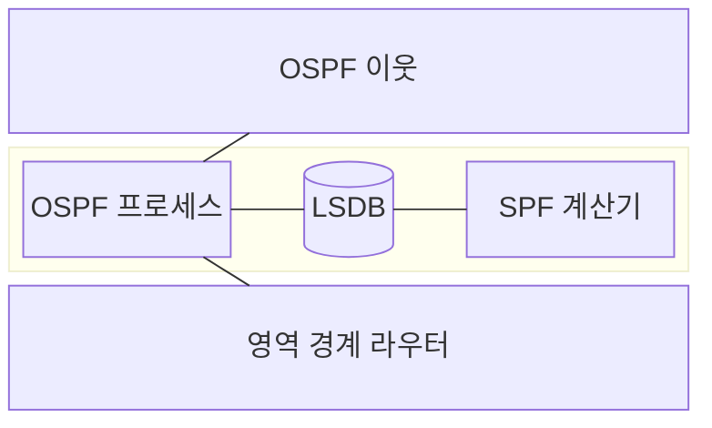
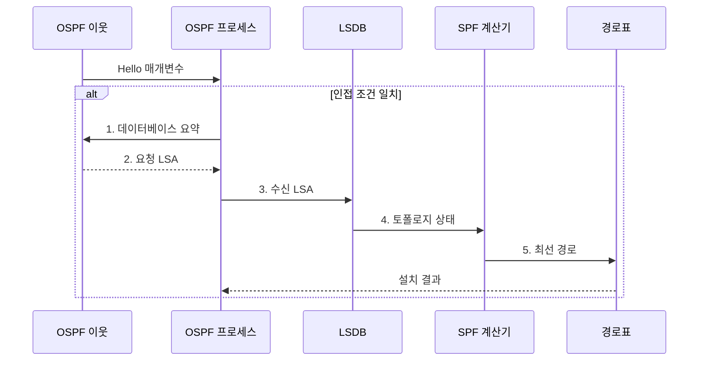

---
sidebar:
  order: 11
  label: "011. 링크 상태 라우팅: OSPF•OSPFv3 (OSPF Link State Routing)"
  badge:
    text: "기출 • 50%"
    variant: note
title: "링크 상태 라우팅: OSPF•OSPFv3 (OSPF Link State Routing)"
date: "2026-08-03T15:05:00+09:00"
tags:
  - "notes-network"
weight: 11
extra:
  question_no: "011"
  source_status: "기출"
  source_history: "137회"
  priority: 50
  priority_note: "설명•운영형: 137회 OSPFv3 직접 출제"
---

## Ⅰ. 개요

핵심 용어

- **최단 경로 우선 개방형 프로토콜(Open Shortest Path First, OSPF)**: 링크 상태를 공유하고 각 라우터가 최단 경로를 계산하는 내부 라우팅 프로토콜이다.
- **내부 게이트웨이 프로토콜(Interior Gateway Protocol, IGP)**: 하나의 자율 시스템 내부에서 경로를 교환하는 라우팅 프로토콜이다.

- 정의/개념: **OSPF** — 자율 시스템 내부 라우터가 LSA로 링크 상태 데이터베이스를 동기화하고 SPF로 최단 경로를 계산하는 **링크 상태 IGP**
- 배경/필요성: 거리 벡터의 **느린 수렴•루프 한계** 해소

#### 한줄 요약

- 같은 구역의 라우터들이 동일한 도로 지도를 맞춘 뒤 각자 자신에서 출발하는 가장 싼 길을 계산한다

## Ⅱ. 특징

핵심 용어

- **링크 상태 광고•데이터베이스•최단 경로 우선(Link-State Advertisement/Link-State Database/Shortest Path First, LSA•LSDB•SPF)**: 링크 상태 광고, 영역의 공통 토폴로지 정보, 최단 경로 계산 알고리즘이다.
- **영역•플러딩**: LSA 전파와 SPF 계산 범위를 제한하는 구역과 새 LSA를 영역에 전달하는 동작이다.

- 영역 내 LSDB의 **토폴로지 정보 동기화**
- LSA 플러딩의 **링크 변화 신속 전파**
- 영역 분할의 **LSA•SPF 계산 범위 제한**

#### 한줄 요약

- 한 도로가 바뀌면 그 구역에만 새 지도 조각을 퍼뜨려 모든 라우터가 같은 지도에서 길을 다시 계산한다

## Ⅲ. 구조 및 구성요소

핵심 용어

- **Hello•인접 관계**: 이웃 조건을 교환하는 메시지와 LSDB를 동기화할 수 있도록 맺는 관계이다.
- **영역 경계 라우터(Area Border Router, ABR)•경로 요약**: 영역 0과 다른 영역을 연결하고 여러 프리픽스를 공통 상위 프리픽스로 묶는 기능이다.

| 구성요소 | 책임 |
|:---|:---|
| OSPF 이웃 | Hello로 **인접 관계•상태** 유지 |
| OSPF 프로세스 | **LSA 플러딩•동기화** 제어 |
| LSDB | 영역 내 동일한 **링크 상태 토폴로지** 저장 |
| SPF 계산기 | **최단 경로 트리•다음 홉** 계산 |
| 영역 경계 라우터 | 영역 연결과 **경로 요약** 수행 |

#### 한줄 요약

- 각 구역은 자기 지도를 따로 관리하고 경계 라우터가 중심 구역을 통해 다른 구역의 길을 알려 준다

## Ⅳ. 흐름도

핵심 용어

- **데이터베이스 동기화**: 이웃끼리 LSA 목록을 비교하고 누락•오래된 정보를 교환해 LSDB를 맞추는 절차이다.
- **최선 경로 설치**: 동기화한 토폴로지에서 최소 비용 경로를 계산해 다음 홉을 경로표에 반영하는 처리이다.

**동작 원리**

1. **데이터베이스 요약**: 보유 LSA 목록으로 동기화 차이 식별
2. **요청 LSA**: 누락되거나 오래된 링크 상태 정보 전달
3. **수신 LSA**: 최신 순번의 광고로 영역 토폴로지 갱신
4. **토폴로지 상태**: 자신을 루트로 SPF 계산 시작
5. **최선 경로**: 목적지별 최소 비용 다음 홉을 경로표에 반영

#### 한줄 요약

- 이웃끼리 가진 지도 목록을 비교해 빠진 조각을 받은 뒤 최단 경로를 다시 계산해 안내표에 올린다

## Ⅴ. 종류 및 비교

핵심 용어

- **OSPF 버전 2•3(Open Shortest Path First version 2/3, OSPFv2•OSPFv3)**: 인터넷 프로토콜 버전 4 프리픽스를 다루는 버전과 인터넷 프로토콜 버전 6•링크 로컬 인접 관계를 지원하는 버전이다.

| OSPF 버전 | OSPFv2 | OSPFv3 |
|:---|:---|:---|
| 적용 기준 | **IPv4 내부 라우팅** | **IPv6 라우팅•다중 주소군 확장** |
| 핵심 특징 | **IPv4 프리픽스•LSA** 결합 | **프리픽스•링크 정보** 분리 |
| 한계 | **IPv6 프리픽스** 광고 미지원 | **링크 로컬 다음 홉** 운영 복잡도 |

> 요약: OSPFv3는 주소와 토폴로지 광고를 분리

#### 한줄 요약

- 기존 OSPF는 IPv4 주소를 지도와 함께 다루고 OSPFv3는 링크 지도와 IPv6 주소 정보를 나눠 다룬다

## Ⅵ. 실무 고려사항 및 대책

핵심 용어

- **영역 0•지정/백업 지정 라우터(Designated Router/Backup Designated Router, DR/BDR)**: 영역 간 연결의 백본과 공유 링크에서 LSA 교환 관계를 줄이는 대표•예비 라우터이다.
- **최대 전송 단위(Maximum Transmission Unit, MTU) 불일치**: 이웃 간 최대 전송 단위가 달라 데이터베이스 교환이 완료되지 않는 상태이다.

| 문제 | 대책 | 효과 |
|:---|:---|:---|
| 영역 0이 물리적으로 단절 | **영역 0** 을 연속된 링크로 구성 | **영역 간 도달성** 확보 |
| 넓은 영역의 잦은 LSA로 SPF 반복 | 변경 빈도에 따라 **영역 분할** | **계산•플러딩 범위** 축소 |
| 영역별 프리픽스가 비연속 | 영역 안에 **연속 주소 블록** 배정 | **경로 요약•경로표 축소** |
| Hello의 영역•타이머•MTU가 불일치 | 인접 전 **Hello 조건** 자동 대조 | **인접 형성 실패** 예방 |

#### 한줄 요약

- 큰 내부망을 구역으로 나누고 경계에서 경로를 묶으면 한 구역 변화가 전체 계산을 흔드는 범위를 줄인다

## Ⅶ. 결론

핵심 용어

- **영역 설계**: 변경 빈도와 연속 프리픽스를 기준으로 LSA•SPF 범위를 나누고 백본에 연결하는 활동이다.
- **영역 결정**: 링크 변화 빈도와 연속 프리픽스를 기준으로 OSPF 영역을 나누고 모두 영역 0에 연결하는 판단이다.

- 변경 빈도•연속 프리픽스로 **OSPF 영역** 을 나누고 **영역 0** 에 연결

#### 한줄 요약

- 변화가 퍼질 범위와 주소 집약 경계를 먼저 정해야 OSPF 영역을 안정적으로 나눌 수 있다.
