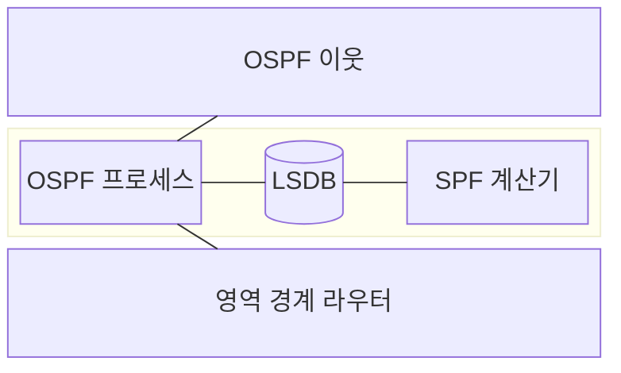
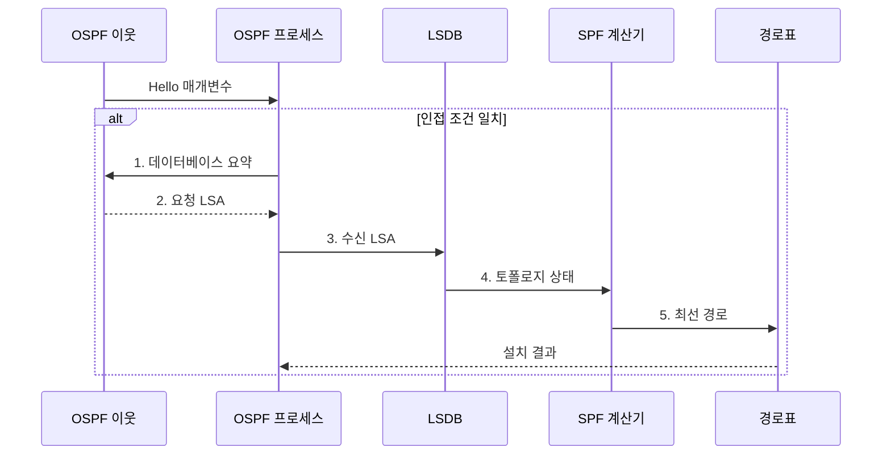

---
sidebar:
  order: 11
  label: "011. 링크 상태 라우팅: OSPF·OSPFv3 (OSPF Link State Routing)"
  badge:
    text: "기출 · 50%"
    variant: note
title: "링크 상태 라우팅: OSPF·OSPFv3 (OSPF Link State Routing)"
date: "2026-07-31T00:58:19+09:00"
tags:
  - "notes-network"
weight: 11
extra:
  question_no: "011"
  source_status: "기출"
  source_history: "137회"
  priority: 50
  priority_note: "설명·운영형: 137회 OSPFv3 직접 출제"
---

## 미리 알고가기

- **개방형 최단 경로 우선(Open Shortest Path First, OSPF)**: 링크 상태를 공유하고 각 라우터가 최단 경로를 계산하는 내부 라우팅 프로토콜
- **OSPF 버전 2(OSPF version 2, OSPFv2)**: IPv4 프리픽스를 전달하고 IPv4 헤더 기반으로 동작하는 OSPF 버전
- **OSPF 버전 3(OSPF version 3, OSPFv3)**: IPv6 프리픽스와 링크 로컬 인접 관계를 지원하는 OSPF 버전
- **인터넷 프로토콜 버전 6(Internet Protocol version 6, IPv6)**: 128비트 주소로 패킷을 전달하는 인터넷 프로토콜
- **링크 상태 광고(Link-State Advertisement, LSA)**: 라우터·네트워크·프리픽스의 연결 상태와 비용을 알리는 OSPF 정보 단위
- **링크 상태 데이터베이스(Link-State Database, LSDB)**: 같은 영역의 라우터들이 LSA를 동기화해 보유하는 공통 토폴로지 정보
- **최단 경로 우선(Shortest Path First, SPF)**: LSDB의 링크 비용으로 자신을 루트로 한 최단 경로 트리를 계산하는 알고리즘
- **영역(Area)**: LSA 플러딩과 SPF 계산 범위를 제한하는 OSPF 관리 구역
- **내부 게이트웨이 프로토콜(Interior Gateway Protocol, IGP)**: 하나의 자율 시스템 내부에서 경로를 교환하는 라우팅 프로토콜
- **인접 관계(Adjacency)**: OSPF 라우터가 헬로 조건을 확인하고 LSDB를 교환할 수 있도록 맺는 관계
- **Hello 메시지**: 이웃 발견과 인접 유지에 필요한 영역·타이머·라우터 식별자를 교환하는 OSPF 메시지
- **플러딩(Flooding)**: 새 LSA를 같은 영역의 모든 OSPF 라우터에 전달해 LSDB를 동기화하는 동작
- **백본 영역·영역 경계 라우터(Area Border Router, ABR)**: 영역 0과 다른 영역을 연결하는 중심 영역과 영역별 경로 정보를 중계·요약하는 라우터
- **경로 요약(Route Summarization)**: 여러 연속 프리픽스를 하나의 공통 상위 프리픽스로 광고하는 기법
- **다중 접속 링크(Multi-Access Link)**: 여러 라우터가 같은 이더넷 같은 하나의 공유 링크에 연결된 환경
- **지정 라우터·백업 지정 라우터(Designated Router/Backup Designated Router, DR/BDR)**: 공유 링크에서 대표와 예비 역할을 맡아 LSA 교환 관계를 줄이는 라우터
- **최대 전송 단위(Maximum Transmission Unit, MTU)**: 한 링크가 분할 없이 전달할 수 있는 최대 패킷 크기
- **링크 로컬 주소(Link-Local Address)**: IPv6에서 같은 링크의 이웃과만 통신하도록 자동 구성하는 주소
- **라우팅 정보 프로토콜(Routing Information Protocol, RIP)**: 이웃에게 목적지별 홉 수를 전달하는 거리 벡터 내부 라우팅 프로토콜

## Ⅰ. 개요

- 정의/개념: LSA를 동기화하고 **SPF**로 경로를 계산하는 **OSPF 링크 상태 IGP**
- 배경/필요성: 거리 벡터의 **느린 수렴·루프 한계** 해소

### 쉽게 이해하기 (학습용)

- 같은 구역의 라우터들이 동일한 도로 지도를 맞춘 뒤 각자 자신에서 출발하는 가장 싼 길을 계산한다

## Ⅱ. 특징

- 영역 내 LSDB의 **토폴로지 정보 동기화**
- LSA 플러딩의 **링크 변화 신속 전파**
- 영역 분할의 **LSA·SPF 계산 범위 제한**

### 쉽게 이해하기 (학습용)

- 한 도로가 바뀌면 그 구역에만 새 지도 조각을 퍼뜨려 모든 라우터가 같은 지도에서 길을 다시 계산한다

## Ⅲ. 구조 및 구성요소

| 구성요소 | 책임 |
|:---|:---|
| OSPF 이웃 | Hello로 **인접 관계·상태** 유지 |
| OSPF 프로세스 | **LSA 플러딩·동기화** 제어 |
| LSDB | 영역 내 동일한 **링크 상태 토폴로지** 저장 |
| SPF 계산기 | **최단 경로 트리·다음 홉** 계산 |
| 영역 경계 라우터 | 영역 연결과 **경로 요약** 수행 |

### 쉽게 이해하기 (학습용)

- 각 구역은 자기 지도를 따로 관리하고 경계 라우터가 중심 구역을 통해 다른 구역의 길을 알려 준다

## Ⅳ. 흐름도

**동작 원리**

1. **데이터베이스 요약**: 보유 LSA 목록으로 동기화 차이 식별
2. **요청 LSA**: 누락되거나 오래된 링크 상태 정보 전달
3. **수신 LSA**: 최신 순번의 광고로 영역 토폴로지 갱신
4. **토폴로지 상태**: 자신을 루트로 SPF 계산 시작
5. **최선 경로**: 목적지별 최소 비용 다음 홉을 경로표에 반영

### 쉽게 이해하기 (학습용)

- 이웃끼리 가진 지도 목록을 비교해 빠진 조각을 받은 뒤 최단 경로를 다시 계산해 안내표에 올린다

## Ⅴ. 종류 및 비교

| OSPF 버전 | OSPFv2 | OSPFv3 |
|:---|:---|:---|
| 적용 기준 | **IPv4 내부 라우팅** | IPv6 기본·확장 시 **IPv4 주소군** |
| 핵심 특징 | **IPv4 프리픽스·LSA** 결합 | **프리픽스·링크 정보** 분리 |
| 한계 | **IPv6 프리픽스** 광고 미지원 | **링크 로컬 다음 홉** 운영 복잡도 |

> 요약: OSPFv3는 주소와 토폴로지 광고를 분리

### 쉽게 이해하기 (학습용)

- 기존 OSPF는 IPv4 주소를 지도와 함께 다루고 OSPFv3는 링크 지도와 IPv6 주소 정보를 나눠 다룬다

## Ⅵ. 실무 고려사항 및 대책

| 고려사항 | 대책 | 효과 |
|:---|:---|:---|
| 영역 0이 물리적으로 단절 | **영역 0**을 연속된 링크로 구성 | **영역 간 도달성** 확보 |
| 넓은 영역의 잦은 LSA로 SPF 반복 | 변경 빈도에 따라 **영역 분할** | **계산·플러딩 범위** 축소 |
| 영역별 프리픽스가 비연속 | 영역 안에 **연속 주소 블록** 배정 | **경로 요약·경로표 축소** |
| Hello의 영역·타이머·MTU가 불일치 | 인접 전 **Hello 조건** 자동 대조 | **인접 형성 실패** 예방 |

### 쉽게 이해하기 (학습용)

- 큰 내부망을 구역으로 나누고 경계에서 경로를 묶으면 한 구역 변화가 전체 계산을 흔드는 범위를 줄인다

## Ⅶ. 결론

- 변경 빈도·연속 프리픽스로 **OSPF 영역**을 나누고 **영역 0**에 연결

### 쉽게 이해하기 (학습용)

- 변화가 퍼질 범위와 주소 집약 경계를 먼저 정해야 OSPF 영역을 안정적으로 나눌 수 있다.
