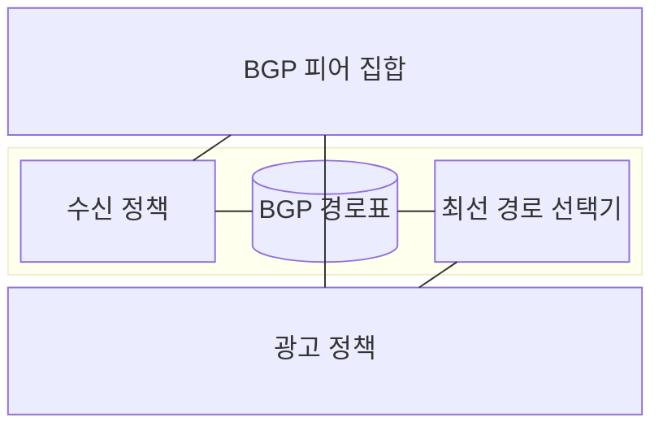
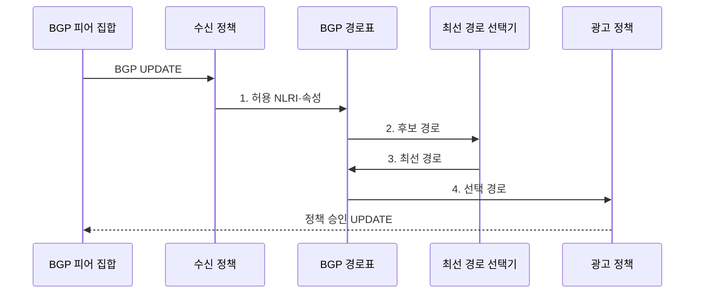

---
sidebar:
  order: 12
  label: "012. BGP 경계 게이트웨이 프로토콜 (BGP Border Gateway Protocol)"
  badge:
    text: "미출 · 50%"
    variant: note
title: "BGP 경계 게이트웨이 프로토콜 (BGP Border Gateway Protocol)"
date: "2026-07-31T11:08:05+09:00"
tags:
  - "notes-network"
weight: 12
extra:
  question_no: "012"
  source_status: "미출"
  source_history: ""
  priority: 50
  priority_note: "설계·보안형: EVPN·RPKI의 기반 BGP 정책"
---

## Ⅰ. 개요

핵심 용어

- **BGP·AS**: 자율 시스템 사이에서 프리픽스·경로 속성을 교환하는 프로토콜과 공통 정책 아래 운영되는 네트워크 집합이다.
- **NLRI**: BGP가 도달 가능하다고 광고하는 프리픽스 정보이다.

- 정의/개념: **BGP**는 자율 시스템 사이에서 NLRI와 경로 속성을 교환하고 운영 정책에 따라 최선 경로를 선택하는 **경로 벡터 라우팅 프로토콜**
- 배경/필요성: IGP 메트릭만으로는 AS 간 **계약·광고 범위 정책 반영 불가**

### 쉽게 이해하기 (학습용)

- 인터넷 조직끼리는 가장 짧은 길뿐 아니라 계약과 허용 정책에 맞는 길을 선택해 서로 알린다

## Ⅱ. 특징

핵심 용어

- **AS_PATH**: 목적지까지 거친 AS 번호 목록으로 순환 경로를 거부하는 기준이다.
- **증분 갱신**: 전체 경로표 대신 변경·철회된 경로만 피어에 전달하는 방식이다.

- 변경 경로만의 **증분 갱신**
- AS_PATH의 **순환 경로 거부**
- 수신·선택·광고의 **정책 단계 분리**

### 쉽게 이해하기 (학습용)

- 이웃이 준 길은 수신 검사·내부 선택·광고 검사를 차례로 거친다

## Ⅲ. 구조 및 구성요소

핵심 용어

- **BGP 피어·UPDATE**: 경로 교환 상대와 NLRI·경로 속성·철회를 전달하는 메시지이다.
- **최선 경로**: 정책과 경로 속성 비교를 통과해 라우팅 표에 설치되는 BGP 경로이다.

| 구성요소 | 책임 |
|:---|:---|
| BGP 피어 집합 | 세션에서 **NLRI·경로 속성** 교환 |
| 수신 정책 | 허용 **프리픽스·속성 변경** 판정 |
| BGP 경로표 | **후보·최선 경로** 보관 |
| 최선 경로 선택기 | **정책·속성 우선순위**로 경로 결정 |
| 광고 정책 | 이웃별 **전파 경로·속성** 제한 |

### 쉽게 이해하기 (학습용)

- 받은 길을 입구에서 검사하고 내부 기준으로 하나를 선택한 뒤 출구에서 공개 범위를 다시 검사함

## Ⅳ. 흐름도

핵심 용어

- **수신·선택·광고 정책**: 받은 경로를 검증하고 내부 최선 경로를 정한 뒤 이웃별 공개 범위를 다시 제한하는 단계이다.

**동작 원리**

1. **허용 NLRI·속성**: 출처·프리픽스·경로 속성 정책 통과
2. **후보 경로**: 같은 목적지의 유효 경로를 선택기에 제공
3. **최선 경로**: 속성 우선순위로 설치 경로 확정
4. **선택 경로**: 이웃별 광고 허용 범위와 속성 재검사

### 쉽게 이해하기 (학습용)

- 이웃의 길 소식을 검증해 내부 길을 정하고 우리 조직이 공개해도 되는 길만 다시 이웃에게 알림

## Ⅴ. 종류 및 비교

핵심 용어

- **eBGP·iBGP·경로 반사기**: AS 간 경로 교환, AS 내부 배포, 내부 피어 연결 수를 줄이는 역할이다.

| BGP 세션 유형 | eBGP | iBGP |
|:---|:---|:---|
| 적용 기준 | 서로 다른 **AS 경계 연결** | 같은 AS의 **내부 피어 연결** |
| 핵심 특징 | AS 간 **경로·정책 교환** | AS 내부에 **외부 경로 배포** |
| 한계 | **잘못된 경로 광고·경로 유출** | **전체 연결 증가·반사 정책 오류** |

> 요약: eBGP는 AS 간 교환, iBGP는 AS 내부 배포

### 쉽게 이해하기 (학습용)

- 회사 밖 파트너와 길을 교환하는 통신과 회사 안 지점에 그 길을 알려 주는 통신은 규칙과 확장 방식이 다름

## Ⅵ. 실무 고려사항 및 대책

핵심 용어

- **RPKI·프리픽스 필터**: 프리픽스 기원 AS 권한을 검증하고 수신·광고할 주소 범위를 제한하는 통제이다.
- **LOCAL_PREF**: 한 AS에서 외부로 나갈 경로의 우선순위를 나타내는 속성이다.

| 문제 | 대책 | 효과 |
|:---|:---|:---|
| 잘못된 기원 AS·프리픽스 경로 수신 | **RPKI·프리픽스 길이 필터** 적용 | **경로 탈취·유출** 위험 감소 |
| 내부 전용 프리픽스가 외부로 광고 | 명시적 **광고 허용 목록** 적용 | **내부 경로 유출** 차단 |
| 단일 피어 정책 오류가 대량 경로에 전파 | 변경 전 경로 재생 검증·**단계 적용** | **인터넷 장애 범위** 축소 |
| 다중 연결의 송수신 경로가 불균형 | **LOCAL_PREF·선택적 프리픽스 광고** 분리 설계 | **트래픽 방향** 통제 |

### 쉽게 이해하기 (학습용)

- 여러 외부 회선 중 어느 길로 내보낼지 로컬 선호도를 다르게 설정한다

## Ⅶ. 결론

핵심 용어

- **경로 유출 방지**: 기원 검증과 명시적 광고 목록으로 허용 범위를 벗어난 경로 전파를 막는 활동이다.

- **RPKI 검증** 통과 경로만 수신하고 계약 정책별 **LOCAL_PREF** 출구 선택

### 쉽게 이해하기 (학습용)

- 어떤 경로를 받고 사용할지, 다시 알릴지를 서로 다른 정책 단계로 관리해야 한다.
