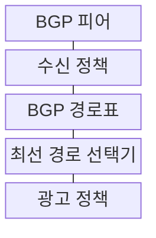
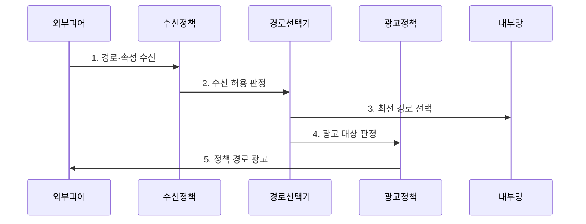

---
sidebar:
  order: 12
  label: "012. BGP 경계 게이트웨이 프로토콜 (BGP Border Gateway Protocol)"
  badge:
    text: "미출 · 50%"
    variant: note
title: "BGP 경계 게이트웨이 프로토콜 (BGP Border Gateway Protocol)"
date: "2026-07-30T18:00:00+09:00"
tags:
  - "notes-network"
weight: 12
extra:
  question_no: "012"
  source_status: "미출"
  source_history: ""
  priority: 50
  priority_note: "설계·보안형: EVPN·RPKI의 기반 BGP 정책"
---

## 미리 알고가기

- **경계 게이트웨이 프로토콜(Border Gateway Protocol, BGP)**: 자율 시스템 사이에서 프리픽스와 경로 속성을 교환하고 정책으로 경로를 선택하는 프로토콜
- **자율 시스템(Autonomous System, AS)**: 하나의 관리 주체와 공통 라우팅 정책 아래 운영되는 네트워크 집합
- **외부 BGP(External BGP, eBGP)**: 서로 다른 자율 시스템의 경계 라우터가 경로를 교환하는 방식
- **내부 BGP(Internal BGP, iBGP)**: 같은 자율 시스템 안에서 외부 BGP 경로를 전달하는 방식
- **네트워크 계층 도달 가능 정보(Network Layer Reachability Information, NLRI)**: BGP가 도달 가능하다고 광고하는 프리픽스 정보
- **AS 경로(AS_PATH)**: '에이에스 패스'로 읽고 밑줄로 두 단어를 하나의 속성명으로 묶어 목적지까지 거친 AS 번호 목록과 순환 거부 기준을 표시
- **로컬 선호도(LOCAL_PREF)**: '로컬 프레프'로 읽고 밑줄로 축약 단어를 하나의 속성명으로 묶어 한 AS에서 외부로 나갈 경로 우선순위를 표시
- **최선 경로(Best Path)**: 정책과 경로 속성 비교를 통과해 라우팅 표에 설치되는 BGP 경로
- **경로 반사기(Route Reflector)**: iBGP 전체 연결 대신 경로를 내부 피어에 반사해 연결 수를 줄이는 라우터
- **다중 연결(Multi-Homing)**: 한 조직이 둘 이상의 외부 회선이나 AS에 연결된 구성
- **경로 유출(Route Leak)**: 허용 범위를 벗어난 경로가 잘못 광고돼 트래픽 경로가 바뀌는 사고
- **자원 공개 키 기반구조(Resource Public Key Infrastructure, RPKI)**: 프리픽스를 광고할 권한이 있는 AS를 전자서명으로 검증하는 체계
- **BGP 피어(BGP Peer)**: 경로를 교환하도록 연결을 맺은 두 BGP 라우터의 상대
- **프리픽스 필터(Prefix Filter)**: 수신·광고할 주소 범위를 프리픽스 규칙으로 허용하거나 거부하는 정책

## Ⅰ. 개요

- 정의/개념: AS 간 프리픽스·속성을 교환해 정책 경로 제어
- 배경/필요성: 조직 간 계약·보안·트래픽 방향 정책 반영

### 쉽게 이해하기 (학습용)

- 인터넷 조직끼리는 가장 짧은 길뿐 아니라 계약과 허용 정책에 맞는 길을 선택해 서로 알린다

## Ⅱ. 특징

- 변경 경로만의 **증분 갱신**
- AS_PATH의 **순환 경로 거부**
- 수신·선택·광고의 **정책 단계 분리**

### 쉽게 이해하기 (학습용)

- 이웃이 준 길은 수신 검사·내부 선택·광고 검사를 차례로 거친다

## Ⅲ. 구조 및 구성요소

| 구성요소 | 책임 |
|:---|:---|
| BGP 피어 | 세션에서 프리픽스·속성 교환 |
| 수신 정책 | 허용 경로·속성 변경 판정 |
| BGP 경로표 | 후보·최선 경로 보관 |
| 최선 경로 선택기 | 정책·속성 순서로 경로 결정 |
| 광고 정책 | 외부 전파 경로·속성 제한 |

### 쉽게 이해하기 (학습용)

- 받은 길을 입구에서 검사하고 내부 기준으로 하나를 선택한 뒤 출구에서 공개 범위를 다시 검사함

## Ⅳ. 흐름도

**동작 원리**

1. **경로·속성 수신**: NLRI·AS_PATH 등 전달
2. **수신 허용 판정**: 출처·프리픽스·속성 검증
3. **최선 경로 선택**: 정책·속성 순서로 설치
4. **광고 대상 판정**: 이웃별 허용 경로 선별
5. **정책 경로 광고**: 승인 프리픽스·속성 전송

### 쉽게 이해하기 (학습용)

- 이웃의 길 소식을 검증해 내부 길을 정하고 우리 조직이 공개해도 되는 길만 다시 이웃에게 알림

## Ⅴ. 종류 및 비교

| 판단 기준 | eBGP | iBGP |
|:---|:---|:---|
| 적용 기준 | 다른 AS와 연결 | 같은 AS의 경계 라우터 연결 |
| 핵심 특징 | AS 경계에서 경로·정책 교환 | AS 내부에 외부 경로 배포 |
| 한계 | 잘못된 경로 광고·유출 | 전체 연결 증가·반사 정책 오류 |

> 요약: eBGP는 AS 간 교환, iBGP는 AS 내부 배포

### 쉽게 이해하기 (학습용)

- 회사 밖 파트너와 길을 교환하는 통신과 회사 안 지점에 그 길을 알려 주는 통신은 규칙과 확장 방식이 다름

## Ⅵ. 실무 고려사항 및 대책

| 고려사항 | 대책 | 효과 |
|:---|:---|:---|
| 잘못된 프리픽스 수신 | RPKI·접두사·길이 필터 | 경로 탈취 위험 감소 |
| 내부 경로 외부 유출 | 명시적 광고 목록·최대 경로 수 | 경로 누출 차단 |
| 단일 피어 정책 오류 | 변경 전 모의 검증·단계 적용 | 인터넷 장애 범위 축소 |
| 경로 비대칭 미고려 | 수신·송신 정책을 별도 설계 | 트래픽 방향 통제 |

### 쉽게 이해하기 (학습용)

- 여러 외부 회선 중 어느 길로 내보낼지 로컬 선호도를 다르게 설정한다

## Ⅶ. 결론

- **출처 검증과 수신·선택·광고 분리를 통한 BGP 정책 제어**

### 쉽게 이해하기 (학습용)

- 어떤 경로를 받고 사용할지, 다시 알릴지를 서로 다른 정책 단계로 관리해야 한다.
