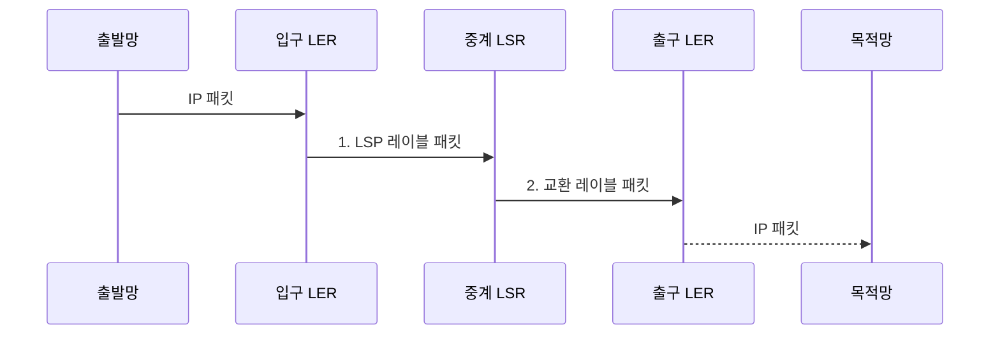

---
sidebar:
  order: 13
  label: "013. MPLS 레이블 스위칭 (MPLS Label Switching)"
  badge:
    text: "기출 · 30%"
    variant: note
title: "MPLS 레이블 스위칭 (MPLS Label Switching)"
date: "2026-07-31T01:00:32+09:00"
tags:
  - "notes-network"
weight: 13
extra:
  question_no: "013"
  source_status: "기출"
  source_history: "126회"
  priority: 30
  priority_note: "비교형: 126회 MPLS-TP·IP-MPLS 연계"
---

## 미리 알고가기

- **인터넷 프로토콜(Internet Protocol, IP)**: 목적지 주소와 라우팅 표를 이용해 패킷을 네트워크 사이에 전달하는 프로토콜
- **다중 프로토콜 레이블 스위칭(Multiprotocol Label Switching, MPLS)**: 패킷에 레이블을 붙여 논리 경로로 전달하는 기술
- **레이블 경계 라우터(Label Edge Router, LER)**: MPLS 영역의 입구에서 레이블을 붙이고 출구에서 제거하는 라우터
- **레이블 스위칭 라우터(Label Switching Router, LSR)**: MPLS 영역 안에서 입력 레이블을 출력 레이블로 교환해 패킷을 중계하는 라우터
- **레이블 스위치 경로(Label Switched Path, LSP)**: 입구 LER부터 출구 LER까지 레이블 교환으로 이어진 단방향 논리 경로
- **전달 동등 클래스(Forwarding Equivalence Class, FEC)**: 같은 경로·서비스·처리 정책을 적용할 패킷의 묶음
- **레이블 전달 정보 베이스(Label Forwarding Information Base, LFIB)**: 입력 레이블별 출력 레이블·다음 홉·동작을 저장한 전달 표
- **레이블 배포 프로토콜(Label Distribution Protocol, LDP)**: 인접 라우터가 프리픽스와 레이블의 연결 정보를 교환하는 프로토콜
- **레이블 스택(Label Stack)**: 전송 경로·고객 서비스처럼 여러 전달 문맥을 표현하도록 레이블을 겹쳐 놓은 구조
- **가상 사설망(Virtual Private Network, VPN)**: 공용망 위에서 고객별 주소·경로를 논리적으로 격리한 네트워크
- **트래픽 엔지니어링(Traffic Engineering, TE)**: 링크 용량·지연·정책을 반영해 트래픽이 지날 경로를 명시적으로 제어하는 기법
- **고속 우회(Fast Reroute, FRR)**: 링크나 노드 장애 때 미리 계산한 보호 경로로 빠르게 전환하는 기능
- **양방향 전달 탐지(Bidirectional Forwarding Detection, BFD)**: 인접 장치 사이의 짧은 주기 제어 메시지로 전달 경로 장애를 탐지하는 프로토콜
- **자원 예약 프로토콜 기반 트래픽 엔지니어링(Resource Reservation Protocol-Traffic Engineering, RSVP-TE)**: 대역폭·경로 제약을 신호로 전달해 명시적 LSP를 설정하는 프로토콜
- **최대 전송 단위(Maximum Transmission Unit, MTU)**: 한 링크가 단편화 없이 전달할 수 있는 최대 패킷 크기

## Ⅰ. 개요

- 정의/개념: 패킷을 FEC로 분류하고 레이블을 교환해 LSP로 전달하는 **MPLS 기술**
- 배경/필요성: 목적지별 IP 경로만으로는 **서비스 격리·명시 경로 표현 제약**

### 쉽게 이해하기 (학습용)

- 운송표를 붙여 정해진 거점만 거치게 하는 전달 기술

## Ⅱ. 특징

- 입구 LER의 **FEC 분류·레이블 부착**
- 중간 LSR의 **레이블 교환 전달**
- 레이블 스택의 **전송·서비스 문맥 표현**

### 쉽게 이해하기 (학습용)

- 운송표를 여러 장 겹치면 바깥 표는 백본 길, 안쪽 표는 고객·서비스 구분을 나타낸다

## Ⅲ. 구조 및 구성요소

| 구성요소 | 책임 |
|:---|:---|
| 입구 LER | **FEC 분류·레이블 스택** 부착 |
| 중계 LSR | **LFIB**로 출력 레이블·다음 홉 교환 |
| 출구 LER | 레이블 제거 후 **IP 패킷** 전달 |

### 쉽게 이해하기 (학습용)

- 관리 체계가 운송표 교환 규칙을 먼저 배포하면 실제 거점은 표에 적힌 다음 동작만 수행함

## Ⅳ. 흐름도

**동작 원리**

1. **LSP 레이블 패킷**: FEC에 대응하는 레이블 스택 부착
2. **교환 레이블 패킷**: LFIB로 레이블·다음 홉을 바꾸고 출구에서 제거

### 쉽게 이해하기 (학습용)

- 입구는 레이블을 붙이고 중간은 바꾸며 출구는 제거한다

## Ⅴ. 종류 및 비교

| 패킷 전달 방식 | MPLS | IP 라우팅 |
|:---|:---|:---|
| 적용 기준 | **VPN 격리·명시적 경로** 제어 | 일반 **인터넷 도달성** |
| 핵심 특징 | 입구 **FEC 분류·레이블 교환** | 매 홉 **목적지 프리픽스** 조회 |
| 한계 | **레이블 상태·LSP 운영** 복잡도 | 서비스 분리에 **별도 오버레이** 필요 |

> 요약: MPLS는 FEC별 LSP로 경로·서비스 제어

### 쉽게 이해하기 (학습용)

- IP는 매 홉에서 주소를 보고 MPLS는 입구에서 정한 레이블 경로를 따른다

## Ⅵ. 실무 고려사항 및 대책

| 고려사항 | 대책 | 효과 |
|:---|:---|:---|
| 여러 고객의 사설 주소가 중첩 | VPN별 **서비스 레이블** 분리 | **고객 경로 격리** |
| LSP 단절 탐지가 늦어 트래픽 손실 | **BFD·FRR 보호 경로** 연동 | **장애 전환 시간** 단축 |
| 깊은 레이블 스택으로 MTU 초과 | 스택 깊이를 포함한 **경로 MTU** 산정 | **패킷 단편화·폐기** 예방 |
| 제어 평면과 LFIB 매핑이 불일치 | **LDP·RSVP-TE**와 LFIB 대조 | **전달 블랙홀** 방지 |

### 쉽게 이해하기 (학습용)

- 안쪽 레이블은 고객 경로를, 바깥 레이블은 백본 경로를 가리켜 여러 고객의 주소가 겹쳐도 섞이지 않는다

## Ⅶ. 결론

- 고객 격리·명시 경로가 필요하면 **레이블 스택**을 구성하되 **경로 MTU** 이내로 제한

### 쉽게 이해하기 (학습용)

- 고객 서비스와 백본 경로를 함께 구분하려면 목적별 레이블을 겹쳐 사용한다.
