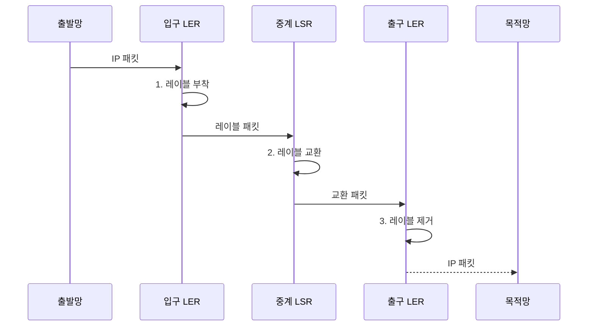

---
sidebar:
  order: 13
  label: "013. MPLS 레이블 스위칭 (MPLS Label Switching)"
  badge:
    text: "기출 • 30%"
    variant: note
title: "MPLS 레이블 스위칭 (MPLS Label Switching)"
date: "2026-08-03T15:05:00+09:00"
tags:
  - "notes-network"
weight: 13
extra:
  question_no: "013"
  source_status: "기출"
  source_history: "126회"
  priority: 30
  priority_note: "비교형: 126회 MPLS-TP•IP-MPLS 연계"
---

## Ⅰ. 개요

핵심 용어

- **다중 프로토콜 레이블 스위칭•전달 등가 클래스(Multiprotocol Label Switching/Forwarding Equivalence Class, MPLS•FEC)**: 패킷에 레이블을 붙여 논리 경로로 전달하는 기술과 같은 처리 정책을 적용할 패킷 묶음이다.
- **레이블 스위치 경로(Label Switched Path, LSP)**: 입구부터 출구까지 레이블 교환으로 패킷을 전달하는 단방향 논리 경로이다.

- 정의/개념: **MPLS** — 입구에서 패킷을 FEC로 분류해 레이블을 붙이고 중계 구간에서 레이블을 교환하며 LSP로 전달하는 **패킷 전달 기술**
- 배경/필요성: 목적지별 IP 경로만으로는 **서비스 격리•명시 경로 표현 제약**

#### 한줄 요약

- 운송표를 붙여 정해진 거점만 거치게 하는 전달 기술

## Ⅱ. 특징

핵심 용어

- **레이블 경계 라우터•레이블 스위칭 라우터•레이블 스위치 경로(Label Edge Router/Label Switching Router/Label Switched Path, LER•LSR•LSP)**: MPLS 영역의 경계 라우터, 내부 레이블 교환 라우터, 이들을 잇는 단방향 논리 경로이다.
- **레이블 스택**: 전송 경로•고객 서비스 등 여러 전달 문맥을 표현하도록 레이블을 겹친 구조이다.

- 입구 LER의 **FEC 분류•레이블 부착**
- 중간 LSR의 **레이블 교환 전달**
- 레이블 스택의 **전송•서비스 문맥 표현**

#### 한줄 요약

- 운송표를 여러 장 겹치면 바깥 표는 백본 길, 안쪽 표는 고객•서비스 구분을 나타낸다

## Ⅲ. 구조 및 구성요소

핵심 용어

- **레이블 전달 정보 기반(Label Forwarding Information Base, LFIB)**: 입력 레이블별 출력 레이블•다음 홉•동작을 저장한 전달 표이다.

| 구성요소 | 책임 |
|:---|:---|
| 입구 LER | **FEC 분류•레이블 스택** 부착 |
| 중계 LSR | **LFIB 기반 조회** 로 출력 레이블•다음 홉 교환 |
| 출구 LER | 레이블 제거 후 **IP 패킷** 전달 |

#### 한줄 요약

- 관리 체계가 운송표 교환 규칙을 먼저 배포하면 실제 거점은 표에 적힌 다음 동작만 수행함

## Ⅳ. 흐름도

핵심 용어

- **푸시•스왑•팝(Push•Swap•Pop)**: 입구에서 레이블을 붙이고 중간에서 교환하며 출구에서 제거하는 동작이다.
- **레이블 전달 정보 기반(Label Forwarding Information Base, LFIB)**: 입력 레이블을 조회해 출력 레이블, 다음 홉, 교환 동작을 결정하는 전달 표이다.

**동작 원리**

1. **레이블 부착**: FEC에 대응하는 레이블 스택 추가
2. **레이블 교환**: LFIB로 출력 레이블•다음 홉 결정
3. **레이블 제거**: 출구 LER에서 레이블을 제거해 IP 복원

#### 한줄 요약

- 입구는 레이블을 붙이고 중간은 바꾸며 출구는 제거한다

## Ⅴ. 종류 및 비교

핵심 용어

- **다중 프로토콜 레이블 스위칭•인터넷 프로토콜 전달(Multiprotocol Label Switching/Internet Protocol, MPLS•IP 전달)**: 입구에서 정한 FEC별 레이블과 매 홉의 목적지 프리픽스를 각각 조회하는 전달 방식이다.
- **가상 사설망(Virtual Private Network, VPN)**: 공용 전달망 위에서 고객별 주소와 경로를 논리적으로 격리한 사설망이다.

| 패킷 전달 방식 | MPLS | IP 라우팅 |
|:---|:---|:---|
| 적용 기준 | **VPN 격리•명시적 경로** 제어 | 일반 **인터넷 도달성** |
| 핵심 특징 | 입구 **FEC 분류•레이블 교환** | 매 홉 **목적지 프리픽스** 조회 |
| 한계 | **레이블 상태•LSP 운영** 복잡도 | 서비스 분리에 **별도 오버레이** 필요 |

> 요약: MPLS는 FEC별 LSP로 경로•서비스 제어

#### 한줄 요약

- IP는 매 홉에서 주소를 보고 MPLS는 입구에서 정한 레이블 경로를 따른다

## Ⅵ. 실무 고려사항 및 대책

핵심 용어

- **레이블 배포 프로토콜•트래픽 공학용 자원 예약 프로토콜(Label Distribution Protocol/Resource Reservation Protocol-Traffic Engineering, LDP•RSVP-TE)**: 프리픽스-레이블 연결을 교환하는 프로토콜과 제약 기반 명시적 LSP를 설정하는 프로토콜이다.
- **양방향 전달 탐지•고속 재라우팅•경로 최대 전송 단위(Bidirectional Forwarding Detection/Fast Reroute/Path Maximum Transmission Unit, BFD•FRR•경로 MTU)**: 장애를 빠르게 탐지•우회하고 레이블 스택을 포함한 최대 패킷 크기를 관리하는 기준이다.

| 문제 | 대책 | 효과 |
|:---|:---|:---|
| 여러 고객의 사설 주소가 중첩 | VPN별 **서비스 레이블** 분리 | **고객 경로 격리** |
| LSP 단절 탐지가 늦어 트래픽 손실 | **BFD•FRR 보호 경로** 연동 | **장애 전환 시간** 단축 |
| 깊은 레이블 스택으로 MTU 초과 | 스택 깊이를 포함한 **경로 MTU** 산정 | **패킷 단편화•폐기** 예방 |
| 제어 평면과 LFIB 매핑이 불일치 | 제어 프로토콜 **LDP•RSVP-TE 및 LFIB 대응 관계** 대조 | **전달 블랙홀** 방지 |

#### 한줄 요약

- 안쪽 레이블은 고객 경로를, 바깥 레이블은 백본 경로를 가리켜 여러 고객의 주소가 겹쳐도 섞이지 않는다

## Ⅶ. 결론

핵심 용어

- **서비스 격리**: 가상 사설망(Virtual Private Network, VPN)별 내부 레이블과 백본 전달 레이블을 나눠 고객 경로가 섞이지 않게 하는 방식이다.
- **경로 최대 전송 단위(Path Maximum Transmission Unit, 경로 MTU)**: 전달 경로 전체에서 단편화 없이 보낼 수 있는 최대 패킷 크기이다.

- 고객 격리•명시 경로가 필요하면 **레이블 스택 구성** 후 **경로 MTU 이내** 로 제한

#### 한줄 요약

- 고객 서비스와 백본 경로를 함께 구분하려면 목적별 레이블을 겹쳐 사용한다.
